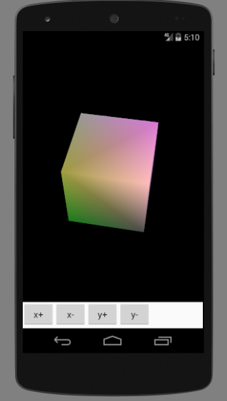
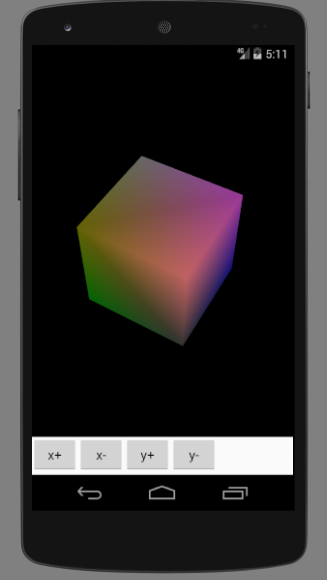
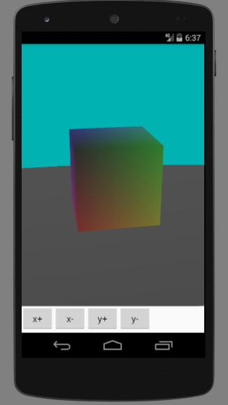

# 光照

OpenGL中，光源发出的光可以分成三种成分：环境光，漫射光，镜面光，类比现实世界中的这三种光。光源通过坐标指定。一旦开启光照，物体原本绘制的颜色就会失效。光源可以调整切角，模拟点光源和探照灯等。

# 材质

材质的概念区分于纹理。材质是指物体材料对光的反应，金属板和木板相比，金属板镜面光反射更强烈，所以有金属光泽，OpenGL中也是类似的道理。物体的颜色则是通过材质对RGB光的反射率指定的，物体吸收红色和绿色光，反射蓝色光，物体就呈现蓝色。物体绘制时会对应颜色缓冲区中指定的颜色，但开启光照时颜色会失效。打开颜色追踪，OpenGL会按照原来颜色缓冲区的颜色设置RGB光纤的反射。

# 法线

光线入射光和反射光需要一个平面和法线才能确定，可以通过调整法线呈现不同反射效果。

# 光照下的颜色立方体

MyRenderer.java
```java
package com.ciyaz.lightdemo;

import android.opengl.GLSurfaceView;
import android.opengl.GLU;

import javax.microedition.khronos.egl.EGLConfig;
import javax.microedition.khronos.opengles.GL10;

public class MyRenderer implements GLSurfaceView.Renderer
{

	public float rotateX = 0;
	public float rotateY = 0;

	//该方法在surfaceView初始化时调用
	@Override
	public void onSurfaceCreated(GL10 gl, EGLConfig config)
	{
		//设置清屏颜色
		gl.glClearColor(0, 0, 0, 1);
		//启用顶点缓冲区
		gl.glEnableClientState(GL10.GL_VERTEX_ARRAY);
		//启用颜色缓冲区
		gl.glEnableClientState(GL10.GL_COLOR_ARRAY);
		gl.glShadeModel(GL10.GL_SMOOTH);
		//启用深度测试
		gl.glEnable(GL10.GL_DEPTH_TEST);
		//开启表面剔除
		gl.glEnable(GL10.GL_CULL_FACE);
		gl.glFrontFace(GL10.GL_CCW);
		gl.glCullFace(GL10.GL_BACK);
		//开启光照
		gl.glEnable(GL10.GL_LIGHTING);
		gl.glEnable(GL10.GL_LIGHT0);
		//开启光线追踪
		gl.glEnable(GL10.GL_COLOR_MATERIAL);

	}

	@Override
	public void onSurfaceChanged(GL10 gl, int width, int height)
	{
		//设置视口,输出画面的区域
		gl.glViewport(0, 0, width, height);
		//计算宽高比例用于设置平截头体
		float ratio = (float) width / (float) height;

		//设置矩阵模式为投影矩阵
		gl.glMatrixMode(GL10.GL_PROJECTION);
		//加载单位矩阵
		gl.glLoadIdentity();
		//设置平截头体
		//left right top bottom 前平面上下左右距离
		//znear zfar 前后平面距摄像机距离
		gl.glFrustumf(-ratio, ratio, -1, 1, 3, 7);
	}

	@Override
	public void onDrawFrame(GL10 gl)
	{
		//清屏
		gl.glClear(GL10.GL_COLOR_BUFFER_BIT | GL10.GL_DEPTH_BUFFER_BIT);

		//设定矩阵模式为模型视图矩阵
		gl.glMatrixMode(GL10.GL_MODELVIEW);
		gl.glLoadIdentity();

		//设置摄像机
		//eyex eyey eyez 放置眼球坐标
		//centerx centery centerz 眼球观察点
		//upx upy upz 指定眼球向上的向量
		GLU.gluLookAt(gl, 0, 0, 5, 0, 0, 0, 0, 1, 0);

		//旋转坐标变换
		//angle 角度 xyz 旋转轴的方向向量
		gl.glRotatef(rotateX, 1, 0, 0);
		gl.glRotatef(rotateY, 0, 1, 0);

		//光照参数
		float[] ambient = {0.1f, 0.1f, 0.1f, 1f};//环境光RGBA
		float[] diffuse = {0.1f, 0.1f, 0.1f, 1f};//漫射光RGBA
		float[] specular = {0.9f, 0.9f, 0.9f, 1f};//镜面光RGBA
		float[] lightPos = {0, 2, 3, 1};//光源位置
		gl.glLightfv(GL10.GL_LIGHT0, GL10.GL_AMBIENT, ambient, 0);
		gl.glLightfv(GL10.GL_LIGHT0, GL10.GL_DIFFUSE, diffuse, 0);
		gl.glLightfv(GL10.GL_LIGHT0, GL10.GL_SPECULAR, specular, 0);
		gl.glLightfv(GL10.GL_LIGHT0, GL10.GL_POSITION, lightPos, 0);

		//设置镜面反射率
		gl.glMaterialfv(GL10.GL_FRONT_AND_BACK, GL10.GL_SPECULAR, specular, 0);
		//设置镜面反射指数
		gl.glMaterialf(GL10.GL_FRONT_AND_BACK, GL10.GL_SHININESS, 64);

		//定义颜色数组
		float[] colors = {
				1,0,0,1,
				0,0,0,1,
				0,1,0,1,
				1,1,0,1,
				1,0,1,1,
				0,0,1,1,
				0,1,1,1,
				1,1,1,1,
		};
		//输入颜色缓冲区
		//size 几个数据表示一个颜色 type 数据类型 stride 跨度 pointer 缓冲区
		gl.glColorPointer(4, GL10.GL_FLOAT, 0, BufferUtil.toFloatBuffer(colors));

		DrawUtil.drawCube(gl);
	}
}
```

33行开启光照，34行开启光源0,OpenGL中可以指定多个光源，36行开启光线追踪，80-87行设置了光线各颜色强度和光源位置，由于开启光线追踪后，默认各种光成分反射率相同，因此这里为了突出显示镜面反射，单独设置了镜面反射率，92行设置了镜面反射指数，该参数取值范围1-128，该值越大，亮点越明显。

结果如图，镜面反射效果十分明显。




# 雾效果

为了使场景更加真实，OpenGL还提供了雾效果。下面的代码中，增加了雾效果，改变了世界的背景色，新绘制了一个作为地面的矩形面。

```java
package com.ciyaz.lightdemo;

import android.opengl.GLSurfaceView;
import android.opengl.GLU;

import javax.microedition.khronos.egl.EGLConfig;
import javax.microedition.khronos.opengles.GL10;

public class MyRenderer implements GLSurfaceView.Renderer
{

	public float rotateX = 0;
	public float rotateY = 0;

	//该方法在surfaceView初始化时调用
	@Override
	public void onSurfaceCreated(GL10 gl, EGLConfig config)
	{
		//设置清屏颜色
		gl.glClearColor(0, 0.7f, 0.7f, 1);
		//启用顶点缓冲区
		gl.glEnableClientState(GL10.GL_VERTEX_ARRAY);
		//启用颜色缓冲区
		gl.glEnableClientState(GL10.GL_COLOR_ARRAY);
		gl.glShadeModel(GL10.GL_SMOOTH);
		//启用深度测试
		gl.glEnable(GL10.GL_DEPTH_TEST);
		//开启表面剔除
		gl.glEnable(GL10.GL_CULL_FACE);
		gl.glFrontFace(GL10.GL_CCW);
		gl.glCullFace(GL10.GL_BACK);
		//开启光照
		gl.glEnable(GL10.GL_LIGHTING);
		gl.glEnable(GL10.GL_LIGHT0);
		//开启光线追踪
		gl.glEnable(GL10.GL_COLOR_MATERIAL);
		//启用雾效果
		gl.glEnable(GL10.GL_FOG);

	}

	@Override
	public void onSurfaceChanged(GL10 gl, int width, int height)
	{
		//设置视口,输出画面的区域
		gl.glViewport(0, 0, width, height);
		//计算宽高比例用于设置平截头体
		float ratio = (float) width / (float) height;

		//设置矩阵模式为投影矩阵
		gl.glMatrixMode(GL10.GL_PROJECTION);
		//加载单位矩阵
		gl.glLoadIdentity();
		//设置平截头体
		//left right top bottom 前平面上下左右距离
		//znear zfar 前后平面距摄像机距离
		gl.glFrustumf(-ratio, ratio, -1, 1, 3, 7);
	}

	@Override
	public void onDrawFrame(GL10 gl)
	{
		//清屏
		gl.glClear(GL10.GL_COLOR_BUFFER_BIT | GL10.GL_DEPTH_BUFFER_BIT);

		//设定矩阵模式为模型视图矩阵
		gl.glMatrixMode(GL10.GL_MODELVIEW);
		gl.glLoadIdentity();

		//设置摄像机
		//eyex eyey eyez 放置眼球坐标
		//centerx centery centerz 眼球观察点
		//upx upy upz 指定眼球向上的向量
		GLU.gluLookAt(gl, 0, 0, 5, 0, 0, 0, 0, 1, 0);

		//旋转坐标变换
		//angle 角度 xyz 旋转轴的方向向量
		gl.glRotatef(rotateX, 1, 0, 0);
		gl.glRotatef(rotateY, 0, 1, 0);

		//光照参数
		float[] ambient = {0.3f, 0.3f, 0.3f, 1f};//环境光
		float[] diffuse = {0.3f, 0.3f, 0.3f, 1f};//漫射光
		float[] specular = {0.9f, 0.9f, 0.9f, 1f};//镜面光
		float[] lightPos = {0, 2, 3, 1};//光源位置
		gl.glLightfv(GL10.GL_LIGHT0, GL10.GL_AMBIENT, ambient, 0);
		gl.glLightfv(GL10.GL_LIGHT0, GL10.GL_DIFFUSE, diffuse, 0);
		gl.glLightfv(GL10.GL_LIGHT0, GL10.GL_SPECULAR, specular, 0);
		gl.glLightfv(GL10.GL_LIGHT0, GL10.GL_POSITION, lightPos, 0);

		//雾效果参数
		//雾颜色
		gl.glFogfv(GL10.GL_FOG_COLOR, BufferUtil.toFloatBuffer(new float[]{0.3f, 0.3f, 0.3f, 1f}));
		//雾开始距离
		gl.glFogf(GL10.GL_FOG_START, 3);
		//雾结束距离
		gl.glFogf(GL10.GL_FOG_END, 7);
		//雾模式：线性雾
		gl.glFogf(GL10.GL_FOG_MODE, GL10.GL_LINEAR);
		//雾浓度 0-1
		gl.glFogf(GL10.GL_FOG_DENSITY, 0.2f);

		//物体1
		//设置镜面反射率
		gl.glMaterialfv(GL10.GL_FRONT_AND_BACK, GL10.GL_SPECULAR, specular, 0);
		//设置镜面反射光斑强度
		gl.glMaterialf(GL10.GL_FRONT_AND_BACK, GL10.GL_SHININESS, 64);

		//定义颜色数组
		float[] colors = {
				1,0,0,1,
				0,0,0,1,
				0,1,0,1,
				1,1,0,1,
				1,0,1,1,
				0,0,1,1,
				0,1,1,1,
				1,1,1,1,
		};
		//输入颜色缓冲区
		//size 几个数据表示一个颜色 type 数据类型 stride 跨度 pointer 缓冲区
		gl.glColorPointer(4, GL10.GL_FLOAT, 0, BufferUtil.toFloatBuffer(colors));

		DrawUtil.drawCube(gl);

		//物体2
		//设置镜面反射率
		gl.glMaterialfv(GL10.GL_FRONT_AND_BACK, GL10.GL_SPECULAR, new float[]{0.1f, 0.1f, 0.1f, 1f}, 0);
		//定义顶点数组
		float[] vertex2 = {
				-2, -0.51f, -2,
				-2, -0.51f, 2,
				2, -0.51f, 2,
				2, -0.51f, -2,
		};
		//定义颜色数组
		float[] colors2 = {
				0.5f, 0.5f, 0.5f, 1f,
				0.5f, 0.5f, 0.5f, 1f,
				0.5f, 0.5f, 0.5f, 1f,
				0.5f, 0.5f, 0.5f, 1f,
		};
		gl.glColorPointer(4, GL10.GL_FLOAT, 0, BufferUtil.toFloatBuffer(colors2));
		gl.glVertexPointer(3, GL10.GL_FLOAT, 0, BufferUtil.toFloatBuffer(vertex2));
		gl.glDrawArrays(GL10.GL_TRIANGLE_FAN, 0, 4);
	}
}
```

38行启用了雾效果，91-101行设定了雾的参数，126-145行新绘制了地面，效果如下图


