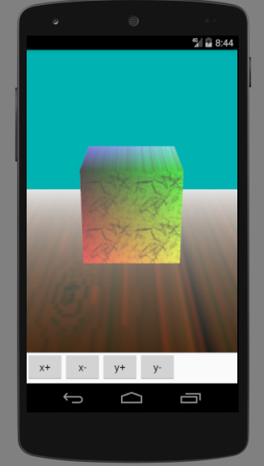
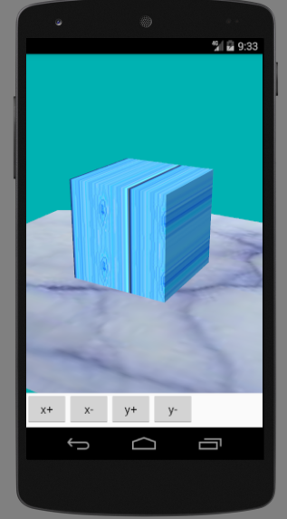
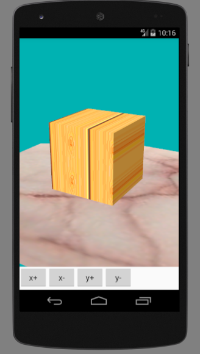

# 纹理

对于一个物体，仅仅指定材质是不够的，现实世界的物体表面是极其复杂的，而当前计算设备的计算能力是很有限的，因此为了表现一个具有复杂纹理的物体，一个折中的方案就是绘制一个二维平面的贴图，贴在几何体上，比如一个砖块，上面有凹凸不平的凹槽，在计算机中模拟这个砖块，建立大量的三角形面模拟这种凹槽，矩阵会极其庞大，着色等运算也过于复杂，所以用现实世界砖块照片贴到OpenGL模拟的立方体上，也是比较逼真的。

# 纹理坐标

几何体顶点坐标对应二维纹理图的平面坐标，指定这种对应关系，OpenGL就知道如何把图片贴到几何体上了。这个纹理的平面坐标，在3D设计中通常叫uv坐标，OpenGL中也叫st坐标。

# 绘制简单的纹理

下列代码是在上一节基础上添加而成的。

MyRenderer.java
```java
package com.ciyaz.texturedemo;

import android.content.res.Resources;
import android.graphics.Bitmap;
import android.graphics.BitmapFactory;
import android.opengl.GLSurfaceView;
import android.opengl.GLU;
import android.opengl.GLUtils;

import java.nio.Buffer;
import java.nio.ByteBuffer;
import java.nio.ByteOrder;
import java.nio.IntBuffer;

import javax.microedition.khronos.egl.EGLConfig;
import javax.microedition.khronos.opengles.GL10;

public class MyRenderer implements GLSurfaceView.Renderer
{

	public float rotateX = 0;
	public float rotateY = 0;

	private Bitmap ground;
	private Bitmap stone;

	public MyRenderer(Resources res)
	{
		ground = BitmapFactory.decodeResource(res, R.drawable.ground);
		stone = BitmapFactory.decodeResource(res, R.drawable.stone);
	}

	//该方法在surfaceView初始化时调用
	@Override
	public void onSurfaceCreated(GL10 gl, EGLConfig config)
	{
		//设置清屏颜色
		gl.glClearColor(0, 0.7f, 0.7f, 1);
		//启用顶点缓冲区
		gl.glEnableClientState(GL10.GL_VERTEX_ARRAY);
		//启用颜色缓冲区
		gl.glEnableClientState(GL10.GL_COLOR_ARRAY);
		gl.glShadeModel(GL10.GL_SMOOTH);
		//启用深度测试
		gl.glEnable(GL10.GL_DEPTH_TEST);
		//开启表面剔除
		gl.glEnable(GL10.GL_CULL_FACE);
		gl.glFrontFace(GL10.GL_CCW);
		gl.glCullFace(GL10.GL_BACK);
		//开启光照
		gl.glEnable(GL10.GL_LIGHTING);
		gl.glEnable(GL10.GL_LIGHT0);
		//开启光线追踪
		gl.glEnable(GL10.GL_COLOR_MATERIAL);
		//启用雾效果
		gl.glEnable(GL10.GL_FOG);
		//启用纹理缓冲区
		gl.glEnableClientState(GL10.GL_TEXTURE_COORD_ARRAY);
		//启用纹理
		gl.glEnable(GL10.GL_TEXTURE_2D);
	}

	@Override
	public void onSurfaceChanged(GL10 gl, int width, int height)
	{
		//设置视口,输出画面的区域
		gl.glViewport(0, 0, width, height);
		//计算宽高比例用于设置平截头体
		float ratio = (float) width / (float) height;

		//设置矩阵模式为投影矩阵
		gl.glMatrixMode(GL10.GL_PROJECTION);
		//加载单位矩阵
		gl.glLoadIdentity();
		//设置平截头体
		//left right top bottom 前平面上下左右距离
		//znear zfar 前后平面距摄像机距离
		gl.glFrustumf(-ratio, ratio, -1, 1, 3, 7);
	}

	@Override
	public void onDrawFrame(GL10 gl)
	{
		//清屏
		gl.glClear(GL10.GL_COLOR_BUFFER_BIT | GL10.GL_DEPTH_BUFFER_BIT);

		//设定矩阵模式为模型视图矩阵
		gl.glMatrixMode(GL10.GL_MODELVIEW);
		gl.glLoadIdentity();

		//设置摄像机
		//eyex eyey eyez 放置眼球坐标
		//centerx centery centerz 眼球观察点
		//upx upy upz 指定眼球向上的向量
		GLU.gluLookAt(gl, 0, 0, 5, 0, 0, 0, 0, 1, 0);

		//旋转坐标变换
		//angle 角度 xyz 旋转轴的方向向量
		gl.glRotatef(rotateX, 1, 0, 0);
		gl.glRotatef(rotateY, 0, 1, 0);

		//光照参数
		float[] ambient = {0.5f, 0.5f, 0.5f, 1f};//环境光
		float[] diffuse = {0.5f, 0.5f, 0.5f, 1f};//漫射光
		float[] specular = {0.7f, 0.7f, 0.7f, 1f};//镜面光
		float[] lightPos = {0, 2, 3, 1};//光源位置
		gl.glLightfv(GL10.GL_LIGHT0, GL10.GL_AMBIENT, ambient, 0);
		gl.glLightfv(GL10.GL_LIGHT0, GL10.GL_DIFFUSE, diffuse, 0);
		gl.glLightfv(GL10.GL_LIGHT0, GL10.GL_SPECULAR, specular, 0);
		gl.glLightfv(GL10.GL_LIGHT0, GL10.GL_POSITION, lightPos, 0);

		//雾效果参数
		//雾颜色
		gl.glFogfv(GL10.GL_FOG_COLOR, BufferUtil.toFloatBuffer(new float[]{0.9f, 0.9f, 0.9f, 1f}));
		//雾开始距离
		gl.glFogf(GL10.GL_FOG_START, 3);
		//雾结束距离
		gl.glFogf(GL10.GL_FOG_END, 7);
		//雾模式：线性雾
		gl.glFogf(GL10.GL_FOG_MODE, GL10.GL_LINEAR);
		//雾浓度 0-1
		gl.glFogf(GL10.GL_FOG_DENSITY, 0.2f);

		//纹理初始化
		int[] textureIds = new int[1];
		//生成纹理 n 生成纹理的数量 textures 包含纹理id的数组 offset 数组偏移
		gl.glGenTextures(1, textureIds, 0);

		//物体1
		//设置镜面反射率
		gl.glMaterialfv(GL10.GL_FRONT_AND_BACK, GL10.GL_SPECULAR, specular, 0);
		//设置镜面反射光斑强度
		gl.glMaterialf(GL10.GL_FRONT_AND_BACK, GL10.GL_SHININESS, 64);

		//定义颜色数组
		float[] colors = {
				1,0,0,1,
				0,0,0,1,
				0,1,0,1,
				1,1,0,1,
				1,0,1,1,
				0,0,1,1,
				0,1,1,1,
				1,1,1,1,
		};
		//输入颜色缓冲区
		//size 几个数据表示一个颜色 type 数据类型 stride 跨度 pointer 缓冲区
		gl.glColorPointer(4, GL10.GL_FLOAT, 0, BufferUtil.toFloatBuffer(colors));

		//绑定纹理textureIds[0]为2D类型
		gl.glBindTexture(GL10.GL_TEXTURE_2D, textureIds[0]);
		//设置纹理映射参数
		gl.glTexParameterf(GL10.GL_TEXTURE_2D, GL10.GL_TEXTURE_MIN_FILTER, GL10.GL_LINEAR);
		gl.glTexParameterf(GL10.GL_TEXTURE_2D, GL10.GL_TEXTURE_MAG_FILTER, GL10.GL_LINEAR);
		gl.glTexParameterf(GL10.GL_TEXTURE_2D, GL10.GL_TEXTURE_WRAP_S, GL10.GL_REPEAT);
		gl.glTexParameterf(GL10.GL_TEXTURE_2D, GL10.GL_TEXTURE_WRAP_T, GL10.GL_REPEAT);
		//加载纹理贴图
		IntBuffer bitmapBuffer = DrawUtil.toBitmapBuffer(stone);
		gl.glTexImage2D(GL10.GL_TEXTURE_2D, 0, GL10.GL_RGBA, stone.getWidth(), stone.getHeight(), 0, GL10.GL_RGBA, GL10.GL_UNSIGNED_BYTE, bitmapBuffer);
		//设定纹理坐标数组
		float[] texture1 = {
				0, 0,
				0, 1,
				1, 1,
				1, 0,
				0, 0,
				0, 1,
				1, 1,
				1, 0,
		};
		//加载纹理缓冲区
		gl.glTexCoordPointer(2, GL10.GL_FLOAT, 0, BufferUtil.toFloatBuffer(texture1));

		DrawUtil.drawCube(gl);

		//物体2
		//设置镜面反射率
		gl.glMaterialfv(GL10.GL_FRONT_AND_BACK, GL10.GL_SPECULAR, new float[]{0.1f, 0.1f, 0.1f, 1f}, 0);
		//定义顶点数组
		float[] vertex2 = {
				-2, -0.51f, -2,
				-2, -0.51f, 2,
				2, -0.51f, 2,
				2, -0.51f, -2,
		};
		//定义颜色数组
		float[] colors2 = {
				0.66f, 0.14f, 0, 1f,
				0.66f, 0.14f, 0, 1f,
				0.66f, 0.14f, 0, 1f,
				0.66f, 0.14f, 0, 1f,
		};
		//加载纹理贴图
		IntBuffer bitmapBuffer2 = DrawUtil.toBitmapBuffer(ground);
		gl.glTexImage2D(GL10.GL_TEXTURE_2D, 0, GL10.GL_RGBA, ground.getWidth(), ground.getHeight(), 0, GL10.GL_RGBA, GL10.GL_UNSIGNED_BYTE, bitmapBuffer2);
		//定义纹理坐标
		float[] texture2 = {
				0, 0,
				0, 1,
				1, 1,
				1, 0,
		};
		//加载纹理缓冲区
		gl.glTexCoordPointer(2, GL10.GL_FLOAT, 0, BufferUtil.toFloatBuffer(texture2));

		gl.glColorPointer(4, GL10.GL_FLOAT, 0, BufferUtil.toFloatBuffer(colors2));
		gl.glVertexPointer(3, GL10.GL_FLOAT, 0, BufferUtil.toFloatBuffer(vertex2));
		gl.glDrawArrays(GL10.GL_TRIANGLE_FAN, 0, 4);
	}

}
```

58行启用纹理缓冲区，60行启用纹理效果，125和127行生成一个纹理，151行绑定这个纹理的类型为GL_TEXTURE_2D，一般纹理都是使用2D图像的，153-156行设定纹理的参数，158-159行加载纹理贴图，其中将Bitmap加载到InteBuffer的过程封装到了DrawUtil，这个过程就是逐个读取Bitmap像素存入Intebuffer，这里就不展开了。161行设定纹理坐标，和Cube顶点坐标是对应的，172行将纹理坐标载入纹理坐标缓冲区。

物体2过程与此相同，只不过实际上物理1和物体2使用的是一个纹理，绘制物体2的时候把这个纹理的顶点缓冲区和位图图像更改了。物体2绘制了地面。

## 运行结果



## 一些问题

可以观察到，Cube的贴图是有问题的，上图中，正对观察者的面和其对应背面贴图正常，但四个侧面贴图被拉成了线，检查纹理坐标和顶点对应关系不难发现这个问题究竟出在哪里。目前来看，解决办法似乎只能是在绘制Cube6个面时分别指定贴图了。这里就偷懒了。

## 材质颜色和纹理的关系

立方体的颜色主要是纹理决定的，但是上图地面贴图本来是浅黄色，但地面材质设定是棕色，所以最后呈现棕色，Cube贴图是白色，但最后还是原来材质的颜色，可以发现材质也影响最终呈现颜色，但是实际上颜色应该是贴图时决定的，所以贴图后的物体应该设置为白色。

## 历史遗留问题

实际上把立方体材质设为白色，png图片纹理依然颜色错误，是Java读取rgba参数顺序和OpenGL不同导致的。OpenGL可以指定BGR顺序的参数，但OpenGLES却不能。因此需要在加载texture函数里做位运算把顺序调换过来。每一帧都这样计算一遍，可能会影响性能，所以最好将缓冲区Bytebuffer对象提升为成员变量。

```java
public static ByteBuffer toBitmapBuffer(Bitmap bitmap)
{
	byte[] tempBuffer = new byte[bitmap.getHeight() * bitmap.getWidth() * 4];
	ByteBuffer vbb = ByteBuffer.allocateDirect(bitmap.getHeight() * bitmap.getWidth() * 4);
	vbb.order(ByteOrder.nativeOrder());
	for (int y = 0; y < bitmap.getHeight(); y++) {
		for (int x = 0; x < bitmap.getWidth(); x++) {
			int pixel = bitmap.getPixel(x, y);
			tempBuffer[(y * bitmap.getWidth() + x) * 4 + 0] = (byte)((pixel >> 16) & 0xFF);
			tempBuffer[(y * bitmap.getWidth() + x) * 4 + 1] = (byte)((pixel >> 8) & 0xFF);
			tempBuffer[(y * bitmap.getWidth() + x) * 4 + 2] = (byte)((pixel >> 0) & 0xFF);
			tempBuffer[(y * bitmap.getWidth() + x) * 4 + 3] = (byte)((pixel >> 24) & 0xFF);
		}
	}
	vbb.put(tempBuffer);
	vbb.position(0);
	return vbb;
}
```

错误的颜色（左）和正确颜色图（右）



