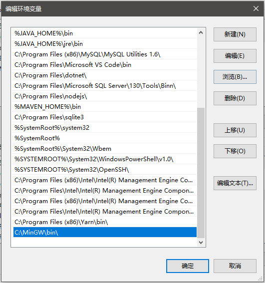

# 环境搭建

操作系统这东西比较复杂，单纯学习理论知识而不去实践是不行的，本系列笔记主要参考《30天自制操作系统》和《Orange'S 一个操作系统的实现》这两本书，着手实现一个简单的操作系统内核。

开发环境这里使用Windows10+Cmder终端（便于使用一些Linux命令）和Bochs虚拟机，汇编器和编译器选择NASM和MinGW，建议暂时关闭Windows Defender、360等软件，否则你编译输出的二进制文件经常会被这些杀毒软件识别为病毒而误删，导致不必要的麻烦。


注：如果使用Linux系统，用到的工具和这里基本一样，而且安装更加简便，这里就不多介绍了。

## 安装MinGW

MinGW（Minimalist GNU for Windows）是一个工具包，可以安装Windows版的GNU编译器套件，比如我们在Linux上常用的GCC等。

MinGW官网：[http://www.mingw.org/](http://www.mingw.org/)

进去后在左边找到Download，下载一个叫做MinGW Installation Manager的工具，这个是Windows版GNU编译器套件的下载工具，我们通过这个工具安装Windows版的GCC等编译器，这里不得不吐槽下，MinGW官网和这个破下载工具做的都很难用。

安装好后，打开这个工具，在Basic Setup中选择如图两个选项，安装基本工具和Cpp编译器（什么ada、fortran、oc的我都完全没用过，就不选上了）：


选择完后，下载之前首先确保你的网络能连上source forge，否则要挂个代理。确认下载点击`Installation->Apply Changes`。

安装完成后，加一下环境变量：



写个简单的代码，测试一下编译器：

```c
#include <stdio.h>

int main()
{
	printf("Hello, world!\n");
	return 0;
}
```

编译执行：


## 安装NASM

NASM汇编器下载地址：[https://www.nasm.us/pub/nasm/releasebuilds/2.14/win64/](https://www.nasm.us/pub/nasm/releasebuilds/2.14/win64/)

一路下一步即可，安装完成后，加一下环境变量：


写段汇编，调用C标准库的`printf`，测试下汇编器：

```asm
global _main
extern _printf

section .text
_main:
push	message
call	_printf
add		esp, 4
ret
message:
db		'Hello, World', 10, 0
```

编译、链接、执行：


## 安装Bochs虚拟机

除了Bochs，qemu也是可以的，但是我一直用的Bochs，比较熟悉，qemu没用过。

下载地址：[https://sourceforge.net/projects/bochs/](https://sourceforge.net/projects/bochs/)

下载完是个安装包，一路next就行了，安装完成后记得配一下环境变量。

新版本的Bochs直接启动时，会弹出一个GUI界面，选择一些配置（老版本是CLI界面），实际上如果使用Linux系统，我们开发时一般都是把Bochs集成到make里，对于Bochs虚拟机的配置则可以写到一个配置文件中，通过命令行参数进行加载。对于Windows操作系统，我们可以把配置文件命名为`bochsrc.bxrc`，然后双击该文件，就能基于该配置启动Bochs虚拟机了（貌似Windows下`-f`参数不好使，不知道是不是bug）。

bochsrc.bxrc
```
megs:32
romimage:file=$BXSHARE/BIOS-bochs-latest
vgaromimage:file=$BXSHARE/VGABIOS-lgpl-latest
floppya:1_44=a.img,status=inserted
boot:floppy
mouse:enabled=0
keyboard: keymap=$BXSHARE/keymaps/x11-pc-de.map
```

## Hello World

这里我们用NASM编写一个简单的引导扇区程序，该程序使用的是16位实模式，在Bochs虚拟机中输出一个红色的`Hello, world!`。

代码参考《Orange's 一个操作系统的实现》：
```asm
org		07c00h		;引导扇区会被BIOS装载到0x7c00处
mov 	ax,cs
mov 	ds,ax
mov 	es,ax
call 	DispStr
jmp 	$
DispStr:
mov 	ax,BootMessage
mov 	bp,ax
mov 	cx,16
mov 	ax,01301h
mov 	bx,000ch
mov 	dl,0
int 	10h
ret
BootMessage:
db 		"Hello, world!"
times 	510-($-$$) db 0
dw 		0xaa55		;软盘引导扇区的结束标志
```

运行汇编器，输出结果写入镜像：


运行虚拟机：


注：如果虚拟机提示找不到启动设备，检查下你的配置文件`bochsrc.bxrc`中，启动镜像的文件名和`dd`命令生成的镜像文件名是否一致。如果使用Windows操作系统，检查一下生成的二进制文件是否被杀毒软件误删。
