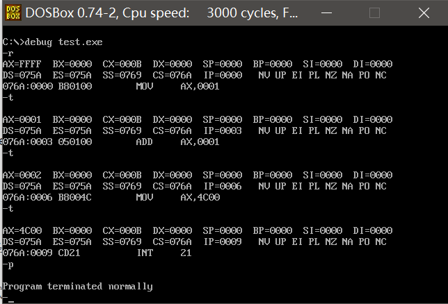

# 汇编语言实验环境搭建

本系列笔记参考王爽老师的《汇编语言 第三版》，这本书知识结构清晰，语言通俗易懂，是难得的好书。

我们编写的代码使用MASM汇编器，都是针对于8086处理器，采用16位实模式。有关32位保护模式的内容，将在操作系统相关章节介绍。

## 汇编语言简介

要想控制电子系统的硬件设备，我们必须使用电信号，对于计算机的CPU也是如此，如今所有的CPU都是基于二进制数字信号工作的，即只用导线上的高低电平两种状态表示0和1，这种方式稳定可靠，久经考验。我们指挥CPU帮我们干活，也必须使用二进制指令，但是如果对于我们人类来说，编写一长串`01010001`的代码，可读性极差，调试十分困难，因此汇编语被发明了出来。

汇语语言实际上就是用一些助记符代替了二进制指令，我们使用汇编语言编写代码，要做的事一目了然，可读性很好，汇编代码由汇编器翻译成二进制代码，CPU也能原原本本的遵照我们的意图去干活，因此使用汇编语言而不是直接用0和1编写程序，是有利无害的好事。

## 为什么要学习汇编语言

学习汇编语言主要有以下好处：

1. 了解直接操作计算机硬件的方式
2. 了解高级语言的底层实现，学习完汇编你会发现对C语言的理解直接上升了一个高度，而C语言又是许多现代高级语言VM或解释器的基础

## MASM环境搭建

我们采用的是DosBox+MASM5.0汇编器的方式进行实验，这套工具基本上比较接近书中Windows2000的环境，包括：

* DosBox0.74-2模拟器安装程序
* MASM.EXE MASM5.0汇编器
* DEBUG.EXE 调试工具
* LINK.EXE 链接工具

## hello world

装好DosBox后启动，即可看到DOS界面，盘符显示`Z:\>`，我们需要把我们的工作区挂载到DosBox中。

```
mount c e:\workspace_ciyaz\masm
c:
```

为了使用方便，我们直接把汇编器等工具解压到工作空间中。


我们主要用到的就是`MASM.EXE`，`LINK.EXE`和`DEBUG.EXE`。

下面编写一个简单的汇编程序，我们直接在DosBox外部使用Notepad++编辑就行了，DosBox只负责编译运行和调试：

test.asm
```asm
assume cs:codeseg

codeseg segment

mov ax,1
add ax,1

mov ax,4c00h
int 21h

codeseg ends

end
```

编译连接时，分别输入`MASM`和`LINK`，按提示操作即可。编译后会生成`obj`文件，链接后会生成`exe`可执行文件。

调试：
```
debug test.exe
```

参考书中的debug各种命令，我们可以看看寄存器是如何变化的。



## debug工具使用简介

这里我们简单介绍一下DEBUG.EXE工具的使用，方面快速查阅。

R命令：观察当前寄存器的值。

T命令：单步执行。

P命令：单步执行，但不会进入子程序和软中断。

D命令：查看内存区域的值，例如我们要查看偏移地址为`0`的内存，我们首先用R命令，发现DS寄存器值为`075a`，因此使用D命令：`d 075a:0`。
