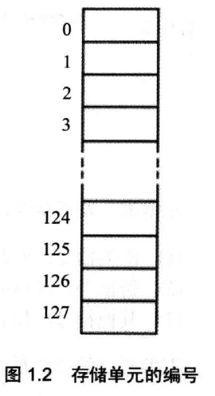
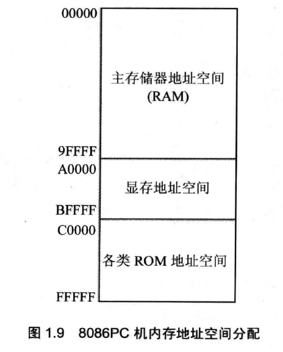

# CPU和存储器的基本概念

## 指令、数据、存储单元

“指令”和“数据”都是存储在内存或磁盘上的二进制信息，指挥CPU的二进制信息叫“指令”，被CPU操作的二进制信息叫“数据”。

对于存储器，我们将它划分成若干存储单元以便于使用，每个存储单元从0开始顺序递增编号，每一个存储单元可以存储8bit的信息，即一个byte（字节）。字节是存储器存储信息的最小单元。

## CPU和总线

我们编写程序时可以这样认为：CPU是我们的小弟，我们指挥他去干活，我们为CPU设计程序，要时刻站在CPU的角度考虑问题。CPU干活时，要读写存储器，那么肯定有几根导线连着CPU和存储器，这些导线称为总线。总线分为三类：

* 地址总线：用于CPU告诉存储它要访问哪个存储单元
* 数据总线：用于CPU操作的二进制信息的传输
* 控制总线：用于CPU告诉存储器，它要读数据还是写数据

## CPU寄存器

寄存器是CPU内部的高速存储结构，CPU运行时光靠RAM存储器是不行的，那样速度太慢了，CPU内部有自己的寄存器，分为通用寄存器（AX、BX、CX、DX）、段寄存器（DS、CS、SS、ES）、变址指针寄存器（SI、DI）、栈指针寄存器（SP、BP）、指令指针寄存器（IP）、标志寄存器（FLAG），这些寄存器会在用到的时候详细讲解。

## 主板、存储器、接口卡

主板是一块大电路板，上面安装了CPU、存储器、外围芯片组、以及各种接口卡插槽，所有这些设备都是通过总线和CPU相连的，所有这些设备都是由CPU指挥的，因此CPU可以干这些事：

* 读写主存储器
* 指挥接口卡干活
* 读写接口卡的存储器

存储器又分为两种：

* RAM：随机存储器，CPU能够读写
* ROM：只读存储器，如BIOS，由厂家写入数据后，CPU只能读数据而取不能向其写数据，想要改写或擦除ROM的数据就必须通过其他的手段了

## 内存地址空间

实际上，CPU操作所有设备都是把它们当做存储器来看待的，无论读写数据还是控制接口卡设备，要进行的操作都是“读”或“写”一些信息，因此人们就把所有和CPU相连的设备抽象的看成一个大的存储器设备，读写这个抽象的存储器设备，就需要给要操作的数据编号，所以就有了内存地址空间的概念。

