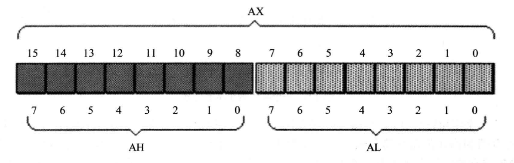

# 通用寄存器

8086CPU的所有寄存器都是16位的，可以存放2个字节（一个字长），AX、BX、CX、DX通常用来存储通用性的数据，被称为通用寄存器。

图中是AX寄存器，AX还可以分为两个8位寄存器，高8位称为AH，低8位称为AL。

## AX、BX、CX、DX的细微区别

一般来说，这四个寄存器都是用来存放通用数据的，比如我想计算`1+1`，那么我用哪一个寄存器累加都可以，但是习惯上我们还是会使用AX进行这个操作，基于这些习惯，CPU指令的设计者也为AX、BX、CX、DX赋予了一些特别的功能。

### AX：累加寄存器

常用于存储算数运算的结果，比如：`ADD AX,1`。

### BX：基地址寄存器

常用于存放变址访问内存时的基地址，即`DS:[BX+SI]`这种形式。AX、CX、DX是不允许出现在地址中的。

### CX：计数寄存器

常用于存储循环时的计数变量，使用`LOOP`指令就必须设置CX寄存器的值。

### DX：数据寄存器

在双字长乘除法时和AX结合使用，DX用于存储高16位。
