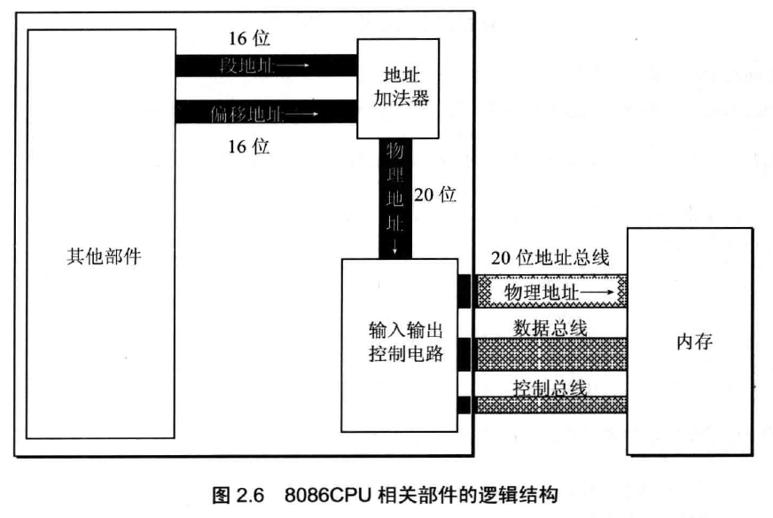

# RAM存储器的访问

## 8086的段偏移寻址

前面介绍过RAM存储器和总线的概念，8086CPU有20根地址总线，具有1MB的寻址能力。

但是我们知道，8086CPU的字长是16位的，那么20根地址总线是怎么利用起来的呢？这是因为8086CPU采用的是“段地址：偏移地址”的形式进行内存访问，我们编写的汇编指令会给出两个16位的数字，分别表示段地址和偏移地址，CPU会计算“段地址x16+偏移地址”得出最终访问的地址。



注：“段地址x16”也可以看做“段地址左移4位”，因此就是共20位地址了。

## 段寄存器

8086有四个段寄存器：CS、DS、SS、ES。几乎所有的程序都有代码段、数据段、栈段，这里我们简单了解下这些段寄存器的作用。

### CS 代码段寄存器

EXE文件加载到内存中，CPU要运行这个程序，肯定要知道代码在哪里，这个是通过CS:IP在EXE文件的描述信息中指定的。

* CS：代码段寄存器
* IP：指令指针寄存器

前面讲了段偏移寻址，CS:IP表示的就是物理地址“CSx16+IP”。每执行一条指令，IP会自动增加刚刚执行过的指令的长度，以正确指向下一条要执行的指令，此外我们也可以通过`JMP`指令手动指示CS寄存器和IP寄存器的值，效果就是跳转到了另一段代码上。

注意：CS寄存器和IP寄存器都是不能直接设置的，它们必须通过`JMP`指令间接指定。

### DS 数据段寄存器

数据段一般存储一个程序要操作的数据区域，通常是静态定义的，对应于高级语言，静态变量就会在数据段初始化（动态申请的内存则属于操作系统分配的堆内存）。

使用DS寄存器的例子：

```asm
mov bx,1000h
mov ds,bx
mov ax,ds:[0]
```

上面代码中，我们为DS寄存器设置了值为1000h，然后将段偏移地址为“1000h:0”对应的数据（长度为一个字长）送入AX寄存器。

注意：DS寄存器也是不能直接设置的，必须通过另一个通用寄存器间接设置，这是8086处理器出于性能考虑规定的。

### SS 栈段寄存器

栈的意义不必多说，SS寄存器存储的就是栈段的段地址，栈操作一般是通过`PUSH`和`POP`指令，而不是直接通过段偏移地址进行操作，栈操作将在后续章节重点介绍。

SS和DS一样，不能直接设置。

### ES 附加段寄存器

ES寄存器用于存放一个辅助数据段的段地址。

## 内存寻址方式

寻址方式我们大致可以分为三类：直接寻址、间接寻址、基址变址寻址。

1. 直接寻址：直接给定一个立即数作为内存偏移地址
2. 间接寻址：常用于数组操作，使用BX、DI、SI这些可作为地址的寄存器指定内存偏移地址
3. 基址变址寻址：常用于二维数组操作，使用两个寄存器相加作为内存偏移地址

寻址方式的例子：

* 直接寻址：例如`mov ax,ds:[0]`
* 寄存器间接寻址：例如`mov ax,ds:[bx]`
* 寄存器相对寻址：例如`mov ax,ds:[bx+1]`
* 基址变址寻址：例如`mov ax,ds:[bx+si]`
* 基址变址相对寻址：例如`mov ax,ds:[bx+si+1]`
