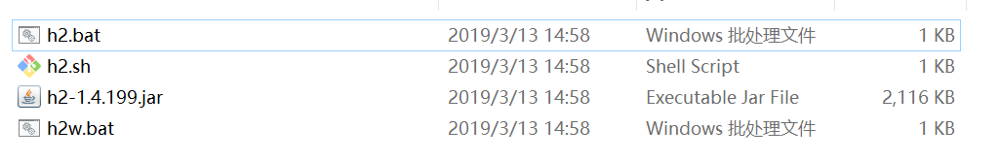
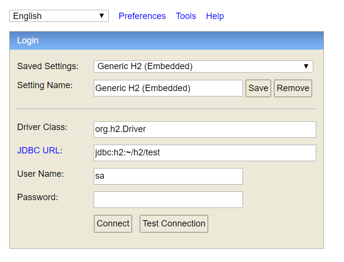
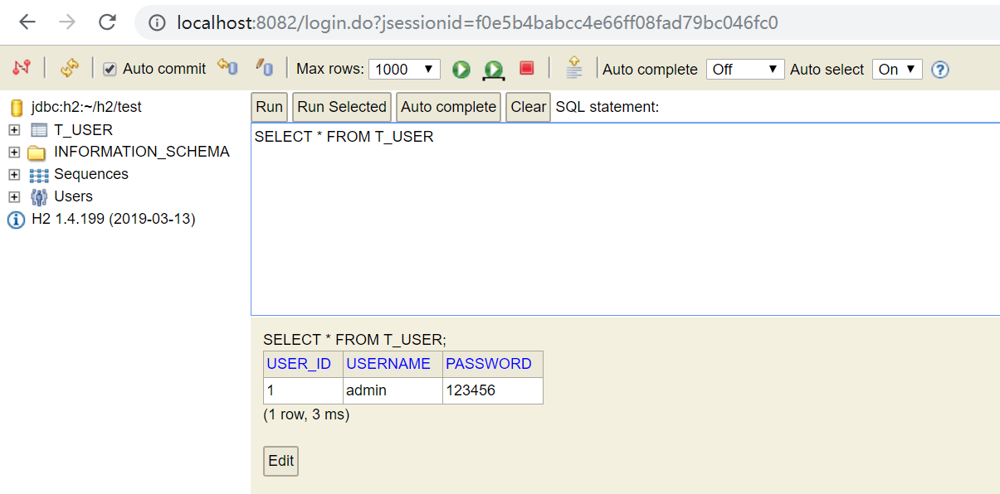
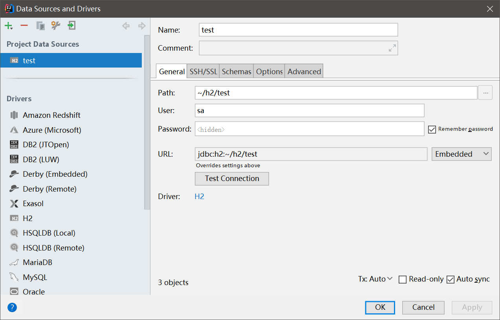
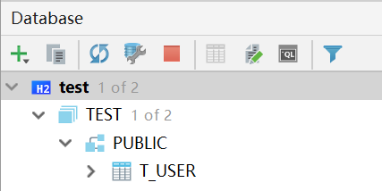

# H2数据库简介

H2是一个Java编写的关系型数据库系统，不同于擅长支撑大型系统的MySQL、Oracle这些数据库管理系统，H2主要用于应用在嵌入式数据库以及单元测试。H2功能比较简单，大多数功能都是在和Java生态做整合，这里我们简单介绍一下如何使用H2数据库。

[https://www.h2database.com/](https://www.h2database.com/)

下载链接可以在官网中找到。

## H2简单使用

运行对应的启动脚本启动H2数据库控制台。注：`h2w.bat`会在Windows任务状态栏注册一个图标，没什么特别的功能。

登录`http://localhost:8082/login.jsp`，即可打开H2数据库的管理控制台页面。

我们这里以嵌入式模式`Embedded`访问，要设置一下`JDBC URL`，它指向H2数据文件，设置好后直接点击`Connect`就可以了。

## H2控制台

进入H2控制台后，就可以以图形界面的形式操作H2数据库了，这和功能其实和`phpmyadmin`很像，这里不多做介绍。

由于我们是以嵌入式模式访问数据文件的，因此要注意H2控制台不要和我们真正的应用程序冲突了，如果我们的应用程序需要访问H2数据库文件，就要关闭H2数据库控制台服务端应用程序。

## 服务器模式和嵌入式模式

这里要注意：H2分为服务器模式和嵌入式模式，说白了服务器模式就是多个H2客户端通过网络协议访问H2服务器，嵌入式模式就是应用程序通过H2驱动直接访问数据库文件，一个应用程序会锁定使用中的数据库文件。

其实基于H2的应用场景，服务器模式并没有什么用处，我们一般都是使用嵌入式模式。

而我们看到的`localhost:8082`这个页面是另外的一个管理工具，可以看做是一个应用程序，能以嵌入式的形式访问H2数据文件，它和服务器模式无关。

## Intellij IDEA集成

我们直接在Intellij IDEA的数据源窗口中，配置一个H2数据源就行了。但是要注意，和H2管理控制台一样，如果使用嵌入式模式，我们应用程序启动前要断开IDEA中的数据源连接。

