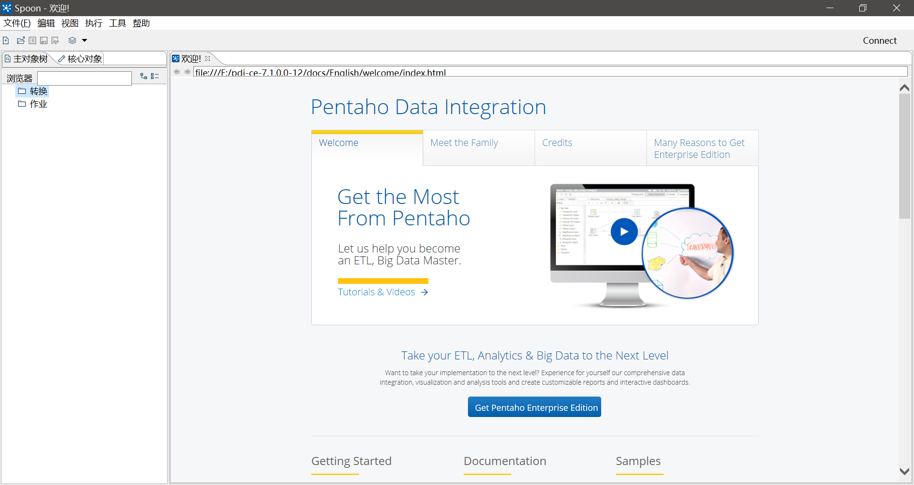

# Kettle简介和环境搭建

## 什么是ETL

无论是业务支撑系统或是企业资源管理系统等等，这些业务系统在运行时会产生各种数据记录，它们可能数据模型各不相同，而且分散在不同的数据库中，甚至同一个字段也有不同的标准（当然这都是历史原因造成的）。

当我们的业务规模非常庞大时，就会产生把这些数据抽取出来进行清洗、处理、整合的需求，以供我们对企业的运营状态进行分析，实现监控，以及为今后发展做出规划的目的。这个抽取整合的过程就叫做ETL（Extract，Transform，Load，即数据的抽取转换加载），用于采集分析的数据库通常被称为数据仓库（DWH，Data Warehouse）。

我们手写代码进行ETL，代码和业务高度耦合，没法复用，每次新加需求都要写新的代码，这就需要很大的人力成本，ETL代码也会随着业务和人员变更，变得无法维护。因此各种ETL工具就为了简化这个过程，而被设计出来了。

## Kettle简介

Pentaho Kettle是一个开源的ETL工具集，主要能够实现数据整合，数据抽取同步，数据迁移，定时采集（部署在服务端）等任务，它不是一个软件，而是一组软件。

Kettle功能很强大，设计的也是越来越复杂，但是对于普通的开发者来说，其实只使用其中的几个简单功能就能完成大部分任务了，而且同一个功能也有多种实现方式，数据采集通常也无所谓效率（只要不过分影响业务数据库的正常访问就行）。而难点恰恰在业务上，而不是Kettle工具本身。

本系列笔记主要介绍Kettle的安装部署和简单使用。

## Kettle基本概念

### 作业（Job）和转换（Transform）

Kettle中用“作业”表示一组转换过程，用“转换”表示从一组数据到另一组数据的变换过程。我们可以用拖拽流程图的形式，在Kettle中编辑作业和转换。编辑完成后，会对应生成一些`.ktr`和`.kjb`文件，这些文件是XML格式，其中定义了ETL的各个流程（可以看做是一种脚本）。通常，我们需要把这些脚本放在服务器上执行。

### Spoon

Spoon是一个集成开发环境，前面提到我们需要用`.ktr`和`.kjb`定义流程，当然我们不能手写它们，而是以拖流程图的形式进行定义的，这些文件的可视化编辑器就是Spoon。

### Kitchen、Pan、Carte

我们编写好作业和转换后，当然就要执行它们了。Kitchen和Pan是Kettle中的两个shell脚本，分别用于执行`.kjb`和`.ktr`。它们通常部署在服务器上，我们可以直接用crontab以命令的方式调用这两个工具，实现数据定时抽取。

Carte是另一个稍微复杂的组件，它包含一个HTTP服务端，能够让我们更方便的进行定时执行等任务的部署，使用Carte就不再需要crontab了，十分便于大量Kettle任务的维护。当然如果Kettle的任务并不是很复杂的情况下，crontab更加容易使用（基本了解Linux的运维和开发人员都懂得使用crontab，但真的很少有人听说过Kettle、Carte）。

## Kettle安装

Kettle可以在SourceForge中找到我们需要的版本：

[https://sourceforge.net/projects/pentaho/files/Data%20Integration/](https://sourceforge.net/projects/pentaho/files/Data%20Integration/)

注：Kettle服务器部署的版本和开发时用的Spoon版本最好一致。

Kettle是SWT编写的，因此需要JRE。下载好后，我们启动Spoon.bat（Linux下是shell文件），该批处理会执行对应的Java启动命令，打开Spoon集成开发环境了。

Kitchen和Pan等的启动脚本也都在Kettle的根目录下，我们可以把整个包复制到服务器上使用。

补充：Spoon中，有很多专业术语中文翻译不好，而且翻译的不完整（版本为7.1），大家都看不懂，建议调成英文版使用，语言可以在设置中调整。
