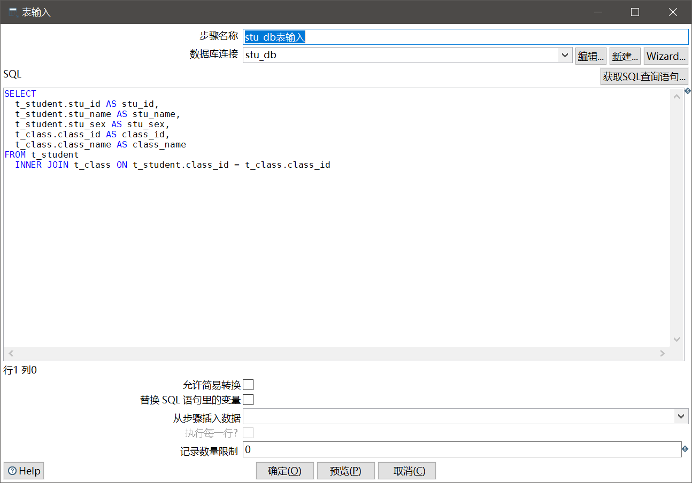
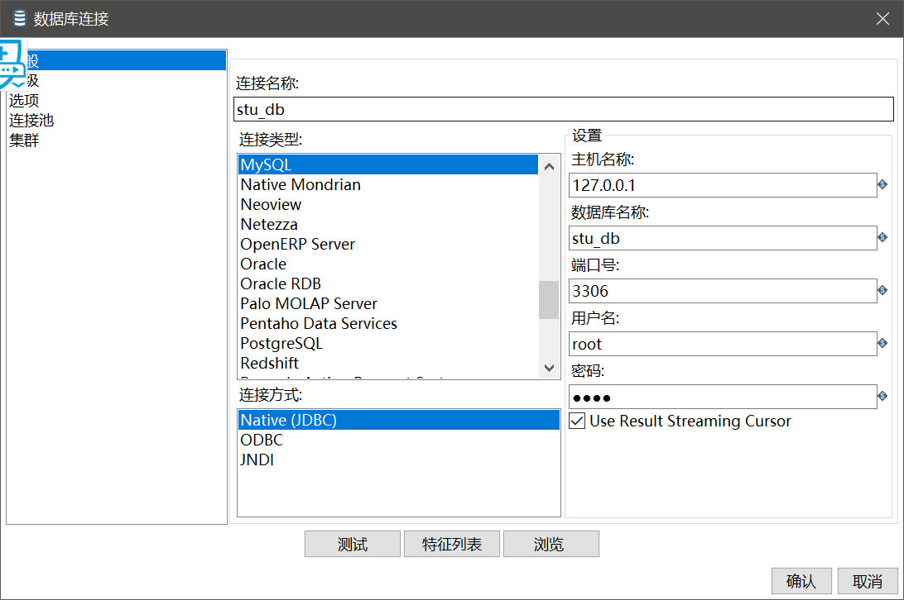
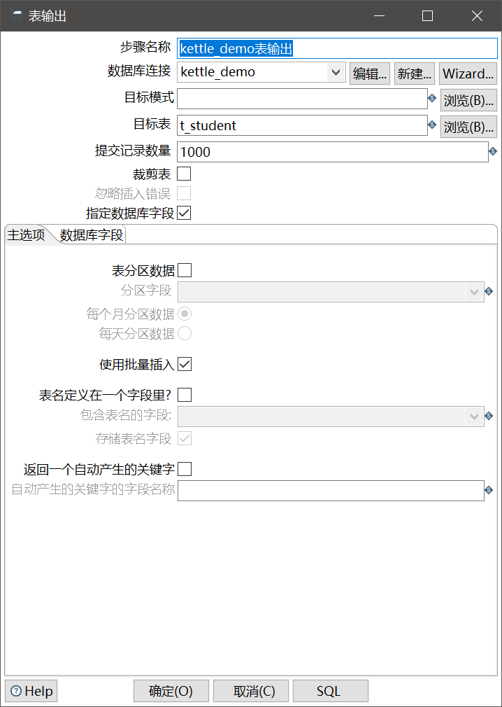
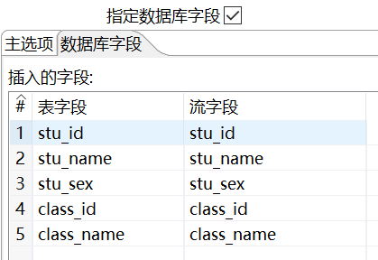
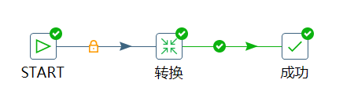
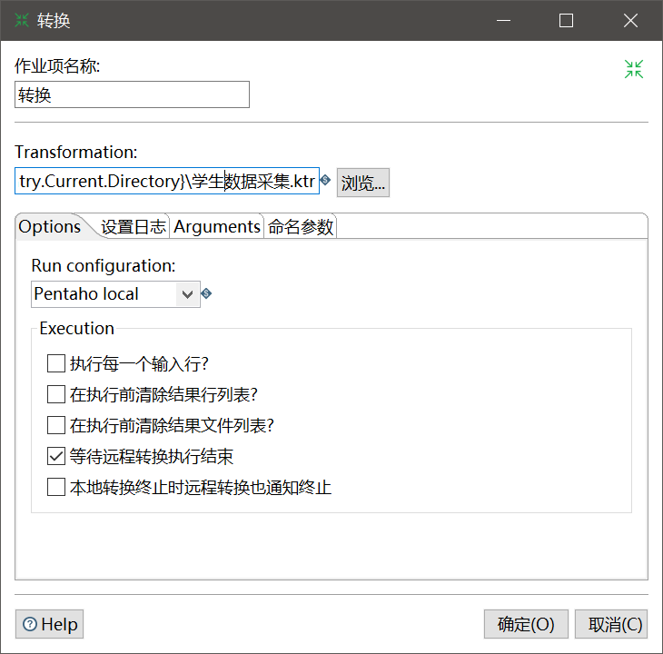
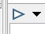
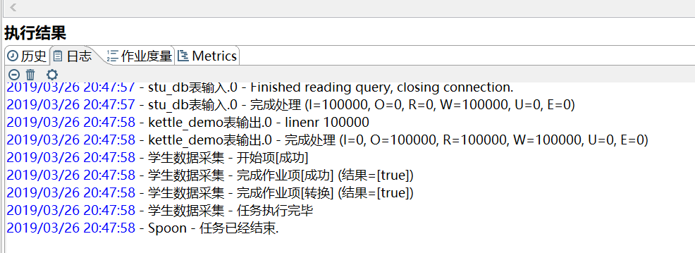
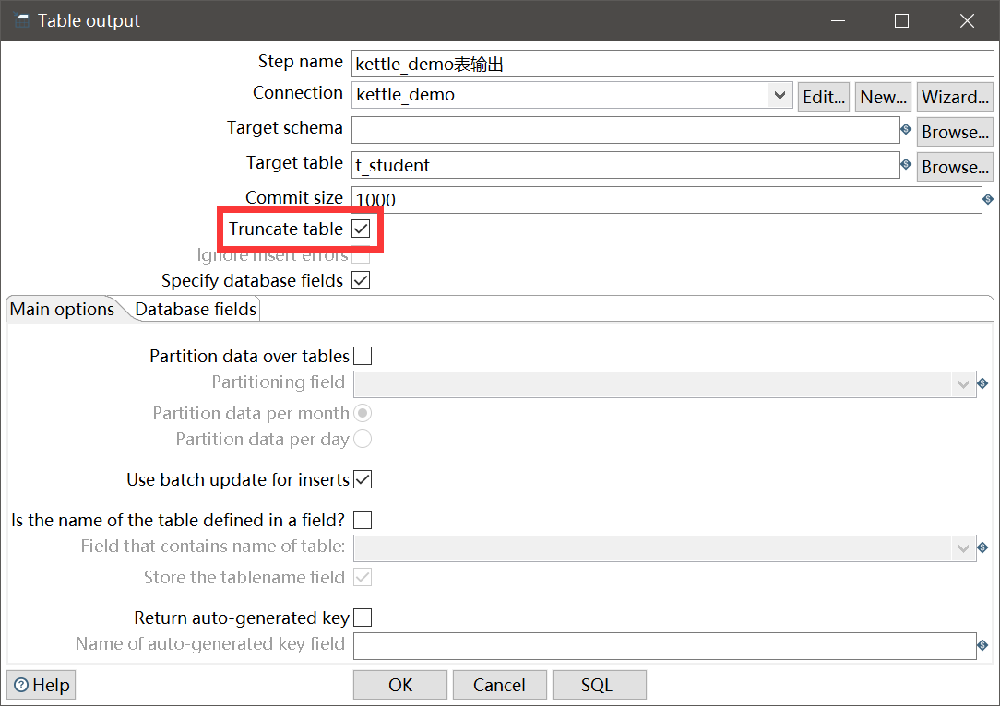

# Kettle实现数据抽取整合

下面我们直接从例子入手，学习如何用Kettle实现数据的抽取和整合。

## 实验环境数据准备

这里简单起见，我们就使用本机的MySQL数据库。首先我们新创建两个数据库，以及三张表。

数据库 stu_db：
```sql
create table t_student(
	stu_id bigint primary key auto_increment,
	stu_name varchar(20) not null,
	stu_sex varchar(10) not null,
	class_id bigint
);

create table t_class(
	class_id bigint primary key auto_increment,
	class_name varchar(255) not null
);
```

假设该库是我们采集的业务数据库，其中定义的两个表分别是学生表和班级表，两者有外键关联关系（并未实际创建外键）。

数据库 kettle_demo：
```sql
create table t_student(
	stu_id bigint primary key auto_increment,
	stu_name varchar(20) not null,
	stu_sex varchar(10) not null,
	class_id bigint not null,
	class_name varchar(255) not null
);
```

假设该库是我们的数据仓库，其中包含一张用于计算的宽表，该表包含了学生和该学生所在班级的信息。这里，我用脚本在`stu_db`中模拟插入了100个班级信息和10万条学生信息，作为模拟数据。

## 创建ktr

在Spoon中点击`文件->新建->转换`，然后在左侧`核心对象`中找到`表输入`和`表输出`这两个组件，拖入工作区中。然后连接一条线（按住Shift从输入拖向输出，或者点击组件旁边的小图标）。


`表输入`和`表输出`是Kettle中最最基础的两个转换组件，它们可以实现从一个表中抽取数据，写入另一个表。

编辑`表输入`组件，这里编写一些查询SQL。Spoon的SQL编辑器非常弱，建议用专业的编辑器写好并测试通过后粘过来。



然后编辑数据库连接，我们填入正确的数据库连接信息就可以了。



编辑`表输出`组件，主要是选定要操作的目标表。



注意，上面我们选中了`指定数据库字段`，无论有多少个字段，这个都最好选上，然后手动指定字段的映射。虽然不是必须这样做，但是手动写上能提醒我们：操作数据时要十分严谨，切不可大意。



注：别忘了输出组件也要新建一个数据库连接，因为我们操作的输入和输出不是同一个数据库。

## 创建kjb

在Spoon中点击`文件->新建->作业`，和ktr操作差不多，在`核心对象`中找到`START`、`转换`、`成功`这三个组件拖进来并创建流程。



编辑`转换`组件，这里指定我们刚才编辑的ktr即可。



注意：这里我们用了`${Internal.Entry.Current.Directory}`这个内置变量，因为这里我们是用kjb引用ktr，所以kjb要知道ktr存储在哪里了，但是我们又不能指定一个绝对路径，因为我们的kjb和ktr是要放到服务器上执行的。这时，`${Internal.Entry.Current.Directory}`这个内置变量就派上用场了。

## 测试执行



如果设置的输入输出数据库连接配置，能够正确连接到数据库，那么我们可以在Spoon的kjb编辑中，点击左上角三角按钮，触发一次测试执行。执行的日志会显示在下方：



注：启动时可以调整日志级别。

## 仍然存在的问题

实际上，上面的做法并不完全正确。我们抽取一次数据后，第二次再执行kjb就会报错，因为两次插入相同的数据，会导致违反了主键的唯一性约束，SQL会拒绝执行。简单粗暴的解决办法是抽取数据前清空目的数据表，这样我们每次抽取数据，其实都是完完全全重新进行的。



但是在数据量达到千万规模或者抽取逻辑十分复杂导致效率低下时，就很不可取了。下一篇笔记介绍如何实现增量更新。
