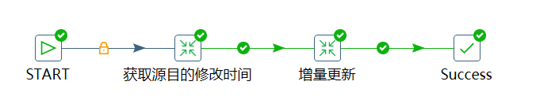
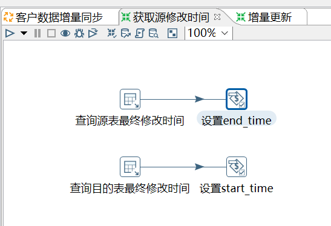
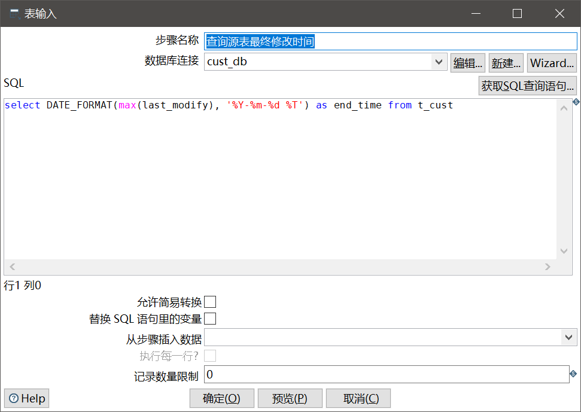
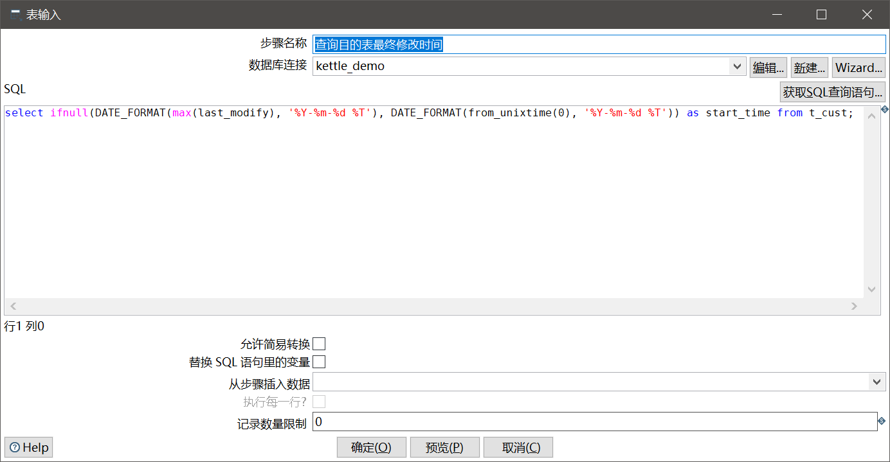
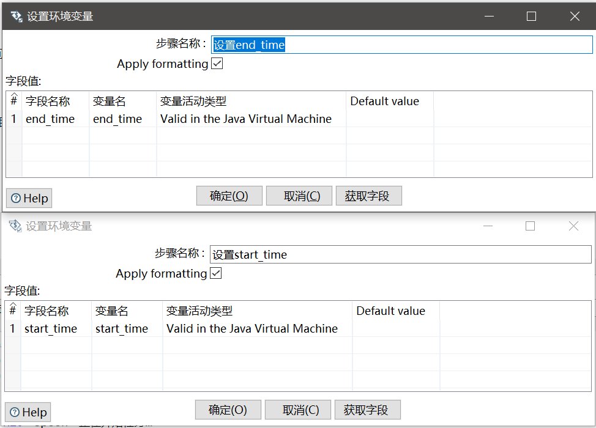
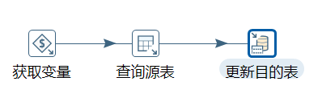
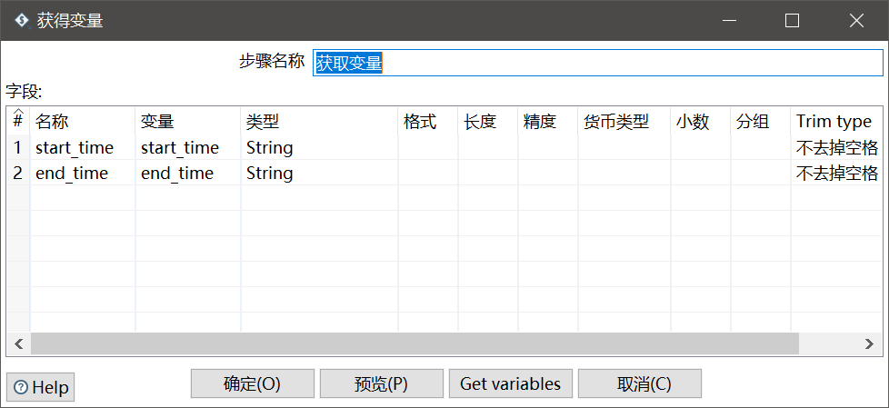
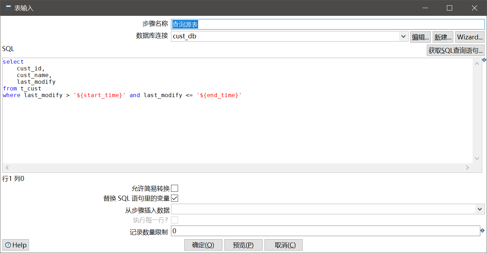
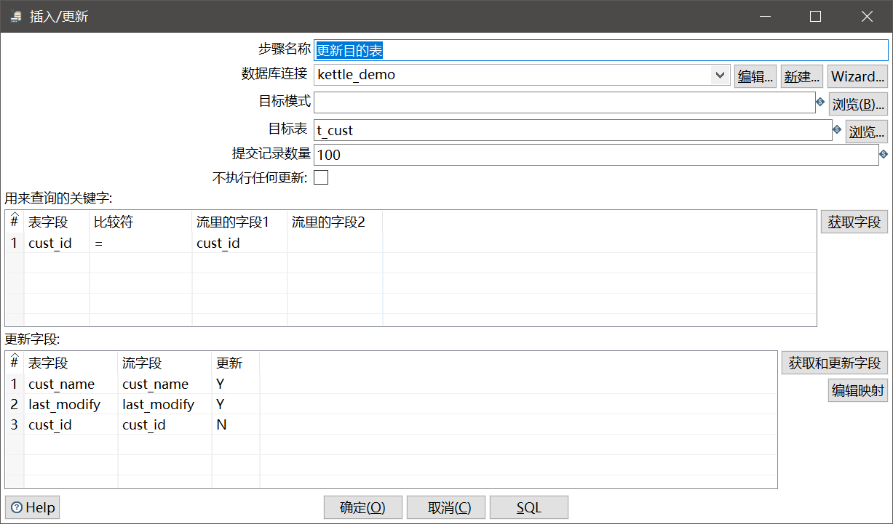

# 实现增量同步

将两个数据库中的数据进行同步的需求非常常见，同步数据自然有两种办法：全量和增量。全量同步自不必说，插入目的表前将其清空即可，这里主要介绍如何实现增量同步。

## 实现增量同步的前提

数据更新，包括：增、删、改。但是现在一般删是不可能删的，出于安全起见，我们从设计数据库的业务系统时，一般就不会真的`delete`一条数据，而是增加一个标志位记录该条数据还是否有效，因此删的情况就排除掉了。

此外，要实现增量同步，我们必须得知道相对于目标数据库，哪些数据发生了更新。数据更新时，业务系统通常会插入一个时间戳，表示该条数据的最终修改时间，我们就是基于此实现数据增量同步的。如果真的没有这个时间戳，可以考虑以下方法：

1. 全量同步
2. 如果是MySQL自增主键，可以通过主键顺序实现增量同步
3. 把对方DBA打一顿

## 实验环境数据准备

简单起见，我们这里准备本地MySQL中的两个数据库，从`cust_db`数据库中增量同步到`kettle_demo`数据库。两个数据库中有同样结构的一张表（实际情况通常不会如此简单），表示客户信息。

t_cust
```sql
create table t_cust(
	cust_id bigint primary key auto_increment,
	cust_name varchar(20) not null,
	last_modify timestamp not null
);
```

这里我们用脚本编写一个模拟程序，每秒钟随机向`cust_db`中插入若干条数据，并更改若干条数据，然后用Kettle实现一个增量同步的过程。这样，我们每次执行这个增量同步过程，目的数据库中的内容都会增量更新。

## Kettle实现

我不知道这样实现是否简介高效，但总之它是好使的。



### 转换之获取源目的修改时间

这里面我们用到了Kettle中的变量，在“获取源目的修改时间”这一步时，我们获取了两个变量：

1. 源库最终修改时间，作为我们增量判断的上界
2. 目的库最终修改时间，作为我们增量判断的下界

下面是这一步的实现：



两步查询的SQL语句：



```sql
select DATE_FORMAT(max(last_modify), '%Y-%m-%d %T') as end_time from t_cust
```



```sql
select ifnull(DATE_FORMAT(max(last_modify), '%Y-%m-%d %T'), DATE_FORMAT(from_unixtime(0), '%Y-%m-%d %T')) as start_time from t_cust;
```

注意：这里我们查出时间戳字段后，使用了MySQL的`DATE_FORMAT`函数对其进行了格式化并设置为字符串变量，后面我们取出时则是再次转换成了时间戳格式作为查询条件，这样能避开一些坑。

设置变量的操作就非常简单了：



### 转换之增量更新

这里我们先用`获取变量`组件取出变量，然后通过增量更新的时间戳限制用`表输入`条件查询数据。查询得到的结果通过`插入/更新`组件同步到我们的数据仓库。



获得变量这里就是取得之前设置的两个时间条件，这里我们采用String类型进行取用，和之前查询结果保持一致。



查询源表：



这里一定要勾选上“替换SQL语句里的变量”，我们设置的变量才能生效，否则`${xxx}`是原样输出的。

```sql
select
	cust_id,
	cust_name,
	last_modify
from t_cust
where last_modify > '${start_time}' and last_modify <= '${end_time}'
```

注意：所谓的“变量”其实就是简单的模板字符串替换，因此不要忘了加上引号，以免SQL语法报错。

更新目的表：



这次我们使用的组件和前一篇笔记的`表输出`不同，这里为了实现增量更新我们使用的是`插入/更新`组件，它通过定义一组唯一约束来选择性的进行“更新”，这里所说的更新是指：当该约束所对应的表记录存在时执行`update`，不存在时执行`insert`。

更新的字段我们也是手动设定的。
