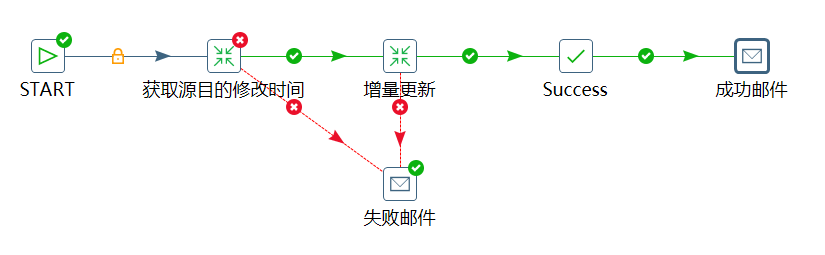

# 数据同步邮件通知

我们把Kettle扔在服务器上执行，执行结果会输出到日志中。但是，我们每天都要登录服务器检查好多日志，这显然是不可行的，而且也不利于我们及时发现执行失败的状况。

Kettle支持以邮件的形式通知我们执行结果。

## Kettle发送邮件

我们这里基于上一节客户数据增量同步的例子，增加两个发送邮件的`Mail`组件。这个组件的配置和各种邮件客户端都差不多，只不过`Mail`组件只管发邮件，不管收。因此只需要配置SMTP协议就可以。

双击`Mail`组件可以看到一些配置项，前两页比较简单，配置我们发送的邮件地址，以及SMTP服务器的信息，第三页就是设定我们邮件的内容，第四页可以设定附件。

注意：我们不能只通知成功邮件，而不通知失败邮件，因此我们设定了两个`Mail`组件，一个连接了成功的状态，另一个连接了失败的状态。
