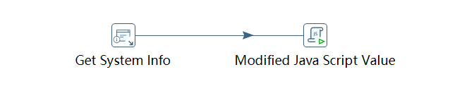

# 自定义脚本逻辑

Kettle中能够编写「Java Script」脚本（你没看错，这里应该就是写作Java Script而不是JavaScript），实现我们的一些自定义的数据处理逻辑。这个所谓的「Java Script」用法比较怪异，难编写，难调试，而且坑非常多，不要试图用它实现复杂的逻辑。

在Kettle中我们用Java Script语法调用Java接口，说白了就是用JavaScript写Java这门编译型语言的脚本，底层执行原理不明，可能是通过调用类似Rhino这种JavaScript解释器实现的，并且实现了一些自己的函数库。但JVM上已经有Grovvy等优秀的脚本语言了，Kettle居然使用JavaScript，这可能是历史原因造成的。

## 脚本组件


找到`Scripting -> Modified Java Script Value`，拖入编辑器中即可。

## 编写脚本例子

下面代码是一个实际的数据采集中，用来组织几个时间变量的脚本。

```javascript
// 根据系统时间获取查询所需的时间
var date = new java.util.Date();

// 获取前一天时间
var calendar = java.util.Calendar.getInstance();
calendar.setTime(date);
calendar.add(java.util.Calendar.DATE, -1);
date = calendar.getTime();

// 格式化
var formatDate = new java.text.SimpleDateFormat("yyyy-MM-dd").format(date);

// 组装几个需要使用的时间点
var startTime = formatDate + " 00:00:00";
var endTime1 = formatDate + " 18:00:00";
var endTime2 = formatDate + " 23:59:59";
var endTime3 = formatDate + " 22:00:00";

// 设置变量
setVariable("GATHER_DATE", formatDate,"r");
setVariable("START_TIME", startTime,"r");
setVariable("END_TIME1", endTime1,"r");
setVariable("END_TIME2", endTime2,"r");
setVariable("END_TIME3", endTime3,"r");
```

代码逻辑非常简单，就是调用`java.util.Date`和`java.util.Calendar`生成昨天的日期并格式化，然后和几个固定的时间字符串拼接，最后通过`setVariable()`设置变量，后续的「转换」步骤就可以使用这里设置的变量了。

注：不要忘记任何设置的变量都不能在当前「转换」中使用。

## 注意

如果你单独在一个转换中，只有一个脚本组件，它是没法执行的，一个转换必须有一个数据转换流程的定义（也就是说需要有一个箭头），所以我们可以用`Get System Info`组件创建一个空的输入，它没有任何实际作用，但是不加上我们的脚本就永远不会被执行。



## 调试

Kettle的自定义脚本可以通过打日志的方式进行调试，这需要用到`writeToLog()`函数，用法例子：

```javascript
writeToLog("d", "script set variable GATHER_YEAR: " + gatherYear);
```

其中第一个参数`d`表示这是一个`Debug`级别的日志，我们一般都使用此级别输出调试日志。在Spoon开发环境中，默认日志级别是不包括`Debug`级别的，需要在运行时特别指定。如果使用Kitchen在服务器上运行，想要看到调试日志，可以通过指定日志级别参数：

```
kitchen.sh -file xxx.kjb -level=Debug
```

注意`Debug`这个参数值的大小写，写错是无法识别的。

## 帮助

Kettle缺乏文档，也缺乏足够的用户经验，前面我们用到了`setVariable()`这个函数用来设置变量，那么我们在哪里可以找到这些函数的文档呢？其实脚本组件内置了一个简单的文档。


在脚本组件左侧，可以找到内置函数提示，右键选择`Sample`，可以查看一个函数的文档和例子。

`date2str()`函数的示例：
```javascript
// Converts the given Date to a string Value.
//
// Usage:
// date2str(var);
// 1: Date - The Variable with the Date to convert.
// This call uses your localized format.
//
// date2str(var, var);
// 1: Date - The Variable with the Date to convert.
// 2: String - The Format:
//        yy / yyyy - 06 / 2006
//        MM / MMM / MMMMM - 11 / Nov / November
//        d / dd  - 1 / 01
//        E / EEEE - Tue / Tuesday
//        hh / HH - 11 / 23
//        m / mm - 5 / 05
//        s / ss - 8 / 08
//
// date2str(var, var, var);
// 1: Date - The Variable with the Date to convert.
// 2: String - The Format:
// 3: String - The Locale Parameter
//    A valid ISO Language Code. (DE = German, EN = English, FR = France, ...)
//
// date2str(var, var, var, var);
// 1: Date - The Variable with the Date to convert.
// 2: String - The Format:
// 3: String - The Locale Parameter
//    A valid ISO Language Code. (DE = German, EN = English, FR = France, ...)
// 4: String - The Timezone Parameter.
//    A valid timezone: EST, GMT, ... (if invalid GMT will be selected as default)
//
// 2006-11-15
//
var dValue = new Date();
Alert(date2str(dValue));
Alert(date2str(dValue,"dd.MM.yyyy"));
Alert(date2str(dValue,"dd.MM.yyyy HH:mm:ss"));
Alert(date2str(dValue,"E.MMM.yyyy","DE"));
Alert(date2str(dValue,"dd.MM.yyyy HH:mm:ss","EN"));
Alert(date2str(dValue,"dd.MM.yyyy HH:mm:ss","EN", "EST"));
```
