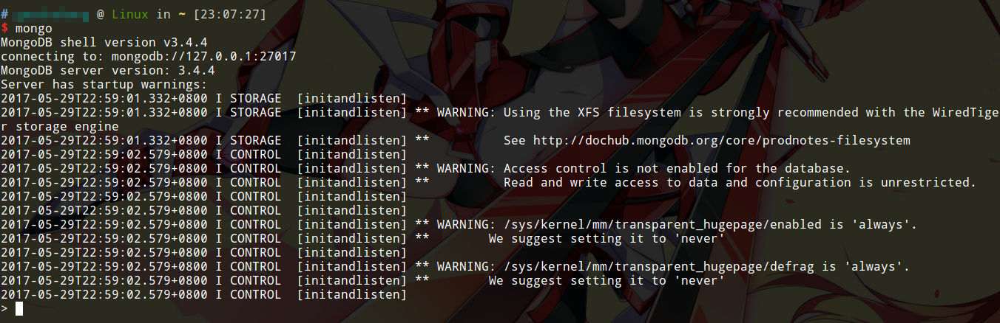
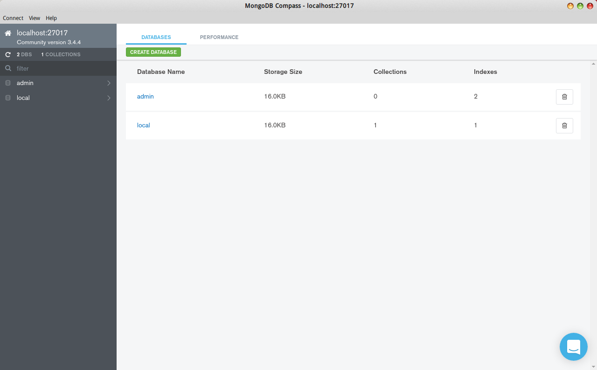
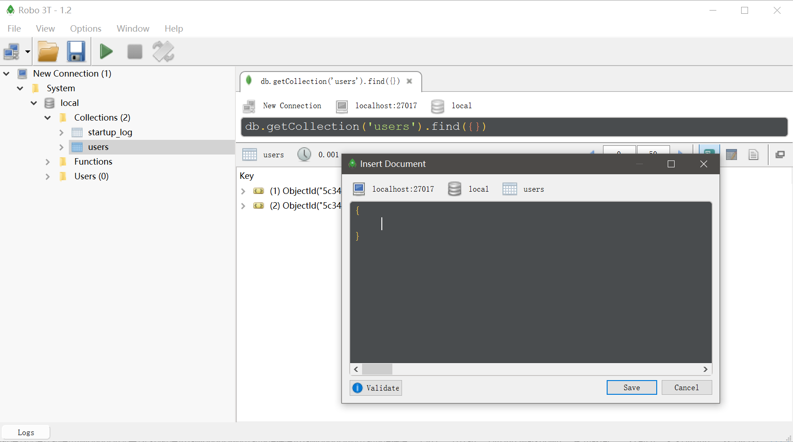

# MongoDB

MongoDB是一个基于分布式文件存储的数据库系统，由C++语言编写，旨在为WEB应用提供可扩展的高性能数据存储解决方案。MongoDB是一个介于关系数据库和非关系数据库之间的产品，是非关系数据库当中功能最丰富，最像关系数据库的产品。他支持的数据结构非常松散，是类似json的bson格式，因此可以存储比较复杂的数据类型。Mongo最大的特点是他支持的查询语言非常强大，其语法有点类似于面向对象的查询语言，几乎可以实现类似关系数据库单表查询的绝大部分功能，而且还支持对数据建立索引。

MongoDB服务端可运行在Linux或Windows平台，支持32位和64位应用，默认端口为27017。推荐运行在64位平台，因为MongoDB在32位模式运行时支持的最大文件尺寸为2GB。

MongoDB提供了详细的使用文档，使用过程中遇到问题，可以随时查阅：[https://docs.mongodb.com](https://docs.mongodb.com)

## MongoDB的使用场景

MongoDB 的主要目标是在键/值存储方式（提供了高性能和高度伸缩性）和传统的RDBMS系统（具有丰富的功能）之间架起一座桥梁，它集两者的优势于一身。根据官方网站的描述，MongoDB适用于以下场景：

* 网站数据：MongoDB非常适合实时的插入，更新与查询，并具备网站实时数据存储所需的复制及高度伸缩性。
* 缓存：由于性能很高，MongoDB也适合作为信息基础设施的缓存层。在系统重启之后，由MongoDB搭建的持久化缓存层可以避免下层的数据源过载。
* 大尺寸、低价值的数据：使用传统的关系型数据库存储一些数据时可能会比较昂贵，在此之前，很多时候程序员往往会选择传统的文件进行存储。
* 高伸缩性的场景：MongoDB非常适合由数十或数百台服务器组成的数据库，MongoDB的路线图中已经包含对MapReduce引擎的内置支持。
* 用于对象及JSON数据的存储：MongoDB的BSON数据格式非常适合文档化格式的存储及查询。

MongoDB的使用也会有一些限制，例如，它不适合于以下几个地方：

* 高度事务性的系统：例如，银行或会计系统。传统的关系型数据库目前还是更适用于需要大量原子性复杂事务的应用程序。
* 传统的商业智能应用：针对特定问题的BI数据库会产生高度优化的查询方式。对于此类应用，数据仓库可能是更合适的选择。
* 需要SQL的问题。

后期补充：从实际使用的角度来看，总的来说MongoDB能够部分替代MySQL，性能倒是其次，MongoDB的主要优势就是数据结构改动升级更加灵活，而且本身简单易用，集群部署（主从、主备、数据分片）非常简单，在一些需要快速迭代的业务系统中，MongoDB是真的方便了开发者，有效提升了团队生产力。

## 安装MongoDB

官方文档安装指南：[https://docs.mongodb.com/guides/server/install/](https://docs.mongodb.com/guides/server/install/)

本文以Ubuntu14.04为例安装当前最新的MongoDB3.4

添加软件源，刷新软件源索引数据库，下载安装MongoDB
```
sudo apt-key adv --keyserver hkp://keyserver.ubuntu.com:80 --recv 0C49F3730359A14518585931BC711F9BA15703C6

echo "deb [ arch=amd64 ] http://repo.mongodb.org/apt/ubuntu trusty/mongodb-org/3.4 multiverse" | sudo tee /etc/apt/sources.list.d/mongodb-org-3.4.list

sudo apt-get update

sudo apt-get install -y mongodb-org
```

启动MongoDB-server服务
```
sudo service mongodb start
```

使用命令行登入mongo服务器
```
mongo
```



## 彻底删除MongoDB

停止MongoDB服务器，彻底卸载软件包，删除数据文件
```
sudo service mongod stop

sudo apt-get purge mongodb-org*

sudo rm -r /var/log/mongodb
sudo rm -r /var/lib/mongodb
```

## 在Windows上学习MongoDB

Windows下连注册和管理服务都省了，下载MongoDB的压缩包后，直接解压，`bin`目录就是MongoDB提供的所有命令行工具。默认情况下，数据文件位于`C:/data`，我们在启动`mongod`时，可以直接用`--dbpath`指定一个新的目录。

## 使用shell

我们可以通过MongoDB提供的shell操作MongoDB的数据，这个功能和MySQL的shell类似，只不过MongoDB并不支持SQL语句，而是通过JavaScript语法在shell中进行查询。MongoDB的文档数据结构类似json，因此使用JavaScript进行操作具有天然的优势。

JavaScript的shell并不罕见，Chrome和Node环境都提供这种交互式shell。进入MongoDB的shell，在启动Mongod的情况下，终端中输入`mongo`就可以了。

我们也可以显示指定MongoDB服务器的IP和端口，例如：
```
mongo 127.0.0.1:27017
```

## MongoDB Compass和Robo 3T

MongoDB Compass是MongoDB官方推出的数据可视化工具，可以免费用于开发环境。这个软件功能比较复杂，基本就是以图形界面界面的形式制作了一个MongoDB的客户端。

下载地址：[https://www.mongodb.com/download-center#compass](https://www.mongodb.com/download-center#compass)



除此之外，常用的可视化工具还有Robo 3T，这个软件更像是加强版的MongoDB的shell，使用起来比较简单，我们学习MongoDB的时候可以用这个。



但是在使用Robo3T时，我也遇到过插入大量数据报错的情况，因此最为稳定可靠的还是MongoDB Shell。

## Ubuntu14.04下mongod服务开机启动

MongoDB不遵循sysV风格的服务配置，所以sysv-rc-conf里找不到MongoDB服务，如果我们想要将MongoDB配置为默认开机启动或者默认不开机启动，需要修改`/etc/init/mongod.conf`：

默认开机启动（默认就是开机启动的配置）
```
start on runlevel [2345]
stop on runlevel [06]
```

默认不开机启动
```
stop on runlevel [023456]
```

注意：修改配置文件前注意备份
