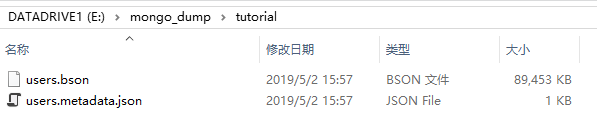

# 数据备份和导出

MongoDB能够将一个数据库以BSON二进制文件的形式导入导出，也能够以txt、xlsx等形式将集合数据导入导出。前种方式通常用来数据备份，后种通常用于不同数据处理系统之间的转换。

## 备份和恢复

MongoDB提供了`mongodump`和`mongorestore`实现数据库的备份和还原。这里我们继续用前面的例子`tutorial`数据库进行演示。

备份数据：
```
mongodump -h 127.0.0.1:27017 -d tutorial -o E:/mongo_dump
```

执行完成后，我们可以看到在相应目录生成的文件。



使用`db.dropDatabase()`将之前的数据库删除（请小心该操作），然后使用备份数据进行恢复，这个操作会比导出慢一些：
```
mongorestore -h 127.0.0.1:27017 -d tutorial --dir E:/mongo_dump/tutorial
```

## 导出和导入

下面例子直接以文本的形式，将`tutorial.users`集合导出：

```
mongoexport -h 127.0.0.1:27017 -d tutorial -c users -o E:/mongo_exp
```

该操作会生成一个巨大的文本文件`mongo_exp`，我们在命令行中也可以为其指定`txt`后缀，便于使用。

将数据库中该集合删除后，再次将其导入：
```
mongoimport -h 127.0.0.1:27017 -d tutorial -c users E:/mongo_exp
```
