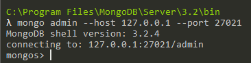

# 集群配置

MongoDB的一大亮点就是集群配置比较简单。和其它关系型数据库一样，MongoDB集群也是主要有这么三种形式：

1. 主从数据库实现读写分离，提高实时访问性能
2. 主备数据库实现实时热备份，一个节点宕机后，备份节点立即接替主节点工作
3. 分布式存储集群实现大量数据分片（Sharding）存储，也就是通常意义上的「分布式数据库」

由于和其它数据库概念都差不多，这里就简单介绍并演示一下。简单起见，就不真的用服务器了，演示使用本机的不同端口和多个数据库存储文件模拟多个MongoDB节点。

## 主备模式和主从模式

主备模式和主从模式其实差不多，只不过主备不允许读从节点，主从则是基于客户端负载均衡，能够读取任何一个节点。在这两种模式下，数据库节点分为「主节点」和「从节点」。从节点从主节点上实时同步数据，只有主节点具有写能力。

启动主节点：
```
mongod --dbpath E:/data/db1 --port 27017 --master
```

启动从节点1：
```
mongod --dbpath E:/data/db2 --port 27018 --slave --source 127.0.0.1:27017
```

启动从节点2：
```
mongod --dbpath E:/data/db3 --port 27019 --slave --source 127.0.0.1:27017
```

现在主节点上任何写入都会同步到从节点上。但现在从节点还不可读，我们可以在从节点上设置可读。登入从节点：
```
rs.slaveOk()
```

这样从节点也就可读了。

## 分片集群

分片集群比主从集群复杂的多，但好在MongoDB已经把功能都实现好了，我们直接按文档操作即可，集群启动后对用户是透明的。分片集群中，有这么几种角色：

1. Shard节点：数据存储的分片节点，可以有多个
2. Config节点：元数据、分片配置等信息存储的数据节点，可以有多个
3. Route节点：对查询请求路由的中间件，也是一个服务程序，对应的可执行文件是`mongos`

我们这里启动三个分片节点和一个配置节点，除此之外还要启动路由中间件。

```
mongod --port 27017 --dbpath E:/data/db1
mongod --port 27018 --dbpath E:/data/db2
mongod --port 27019 --dbpath E:/data/db3
mongod --port 27020 --dbpath E:/data/config
mongos --port 27021 --configdb 127.0.0.1:27020
```

使用`admin`登录`mongos`，添加Shard节点：
```
mongo admin --host 127.0.0.1 --port 27021
```



```javascript
db.runCommand({ addshard:"127.0.0.1:27017" })
db.runCommand({ addshard:"127.0.0.1:27018" })
db.runCommand({ addshard:"127.0.0.1:27019" })
db.runCommand({ enablesharding:"tutorial" })
db.runCommand({ shardcollection: "tutorial.users", key: { id:1 }})
```

上述代码添加了我们启动的所有Shard节点，并指定对`tutorial`数据库分片，ShardKey为`id`字段。

我们可以插入一些数据进行测试：


其实，MongoDB虽然分片集群配置简单，但分布式数据库总归是难用的。ShardKey的选择，分布式事务的实现，各种操作，都需要大量的经验积累，这些就需要从实践中去领悟了。
