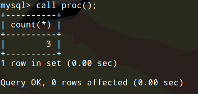

# 存储过程

存储过程（Stored Procedure）是在大型数据库系统中，一组为了完成特定功能的SQL语句集，存储在数据库中，经过第一次编译后再次调用不需要再次编译，用户通过指定存储过程的名字并给出参数（如果该存储过程带有参数）来执行它。存储过程是数据库中的一个重要对象。存储过程说白了就是多条SQL批处理，本篇笔记记录如何在MySQL中使用存储过程。

## 创建一个简单的存储过程

我们直接看一个例子，这个例子创建了一个最简单的存储过程：

```sql
delimiter //
create procedure proc()
  begin
    select count(*) from t_teacher;
  end //
delimiter ;
```

* delimiter 注意`delimiter //`表示将MySQL结束符改为`//`，这是为了防止MySQL语句结束符和存储过程中的`;`冲突。编写完存储过程后，我们应该把结束符改回来。
* `create procedure` 这个就是创存储过程的语句了，里面有固定的`begin...end`表示存储过程定义的开始和结束。

运行结果：



调用存储过程需要使用call语句。

## 存储过程的输入输出参数

定义存储过程时，我们可以使用`in`，`out`，`inout`指定输入输出参数。

使用输出参数例子：
```sql
delimiter //
create procedure proc(out param1 int)
  begin
    select count(*) into param1 from t_teacher;
  end //
delimiter ;
```

上面代码中，我们用out指定了一个输出参数。

# 存储函数

存储函数也是一组SQL语句，但是存储函数只能通过return语句返回一个标量，和存储过程不同的是，存储函数和MySQL内置的函数一样，能够嵌套在SQL语句中使用。

```sql
delimiter //
create function func()
  returns int
  return (select count(*) from t_teacher);
  //
delimiter ;
```

我们使用`returns`指定了返回类型，执行了一条SQL语句，并返回了一条数据。调用存储函数：`select func();`。

实际上存储函数用的还是比较少的，我们通常使用存储过程。

# 变量

变量可以在子程序中声明并使用，这些变量只在`BEGIN...END`之间是有效的。

定义变量：
```sql
declare param1 int default 100;
```

为变量赋值：
```sql
set param1 = expr;
```

这些对我们开发人员来说都是非常简单的了。

# 异常处理程序

`declare...handler`语句可以定义存储过程中异常处理子程序，某种特定异常发生时，就会执行。异常处理子程序需要放在变量定义后面。

```sql
DECLARE handler_action HANDLER
    FOR condition_value [, condition_value] ...
    statement

handler_action:
    CONTINUE
  | EXIT
  | UNDO

condition_value:
    mysql_error_code
  | SQLSTATE [VALUE] sqlstate_value
  | condition_name
  | SQLWARNING
  | NOT FOUND
  | SQLEXCEPTION
```

* statement 异常处理子程序可以是一条语句，或者`begin...end`语句块

# 游标

查询语句可能返回多条记录，如果数据量非常大，需要在存储过程和存储函数中使用光标来逐条读取查询结果集中的记录。

```sql
DECLARE cursor_name CURSOR FOR select_statement
```

* 打开游标 `open <cursor_name>`
* 使用游标 `fetch cursor_name into var_name[,var_name]...`，var_name表示将游标中得到的数据存入该变量，该变量必须事先定义好。
* 关闭游标 `close <cursor_name>`

# 流程控制

IF条件分支
```sql
IF search_condition THEN statement_list
    [ELSEIF search_condition THEN statement_list] ...
    [ELSE statement_list]
END IF
```

CASE条件分支
```sql
CASE case_value
    WHEN when_value THEN statement_list
    [WHEN when_value THEN statement_list] ...
    [ELSE statement_list]
END CASE
```

LOOP循环
```sql
[begin_label:] LOOP
    statement_list
END LOOP [end_label]
```

LEAVE跳出流程控制结构
```sql
LEAVE label
```

ITERATE将执行顺序转到语句开头处
```sql
ITERATE label
```

REPEAT带条件循环
```sql
[begin_label:] REPEAT
    statement_list
UNTIL search_condition
END REPEAT [end_label]
```

WHILE带条件循环
```sql
[begin_label:] WHILE search_condition DO
    statement_list
END WHILE [end_label]
```

# 删除存储过程或存储函数

```sql
DROP {procedure|function} sp_name;
```
