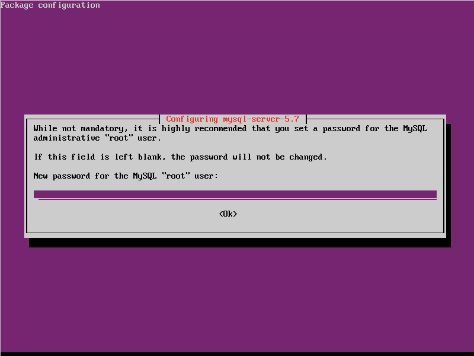
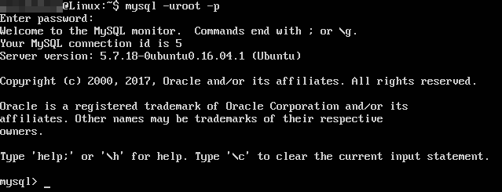
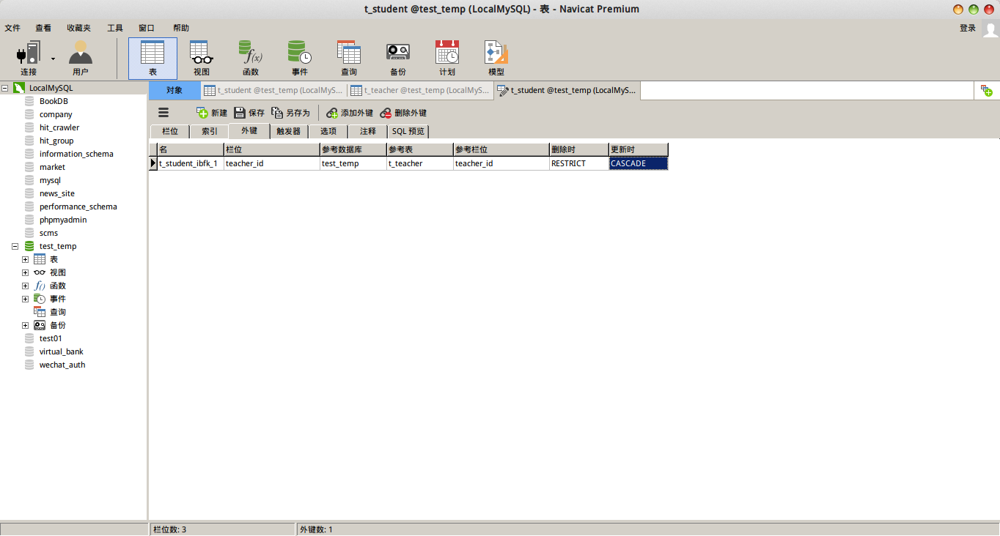
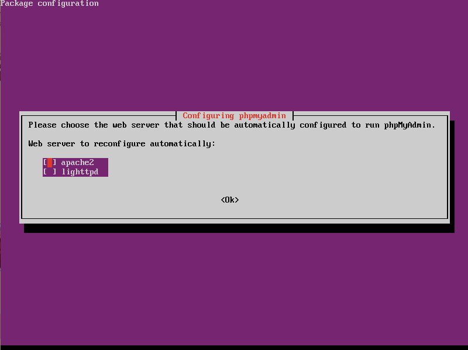
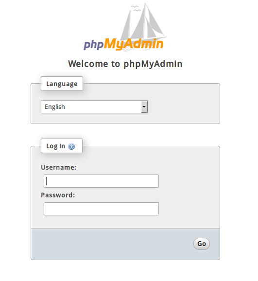

# MySQL简介

MySQL是是一个关系型数据库管理系统（RDBMS），由瑞典MySQL AB公司开发，目前属于Oracle旗下产品。MySQL是当下最流行的关系型数据库管理系统之一，在Web方面是应用最广泛的关系型数据库管理系统。MySQL采用了双授权政策，分为社区版和商业版，由于其体积小、速度快、总体拥有成本低，尤其是开放源码这一特点，一般中小型网站的开发都选择MySQL作为网站数据库。

MySQL使用C和C++编写，支持大多数主流操作系统平台，为多种编程语言提供了API，支持多种高性能存储引擎。MySQL通常作为数据库服务器，我们的应用程序相当于客户端，通过socket（编程上是通过数据库驱动或通用中间层API）对MySQL进行访问。

LAMP/LNMP（Linux Apache/Nginx MySQL PHP/Perl/Python）这四个软件都是免费或开放源码软件，因此使用它们能不花一分钱就可以建立一个免费、稳定的Web应用，LAMP/LNMP是最流行的中小型Web应用解决方案。

## GPL授权和商业授权

如果我们使用了MySQL的源码，或将MySQL嵌入到我们的程序打包发布，这时需要考虑授权问题。MySQL有GPL授权和商业授权两种政策，这意味着我们的程序必须遵循GPL协议开源，或者购买昂贵的商业授权。

但大部分情况下，我们的程序和MySQL之间是互相协作的关系，我们的客户购买我们的软件，并在他们的服务器上免费从MySQL官网下载安装MySQL服务器，我们的软件只是使用MySQL服务器存储数据。PHP语言实现了MySQL驱动，PHP是可以随意使用的，至于Java则拥有JDBC规范，MySQL的Java驱动只是一个实现，其他许多语言也都是类似情况，我们不需要开源我们的软件或支付任何费用。

# 在Ubuntu下安装MySQL

```
sudo apt-get install mysql-server
```

安装过程中，会要求我们输入数据库root密码，如果是真实服务器，建议一定要设置一个复杂一点的密码。



安装完成后，可以使用`mysql --version`查看MySQL版本。虽然上面图是Ubuntu16.04和MySQL5.7，但是本篇笔记还是将以Ubuntu14.04和MySQL5.5为例进行讲解。

## 登入MySQL客户端命令行

执行命令：
```
mysql -uroot -p
```

然后输入密码就可以登入了。



* `-u` 指定登入的用户
* `-p` 要求输入密码

在MySQL客户端命令行中，我们可以进行SQL语句增删改查，或是管理数据库等诸多操作，Linux下命令行默认使用UTF-8编码，但Windows下由于cmd默认是GBK的，可能需要调整一下MySQL客户端命令行的编码才能正常使用，具体方法就不介绍了，因为实际上服务器多为Linux系统。开发环境下我们可以使用诸多图形化工具，不仅可以执行SQL命令，还能可视化浏览数据等。

# 安装MySQL Workbench

MySQL Workbench，是一个为MySQL设计的ER/数据库建模工具。在MySQL官网可以免费下载到社区版MySQL Workbench Community Edition。这个软件提供了Ubuntu可以直接使用的deb安装包，双击安装即可。

具体关于该软件的使用，将在后续章节进行介绍。


# 安装Navicat

Navicat是一个强大的数据库可视化工具。实际开发中，为了节省时间，提高调试效率，我们不需要在命令行中一句句输SQL语句，直接使用Navicat这种工具查看/修改数据就可以了。这个软件还带有很强的数据库设计功能，但是基本不会用到。设计数据库还是SQL语句更可靠。Navicat支持Linux平台，但是官方发布的Linux版本其实只是打包了一个wine（一个让Windows的exe软件在Linux运行的系统调用中间层），其程序和Windows上的是一样的。

Navicat是付费软件，Navicat Premium售价6500RMB，这对个人开发者来说无法承受，所以当然有热心的黑客开发了对应的注册机，幸运的是注册机居然也能用wine跑起来：）



# 安装phpmyadmin

```
sudo apt-get install phpmyadmin
```

phpmyadmin其实是一个Web程序，功能和Navicat差不多，但是运行在浏览器中，而且是完全免费的。在Ubuntu中安装phpmyadmin，如果没有安装apache和php，这些依赖包管理器都会自动帮我们下载，非常方便。

安装过程中，会要求我们输入一些信息，包括使用的服务器等，按要求填写即可：



安装完成后，由于phpmyadmin的web文件安装到了/usr/share，我们得将这个文件夹软链接到/var/www/html，才能在我们的apache中访问，apache会自动执行该目录下index.php，相关的依赖模块包管理器都替我们安装好了，就不用我们操心的。

```
ln -s /usr/share/phpmyadmin /var/www/html/phpmyadmin
```

浏览器中访问phpmyadmin程序



# MySQL的配置文件

Ubuntu下，MySQL的配置文件在`/etc/mysql/`下，主配置文件是`my.cnf`，其引用了两个目录`conf.d`和`mysql.conf.d`，这两个目录中是具体的配置文件。有关mysql-server的具体配置，我们其实应该修改的是`mysql.conf.d/mysqld.cnf`，注意修改前先备份。

安装mysql后，建议先修改一下默认字符编码，Ubuntu下，mysql服务器（character_set_database和character_set_server）的默认编码是latin1，这在插入中文时会报错`Incorrect string value`，因为客户端编码是utf8，而mysql服务器的字符编码是latin1。我们可以用`show variables like 'character%';`进行字符编码查询。

编辑`/etc/mysql/mysql.conf.d/mysqld.cnf`，在`[mysqld]`下，加上`character-set-server=utf8`，这样就能正常使用了。

# 有关SQL语言基础

SQL语言基础和关系数据库的基础理论安排在了`数据库系统/基础理论`章节，本章节中只介绍和MySQL相关的工程技术。

# 官方文档

MySQL有详细的官方文档，文档里包括大量说明和例子程序，非常有参考价值。对于一些技术细节，我们不可能全部记住，这时就应该查阅文档。[https://dev.mysql.com/doc/](https://dev.mysql.com/doc/)
