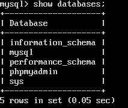
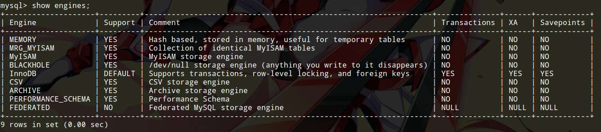

# 管理数据库

学习如何管理数据库之前，我们必须先认清几个基本概念。

* 数据库管理系统：指DBMS，MySQL软件系统是一个强大的关系型数据库管理系统（RDBMS）
* 数据库服务器：指MySQL的mysql-server部分，它以server的形式运行在服务器操作系统上（通常是TCP3306端口），其他程序可以通过各种客户端访问mysql-server
* 数据库服务器的客户端：指mysql-client，phpmyadmin，navicat等诸多能够访问，管理MySQL的客户端
* 数据库：一个应用可以创建一个数据库（database），这是一个抽象的概念，如果我们的服务器电脑上跑了学生管理系统，办公自动化系统两个应用程序，外加一个DBMS server，那么这两个应用程序分别对应DBMS中的两个数据库
* 数据表：一个数据库有多个数据表（table），这个就不需要多介绍了，这个概念是关系数据库理论的基础

## 基本数据库管理命令

下面我们使用mysql命令行工具完成mysql数据库的一些基本管理操作。虽然我们可以用navicat完成这些工作，但是我们要知道，命令行永远是最有效的工具。

### 查看已有的数据库

```sql
show databases;
```



注意：我们刚刚安装了LAMP环境，以及phpmyadmin，上图中这些数据库都不是我们手动创建的，它们都有自己的用途，不了解的情况下，就不要随便修改和删除了。

### 创建一个数据库

```sql
create database my_test_db;
```

这条命令就创建了一个最基本数据库，我们可以在里面创建数据表，我们的应用可以连接上去进行SQL语句操作。

在MySQL命令行中，我们可以使用`use <dbname>`命令选择一个数据库。

### 删除一个数据库

```sql
drop database my_test_db;
```

该命令会删除一个数据库中的一切数据，使用时请务必小心，以免引起不必要的麻烦，服务器上删除数据库是很罕见的操作。不过，在开发环境中，我们调试程序时，有时为了方便，会直接删除一个数据库再重建。

## 存储引擎

MySQL提供了多了存储引擎，不同数据表可以使用不同引擎，各种不同实现有其自身的优势的缺点，我们应该取长补短，合理使用（当然开发环境中确实是无脑用默认的就行了）。这里我们介绍几种常用的存储引擎。有关存储引擎底层的知识，请参考数据库基础理论相关章节。

查看可用的存储引擎：
```
show engines;
```



上图是MySQL5.5的返回结果。

### InnoDB

这个就是默认的存储引擎了，InnoDB功能和性能都很强，是使用最多的存储引擎。

1. 支持事务安全表（ACID），行锁定和外键。MySQL中，InnoDB表可以和使用其他存储引擎的表联合查询（但是外键约束无论如何不能跨引擎使用）。
2. InnoDB将所有的表和索引维持在一个逻辑表空间中，表空间可能包含数个文件。InnoDB表可以是任意尺寸的，即使在文件尺寸被限制在2GB的操作系统上。
3. InnoDB不创建目录，而是在MySQL数据目录下创建一个名为ibdata1的自动扩展数据文件，该文件存储在`/var/lib/mysql/ibdata`下，注意不要误删了啊。

### MyISAM

MyISAM在Web，数据仓库等应用场景下使用，这个引擎有较高的插入，查询速度，但不支持事务。

### MEMORY

MEMORY引擎将表中的数据存储到内存中，通常用于临时存储数据，为查询和引用其他表数据提供快速访问。MEMORY不支持BLOB，TEXT，但有强大的索引功能。还有一些其他的特性，具体请参考MySQL相关的文档，这里就不多做介绍了。

这里要注意：使用MEMORY表，如果MySQL服务重启，里面的数据就全部丢失了。但是我们关闭MySQL命令行再打开，这并不是重启了MySQL服务器，重启服务需要使用命令（Ubuntu14.04）：`sudo service mysql restart`。

### 存储引擎的选择

更换一个数据表的存储引擎：
```sql
alter table <表名> engine=<更改后的存储引擎名>;
```

* MyISAM 数据表主要用来插入和查询记录，使用MyISAM性能较好
* MEMORY 临时存放数据，且数据量不大，并且不需要较高的数据安全性，使用MEMORY性能较好
* InnoDB 如果你还在纠结用什么存储引擎比较好，现在不需要考虑了，我们还是用默认的InnoDB吧
