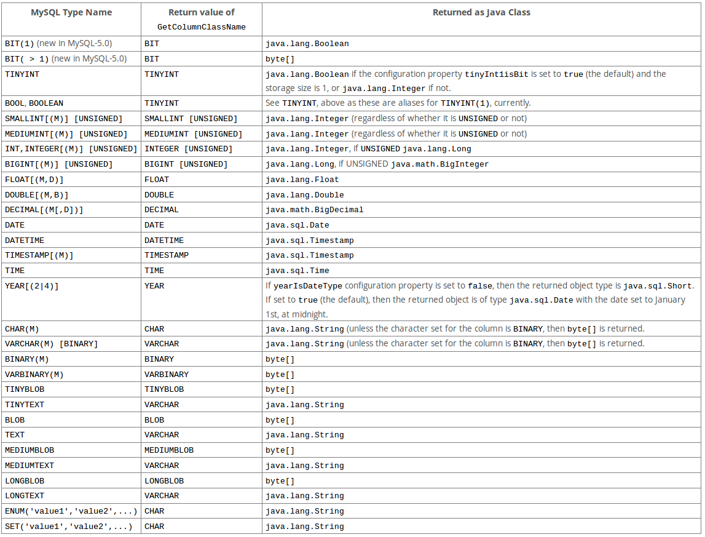

# MySQL支持的数据类型

本篇笔记我们记录一下MySQL中常用的数据类型。

* 数值数据类型
  * 整型 TINYINT SMALLINT MEDIUMINT INT BIGINT
  * 浮点类型 FLOAT DOUBLE
  * 定点类型 DECIMAL
* 日期 YEAR TIME DATE DATETIME TIMESTAMP
* 字符串 CHAR VARCHAR BINARY VARBINARY BLOB TEXT ENUM SET等

## 整形的使用

整形中，方便起见我们可能只会用到int和bigint（对应Java的int和long），不过一个高性能、良好的数据库设计肯定要考虑空间效率等诸多因素，那时我们就应该仔细想想该使用哪种int了。

int占4byte，long占8byte，都是有符号整形，其表示长度请自行脑补。

## 浮点数和定点数的使用

float占用4byte，double占用8byte。我们通常也就用到这两种类型。

## 日期和时间类型

| 类型            | 格式           |大小            |
| :------------- | :------------- | :------------- |
| TIME           | HH:MM:SS       |3byte           |
| DATETIME       | YYYY-MM-DD HH:MM:SS      |8byte |
| TIMESTAMP      | YYYY-MM-DD HH:MM:SS      |4byte |

* TIME只保存时间，插入示例：`insert into t_time values ("10:05:05")`
* DATETIME类型保存日期和时间，通常我们直接使用这个类型对应Java中的（java.util.Date），插入写法和TIME相似
* TIMESTAMP也保存日期和时间，但取值范围小，它只保存UTC时间范围内，因此也就仅能用于保存时间戳

## 字符串类型

* varchar 变长字符串，最大长度为255，需要在建表时指定一个长度，插入数据超过该长度会报错（注意UTF8编码的汉字的长度）
* text 分为tinytext text mediumtext longtext，分别支持255byte，65535byte，16777215byte，4294976295byte
* enum 枚举类型，需要在建表时指定枚举的元素，插入时插入一个枚举元素
* set 集合类型，其值无重复，需要在建表时指定可能插入的值，如果插入了没有预先指定的值，该值不会插入表中

## 二进制类型

在关系数据库中插入很大的二进制类型或是很大的text类型是个糟糕的想法，因为这会导致数据库系统性能下降，对于二进制图片，声音等资源，建议存储在专用的文件服务器或CDN上。

# Java类型和MySQL类型对照表

