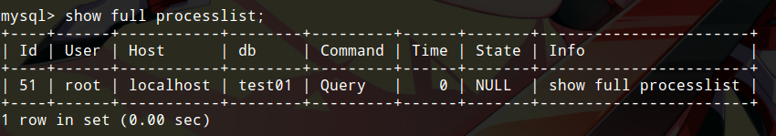

# MySQL函数

MySQL提供了大量丰富的函数，在进行数据库管理以及数据的查询和操作时，经常会用到各种函数。当然，我们不可能记住所有函数，其实也不需要记住，对于开发人员来说，大部分函数都很少用到，使用时现查手册就行了，少数常用的函数简单到不需要记忆。

本篇笔记介绍一些可能会用到的函数，以备随时查阅。

## 数学函数

数学函数有什么用呢？其实也没什么用，数学运算通常是操作数据库的编程语言完成的。但我们还是观赏一下MySQL提供的数学函数吧。

* abs(x) 绝对值
* pi() 圆周率
* sqrt(x) 平方根
* mod(x,y) 求于
* ceil(x)/ceiling(x) floor(x) 向上取整和向下取整
* rand()/rand(x) 随机数
* round(x)/round(x,y) 四舍五入/四舍五入但保留一定精度
* truncate(x,y) 返回被舍去至小数点后y位的数字x（即不四舍五入）
* sign(x) 根据x正负，返回-1,0,1
* pow(x,y) exp(x) x^y和e^x
* log(x) log10(x) log_e(x)和log_10(x)
* radians(x) degrees(x) 角度/弧度转化
* sin(x) asin(x) 正弦/反正弦

## 字符串函数

MySQL的字符串函数也可以说是万年用不上一次。

* char_length(str) 返回字符串的字符个数（utf8汉字算一个字符）
* length(str) 返回字符串字节数
* concat(s1,s2,...)/concat_ws(x,s1,s2,...) 字符串拼接，x为分隔符
* insert(s1,x,len,s2) s1中起始于x，长度为len的子串，被s2取代，返回字符串s1
* lower(str) upper(str) 大小写转换
* left(s,n) right(s,n) substring(s,n,str) 字符串截取
* trim(str)  删除字符串两边空格
* locate(str1, str2) 子串匹配，返回str1在str2开始的位置

## 日期和时间函数

* curdate() 返回当前日期 YYYY-MM-DD
* curtime() 返回当前时间 HH:MM:SS
* now() 返回当前时间 YYYY-MM-DD HH:MM:SS
* unix_timestamp() 返回当前UNIX时间戳（无符号整数）
* from_unixtime(date) 把UNIX时间戳转换为普通格式时间

## 条件判断

* if(expr,v1,v2) 如果expr为true，返回v1，否则返回v2
* case expr when v1 then r1 [when v2 then r2] [else rn] end 很好理解，就是高级语言的switch...case...语句，expr=v1时，返回r1，以此类推

## 系统信息

* version() 返回MySQL服务器版本
* connection_id() 返回当前连接ID（由于每一次连接都有一个自增长的ID，该值可以代表当前连接的次数）
* user() 返回当前登入用户名
* charset(str) 返回字符串的字符集

### 查看当前哪些用户连接了数据库服务器

```
show full processlist;
```



## 加密函数

MySQL提供了几个简单的散列函数，不推荐使用，因为可定制程度差，所以安全性不高。推荐使用openssl库，java自带的/apache的密码学库等。

## 集合函数

集合函数配合查询语句使用，这组函数可以说是十分常用，需要我们熟练掌握，但也十分简单。

* count(字段名) 统计数据表中包含记录行的总数，需要和group by一起使用
* sum(字段名) 求和，需要和group by一起使用
* avg(字段名) 求平均数，需要和group by一起使用
* max(字段名) min(字段名) 最大值/最小值，需要和group by一起使用

## 其他函数

* benchmark(count, expr) 重复执行count次expr，返回执行时间（如果执行很快，通常返回0）
