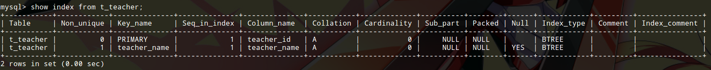

# 使用索引

索引的概念和实现方式已经在基础理论部分学习过了，但那毕竟是理论，实际工程中索引肯定不需要我们实现，其算法也是前人多年努力优化得到的，我们拿来用，知道如何用就好了，这里我们看看MySQL中的索引。

MySQL使用的索引是在存储引擎中实现的，每种存储引擎的索引方式，支持的索引类型，数据表支持的最大索引长度等都不完全相同，我们知道索引实现主要有hash索引（有若干种具体实现）和B+树索引，InnoDB和MyISAM只支持B+树索引，MEMORY支持hash和B+树索引。

## 索引使用的优缺点

优点：

* 大大提高大量数据的查询速度
* 加速连接操作
* 加快分组和排序操作

缺点：

* 占用额外的磁盘空间
* 增删改数据时，要同时维护索引，增加了时间开销

## MySQL索引的分类

### 普通索引和唯一索引

普通索引是最基本的索引类型，允许在定义索引的列中插入重复值和空值，唯一索引的值必须唯一，但是允许空值。

注意：主索引是一种特殊的唯一索引，不允许为空。我们创建数据表时，指定主键会自动为主键创建主索引。

### 单列索引和组合索引

单列索引即一个索引只包含单个列，一个表可以有多个单列索引，组合索引指在表的多个字段组合上创建的索引，只有在查询条件中使用了这些字段的左边字段时，索引才会被使用。

针对组合索引，这里补充说明一下。InnoDB中索引使用的是B+树，例如：对数据列（a，b，c）建立了复合索引，建立索引的操作可以看做为a列建立了一个有顺序的目录，a目录中每一条为b建了个目录，b目录中每一条为c建了个目录。这意味着`where a=x and b=y and c=z`这种形式的查询，索引能够发挥全部作用，而`where a=x and c=z`这种查询只能发挥复合索引中a列索引的作用，`where b=y and c=z`这种查询复合索引完全不会发挥作用。

### 全文索引

在定义索引的列上支持全文查找，允许在这些索引列中插入重复值或空值，全文索引可以创建在char，varchar，text列上。

MySQL只有MyISAM引擎支持全文索引。

## 创建索引

索引可以在创建表时指定，或者使用`alter table`指定。这里只介绍第一种方法。

### 创建普通索引

```sql
create table t_teacher(
  teacher_id bigint primary key,
  teacher_name varchar(20),
  index(teacher_name)
);
```

最简单的索引使用index()自定就行了。通常我们可能还需要手动指定以下索引名，可以使用`index <索引名>(字段名)`。

我们可以使用`show index from <表名>`查看一个表的索引。



注意：主键默认有索引，第二条才是我们手动创建的索引。

### 创建唯一索引

唯一索引的索引列值必须唯一，但允许有空值。如果是组合索引，列值的组合必须唯一。

```sql
create table t_teacher(
  teacher_id bigint primary key,
  teacher_name varchar(20),
  unique index(teacher_name)
);
```

### 创建组合索引

`index()`里用逗号指定多个值就行了
