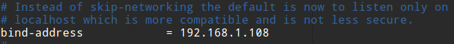

# MySQL用户权限管理

MySQL是一个多用户数据库，具有功能强大的访问控制系统，可以为不同用户指定允许的权限。

* root用户 拥有所有权限
* 普通用户 只拥有被授予的各种权限

## 权限表

权限相关的数据存储在mysql数据库中，主要有`user`，`db`，`host`，`tables_priv`，`columns_priv`和`procs_priv`。


## user表

user表是最重要的表，里面记录了所有用户和被授予的权限。其中，Host，User，Password分别是主机，用户名，密码（加密值），当一个用户远程连接时，这三个字段必须完全匹配，才能登入MySQL服务器。后面的字段是权限列，安全列，资源控制列。

* 权限列 都为ENUM类型，取值Y/N，表示该用户是否有该权限
* 安全列 两个和ssl相关的列，用于加密，两个和x509相关的列，用于标识用户，两个和授权插件相关的列
* 资源控制列 用于限制用户使用的资源（每小时最大查询数等），超过限制的用户将被锁定。


## db表和host表

db表存储了用户对某个数据库的操作权限，决定用户能从哪个主机存取哪个数据库。host表存储了某个主机对数据库的操作权限。

## tables_priv表和columns_priv表

分别用来对表和列设置权限操作。

## procs_priv表

对存储过程和存储函数设置操作权限。

# 账户管理

## 使用mysql终端登录和退出MySQL服务器

我们一直在使用这个mysql命令登入。

```
mysql -u<user> -p<password> -h<host> -P<port>
```

* -u 用户名
* -p 密码
* -h 主机
* -P 端口

退出：

在MySQL命令行中执行：
```
quit
```

## 新建普通用户

新建用户可以使用`grant`语句，或者直接操作MySQL授权表。建议使用`grant`语句。

grant语句基本格式：
```sql
GRANT
    priv_type [(column_list)]
      [, priv_type [(column_list)]] ...
    ON [object_type] priv_level
    TO user [auth_option] [, user [auth_option]] ...
    [REQUIRE {NONE | tls_option [[AND] tls_option] ...}]
    [WITH {GRANT OPTION | resource_option} ...]
```

这个是从MySQL官网上找到的，看起来可能比较复杂，我们直接看一个简单的例子。

例子：创建一个testuser，密码testpwd，授予对所有数据表的select和update权限。

```sql
grant select,update on *.* to "testuser"@"localhost" identified by "testpwd";
```

我们可以查看一下mysql的user表，看看新建的用户的情况。

## 使用普通用户登入


我们使用普通用户登入，并尝试创建一个表，但是显然我们们与这个权限，被MySQL拒绝了。

## 删除普通用户

```sql
drop user <user>;
```

删除用户必须具有CREATE USER或DELETE权限。

例子：


## root修改自己的密码

root用户的安全性非常重要，因为root用户拥有很高的权限。

使用mysqladmin修改root密码：

```
mysqladmin -u username -h localhost -p password "newpassword"
```

按要求输入root原来的密码，即可完成root密码修改。

## root修改普通用户的密码

例：把testuser的密码修改为`newpassword`：
```
grant usage on *.* to "testuser"@"localhost" identified by "newpassword";
```

## 普通用户修改自己的密码

普通用户修改自己密码例子：
```sql
set password = password("newpassword");
```

# 授权管理

MySQL中的权限：


## 授权

给用户分配权限的过程叫授权，为了保证数据库的安全性，必须进行合理的授权。MySQL可以使用`grant`语句为用户授权。

* 全局层级 适用于一个给定服务器中的所有数据库，如前面代码：`grant select,update on *.*...`配置的就是全局授权
* 数据库层级 只适用于一个给定的数据库中的所有目标，该层级可以使用`dbname.*`表示
* 表层级 适用于给定表的所有列，该层级用`dbname.tbname`表示
* 列层级 只适用于一列
* 子程序层级 适用于已存储的子程序，如创建存储过程，grant命令等权限。

授权操作前面已经演示了，就是`grant`语句。那么如何撤销授权呢？撤销授权使用`revoke`语句。

revoke撤销权限例子：
```sql
revoke update on *.* from "testuser"@"localhost";
```

查看已有权限：
```sql
show grants for "user"@"localhost";
```

当然，我们也可以直接查看mysql.user表查看权限。

# 访问控制

前文我们学习了如何为用户配置权限，除了权限配置，用户登入时，MySQL还会通过访问控制规则，对用户登入做出限制。

## 连接核实

请求连接MySQL的用户可能是Web应用程序，也可能是一个正在操作终端机的管理员，在MySQL看来他们都是一样的。连接MySQL服务器时，服务器基于用户名（username），密码（password），主机（host）三个字段对用户身份进行核实。只有这三个字段完全验证通过，才能进入下一阶段。

## 请求核实

这一阶段就是根据用户的授权（user等权限表），判断用户执行的操作是否符合要求。

# 实例：创建用户并远程连接

MySQL服务器运行在`192.168.1.108`，我们登入的终端机在`192.168.1.109`，为了区分MySQL终端和Bash终端，我们使用`mysql>`和`$`前缀进行区分。

创建一个用户，并授予一些权限
```
mysql> grant select,update on *.* to "testuser"@"%" identified by "testpwd";
```

为了实现远程连接，我们在host字段填了`%`，表示允许任何主机使用这个用户连接MySQL服务器。

修改MySQL服务器配置文件



MySQL服务器默认监听`localhost:3306`，这是不行的，我们将其修改为我们的IP：`192.168.1.108:3306`。

重启MySQL服务
```
$ sudo systemctl restart mysql
```

远程登入命令
```
$ mysql -u testuser -h 192.168.1.108 -p
```

* -h 指定MySQL服务器所在主机

结果成功登入：


