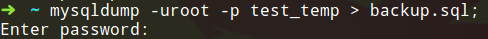
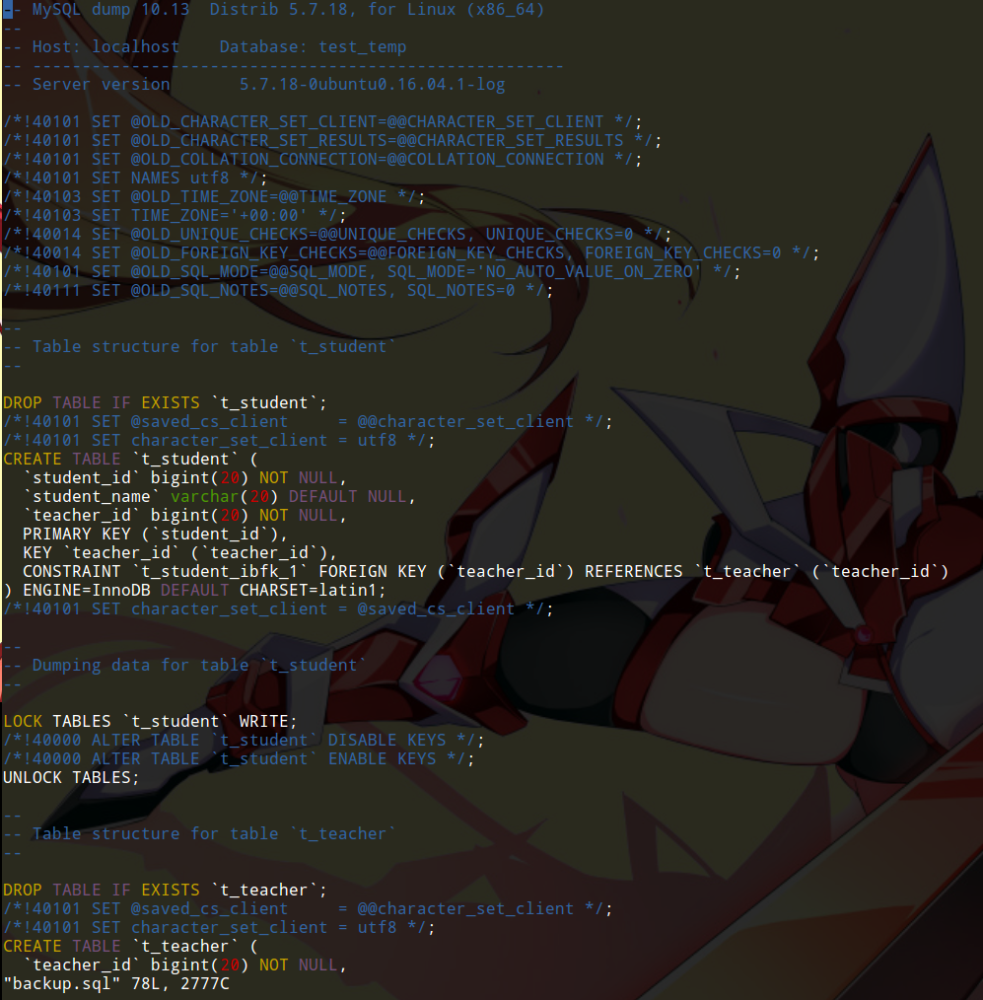
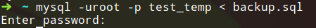
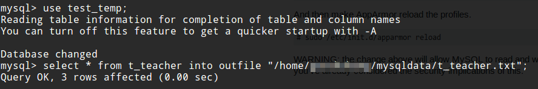
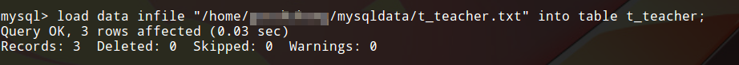

# 数据备份和还原

停电、误操作等意外情况都有可能造成数据损失，真实的服务器上，我们应该定期对数据库进行备份。除此之外，更换服务器等情况需要数据迁移操作。本篇笔记记录MySQL数据库中，数据备份，还原和数据迁移的使用方法。

## mysqldump工具

mysqldump是MySQL提供的数据库备份工具，使用非常简单。

使用mysqldump命令：
```
mysqldump -u<user> -p<password> <dbname>[tbname,[tbname...]] > <filename>.sql
```

实际上，我们发现mysqldump就是个显示数据的工具，我们使用重定向符号把dump得到的语句写入文件。

mysqldump支持备份一个数据库，或者一个数据库表，也可以同时备份多个数据库。

### 使用mysqldump备份一个数据库

首先使用mysqldump命令将数据写入一个sql文件。



接着查看一下这个文件。



还原这个数据库。



### 为什么不直接复制数据库目录

MySQL目录下，有对应数据库的目录文件夹，我们直接复制这个文件夹是否可能呢？其实是不可行的，因为基本上我们都InnoDB引擎，InnoDB不是按文件存储数据表的，而且，即使只是用了MyISAM，也可能造成不同版本MySQL之间，文件格式不兼容的情况，因此除非极特殊情况，应该避免这种做法。

## 导出表记录到文本文件

```
select ... into outfile <filepath>
```

我们可以把一个表的数据以文本形式，导出到一个txt文件中。但是MySQL出于安全考虑，默认不允许执行该操作，我们需要修改一下配置文件才能使用这个功能。


我们在配置文件中加上这样一条配置，这个配置指定了允许数据导出的目录。


其次我们要修改一下Ubuntu Server的AppArmor配置，如上图，加上我们允许的数据目录和权限`rw`。


使用reload命令更新AppArmor配置。



导出数据成功。


执行这些操作时，我也碰到很多问题，都是和权限相关的，也是查了半天，又试了半天才成功的，因此详细的把这个过程记录了下来。

## 从文本文件导入表记录

```
load data infile <filepath> into table <tbname>;
```



这相当于执行了多个插入操作。从图中可以看出，插入成功了。
