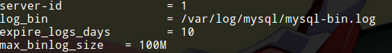
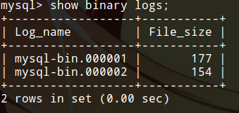
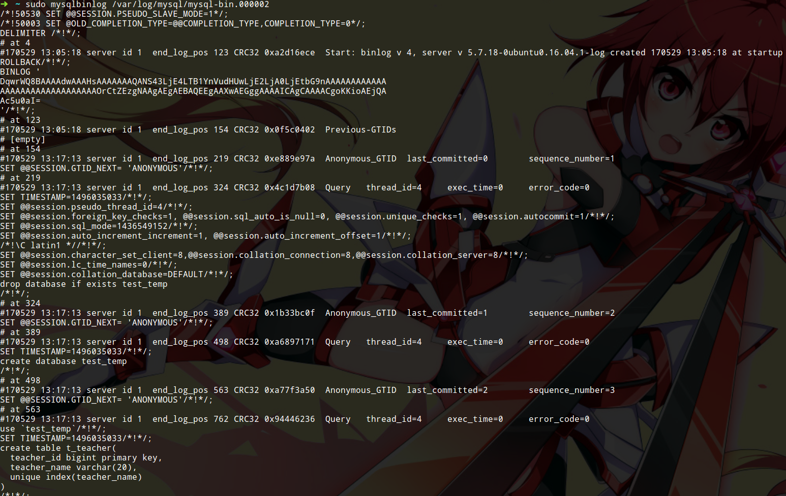
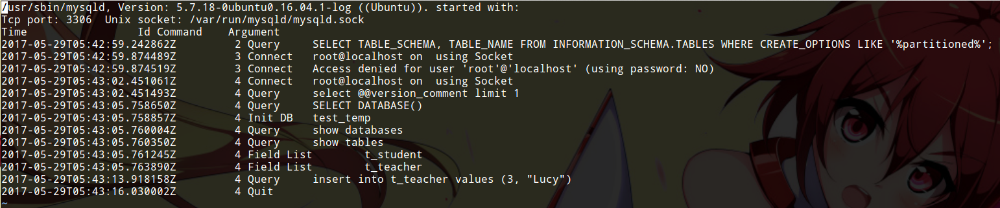
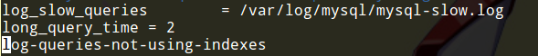

# 日志简介

MySQL日志主要分4类：

* 错误日志 记录mysql-server服务出现的错误
* 查询日志 记录建立的客户端连接和执行的语句
* 二进制日志 记录所有更改数据的语句，可以用于数据复制
* 慢查询日志 记录所有执行时间超过long_query_time的所有查询或不使用索引的查询

我们可以在`/var/log/mysql`查看MySQL的日志文件。

在MySQL命令行中`flush logs`可以刷新日志。

注意：启动日志可能影响服务器性能，比如在一个查询频繁的数据库服务器上使用查询日志，日志需要大量存储空间，同时也会耗费时间。

## 二进制日志

二进制日志主要记录MySQL数据库的变化（更新数据库的语句），以及执行的时间信息，但不包含没有修改任何数据的语句。二进制日志主要用于数据库恢复，因为二进制日志包含备份后进行的所有更新。

### 启动二进制日志



图中是`/etc/mysql/mysql.conf.d/mysqld.cnf`配置文件，我们把`server-id`和`log-bin`前的注释去掉，就打来二进制日志了。

* `server-id` 这个值用于区分主数据库和备份数据库，不指定的话，MySQL启动会报错
* `log-bin` 打开这个选项就打开了二进制日志
* `expire_logs_days` MySQL自动清除过期日志的时间
* `max_binlog_size` 单个日志文件的大小限制，如果超过该限制，就会生成一个新的日志文件，该值不能超过1GB或小于4096B

注意：修改完配置文件后，应该重启MySQL服务

### 查看二进制日志

MySQL终端中运行该命名，可以查看当前有哪些日志文件：
```
show binary logs;
```



如图，现在我们有两个二进制日志文件。

我们可以使用mysqlbinlog工具查看二进制日志，例如：
```
mysqlbinlog /var/log/mysql/mysql-bin.000002
```



里面记录了SQL语句操作等内容。

### 重置二进制日志

MySQL终端中执行该语句，会删除所有二进制日志，并从编号000001重新开始记录日志。
```
reset master;
```

### 使用二进制日志还原数据库

```
mysqlbinlog --no-defaults <binlog-file> | mysql -uroot -p
```

具体使用二进制日志恢复时，是有很多选项的，使用前请参看`man`手册，上面命令只是举一个例子。

## 错误日志

错误日志默认是开启的，不建议关闭。

错误日志位于`/var/log/mysql/error.log`

## 查询日志

启动查询日志会严重影响数据库服务器性能，在配置文件中会有注释提示我们，它是`performance killer`。但某些情况下，我们还是需要打开查询日志。


打开查询日志后，重启MySQL服务，我们试着插入进行一些数据操作，然后查看查询日志：



## 慢查询日志

和之前一样，去掉配置文件中慢查询日志的注释即可打开慢查询日志功能。



* `long_query_time` 慢查询的时间设置，单位是秒

慢查询日志在`/var/log/mysql/mysql-slow.log`。

注意：MySQL5.6以上版本如果按上面设置会报错，导致MySQL无法启动。新版本把`log-slow-queries`改成`slow-query-log-file`，还要加上`slow_query_log = on`，否则用不了。我不知道这种改动有什么意义，更让人惊讶的是我在Ubuntu16.04安装的MySQL5.7自带的配置文件还是旧版本的，百度查了一下才解决了这个问题。
