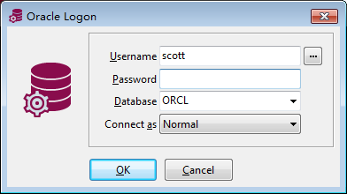

# Oracle安装使用

Oracle是甲骨文公司出品的企业级数据库，在关系型数据库中，是性能最好、功能最强、也是最贵的数据库产品。当然，数据是一切业务的核心，不差钱的企业肯定会用到Oracle的。

Oracle和MySQL相比，优点是不用为各种优化的奇技淫巧操心（闭源软件也操不上心），性能也比MySQL强得多，Oracle作为业务系统或者要求不高的数据仓库都能够胜任。缺点就是非常贵，价格要按服务器和CPU核心数算。此外，Oracle管理操作起来比MySQL繁琐的多，因为它的功能特别复杂，熟练使用MySQL的技术人员突然需要用Oracle肯定会措手不及。至于项目适合上哪个，就需要自己权衡了。

本系列笔记主要介绍Oracle的简单管理和使用。

## 在Windows下安装Oracle 11g

### 前置需求

Oracle服务器安装时需要修改操作系统的许多配置，这里出于学习目的，推荐起一个全新的Windows7的虚拟机进行安装，为其分配2GB内存，50GB硬盘，这些资源能够满足Oracle运行的最低需求，但是性能肯定和生产环境是没法比的（虚拟机主要是磁盘IO性能比较差）。

### 安装Oracle服务器

我们需要下载Oracle的Windows版安装包，安装包的两个`zip`文件可以在Oracle官网找到：

Oracle官网：[https://www.oracle.com/technetwork/cn/database/enterprise-edition/downloads/index.html](https://www.oracle.com/technetwork/cn/database/enterprise-edition/downloads/index.html)


安装步骤比较简单，这里就不多介绍了，安装会自动创建一个`orcl`数据库，我们的服务器上默认用它就可以，实际生产环境中也可以自己创建新的库。Oracle和MySQL这一点套路不太一样，MySQL是每次新项目都对应新建一个数据库，然后创建一个用户进行访问（或者偷懒直接用root）。Oracle则是默认有一个数据库，新开项目时可以新建一个用户，用户的表都存在`orcl`这个数据库里，只不过不同用户只能访问到自己的表。

注意：两个`zip`压缩包不是分卷压缩的，必须两个都手动解压一下，否则安装到一半会提示缺少文件导致安装失败。失败了也不要怕，解压后把原来释放的文件删除，在原位置重新安装就行了。

## 访问Oracle数据库服务器

### 配置TNS Listener

TNS Listener是监听Oracle客户端连接请求的一个服务，默认情况下只配置了`localhost`，也就是我们只能从本机进行访问，这显然是不行的。TNS Listener和对应的连接配置文件存放在类似`E:\app\windows\product\11.2.0\dbhome_1\NETWORK\ADMIN`这样的目录下的`listener.ora`和`tnsnames.ora`，我们修改配置之前备份这两个文件。

配置也可以不用手动修改，我们在开始菜单中，找到`Net Manager`工具，在其中加一个监听配置即可：


添加后，关闭`Net Manager`时选择保存配置即可保存，但是我们还要手动重启所有Oracle服务才能生效。

注：在`Net Manager`中添加监听配置，新加的监听项就不能用原来的`1521`端口了，如果觉得不符合约定，我们也可以把`localhost`删掉，用网络IP监听`1521`，但这样就不能用`localhost`连接了。

### 配置Oracle Instant Client客户端

访问Oracle必须有Oracle客户端，客户端分两种：瘦客户端和OCI（Oracle Call Interface），Oracle Instant Client包括了OCI功能。

所谓瘦客户端，就是我们开发中可能会用到的Oracle JDBC驱动那个jar包，它确实能访问Oracle数据库，但是OCI方式性能更好一些（Java工程中两种都可以用，但瘦客户端方式用Maven私服引进来jar包就行，OCI方式需要服务器上安装相关软件，比较麻烦）。

Oracle官网：[https://www.oracle.com/technetwork/topics/winx64soft-089540.html](https://www.oracle.com/technetwork/topics/winx64soft-089540.html)

我们至少要下载两个，`basic`包和`sqlplus`包。`basic`包是客户端最基本的需求，除此之外我们一般还使用`sqlplus`快速执行一些命令，其它扩展组件可以自己选装。


我们把它们解压放到一起就行了，如果希望在命令提示符中找到`sqlplus`命令，可以将其加入环境变量。

注：装Oracle的虚拟机默认安装了客户端和`sqlplus`，不需要手动安装。

补充：Oracle 11g instant client缺少`imp.exe`和`exp.exe`这两个重要的工具，这些工具在完整的数据库安装包中则已经带有，客户端却并没有在任何下载链接中提供，因此针对11g版本只安装客户端是无法导入导出`dmp`格式的数据的。网上说购买正版Oracle服务后有客户端的补丁链接能够下载到，12c版本客户端也包括了这些工具，未尝试。但是，一般我们也不会通过客户端去导入大量数据，因为这会占用巨大的网络带宽，我们一般是把dmp文件上传到服务器上再导入。

### 使用sqlplus

`sqlplus`是个命令行工具，类似MySQL的`mysql`命令。虚拟机装好Oracle后，会自动设置环境变量，使得我们打开命令提示符后，能够使用该命令。除此之外，我们还可以在开始菜单中找到一个`sqlplus`，它和直接在命令提示符中运行是一样的效果。而其它没有安装过Oracle服务器的客户机则要手动安装Oracle Instant Client（上一节的内容）。

sqlplus命令的标准连接格式：
```
sqlplus <用户名>/<密码>@<主机>:<端口，一般是1521>/<数据库名，一般是orcl>
```

例如：`sqlplus scott/tiger@192.168.1.113:1521/orcl`。现在执行这条命令还连不上数据库，因为scott用户未解锁，scott是一个用来演示学习的用户，后面会专门讲解如何使用。

如果是虚拟机中本机登录，也可以省略一些内容，例如：`sqlplus scott/tiger`。

除此之外，我们还要知道一个叫做`sysdba`的权限，它相当于Oracle数据库的一个超级管理员，我们安装数据库时输入的密码是`sys`用户的，我们可以用该用户以`sysdba`的身份登录Oracle数据库：

假设`sys`的密码是`root`：
```
sqlplus sys/root@192.168.1.113:1521/orcl as sysdba
```

其实如果在虚拟机上，直接`sqlplus / as sysdba`就可以登入`sys`用户和`sysdba`权限了，当不输入用户名和密码时，Oracle会使用校验操作系统用户的方式进行身份认证，我们登入Windows的用户属于`ora_dba`组，因此可以登入。当然，通过其他的客户机肯定是要输全用户名和密码才行的。


注：我的用户名就叫`windows`。

### 解锁scott用户和hr用户

就像MySQL的sakila一样，Oracle中也有两个用于学习的例子用户，分别是：

* 用户：`scott` 密码：`tiger`
* 用户：`hr` 密码`hr`

默认情况下这两个用户是锁定的，如果有需要，我们可以在安装后手动进行解锁（安装过程中也可以选择解锁）。

打开虚拟机的命令提示符，通过`sqlplus`命令连接Oracle数据库，这里先以`sysdba`权限登入：
```
sqlplus / as sysdba
```

连接后依次执行以下命令，进行解锁和设置密码：

```sql
alter user scott account unlock;
alter user scott identified by user;
alter user hr account unlock;
alter user hr identified by hr;
```

这样之后，再运行之前登入`scott`的命令，就可以成功登入该用户了。

注：`tiger`和`hr`这两个密码你可以设置为其它的。

### 创建一个新用户

如果不希望使用`scott`或`hr`进行练习，可以自己创建一个全新的账户，并为其分配权限。

以`sys`用户的`sysdba`身份登录Oracle数据库，然后执行以下命令：
```sql
create user <你的用户名> identified by <你的密码>;
grant create session to <你的用户名>;
grant create table to <你的用户名>;
```

这样配置后，我们就可以使用新用户登入了。该用户具有自己的表和表内数据的增删改查权限。

## 使用导航猫连接Oracle

导航猫内置了Oracle Instant Client，但是其版本是旧的，我们可以手动指定自己的OCI动态链接库（在Instant Client的安装文件夹中寻找oci.dll）：


配置好OCI后，编辑连接参数，就能正确连接Oracle数据库了。


除了Basic类型的连接，我们还可以使用TNS类型的连接，这个其实和Basic是一样的，只不过把一些配置写在一个叫做`<客户端路径>/NETWORK/ADMIN/tnsnames.ora`的配置文件中，可以直接读取，下面介绍的PL/SQL Developer就是使用这种方式配置的（它只支持这一种连接方式）。

## 使用PL/SQL Developer

PL/SQL Developer是另一个Oracle数据管理的图形界面程序。下载安装等操作都非常简单，这里就不过多叙述了。

安装好后，需要配置一下`Oracle Instant Client`的`tnsnames.ora`，在`instantclient_11_2`文件夹下新建目录`NETWORK/ADMIN`，新建一个`tnsnames.ora`文件：

tnsnames.ora
```
ORCL =
	(DESCRIPTION =
		(ADDRESS_LIST =
			(ADDRESS = (PROTOCOL = TCP)(HOST = 192.168.1.113)(PORT = 1522))
	)
	(CONNECT_DATA =
		(SERVER = DEDICATED)
		(SERVICE_NAME = orcl)
	)
)
```

其中内容主要就是主机、端口、数据库名。

我们打开PL/SQL Developer，第一次由于没有设定客户端安装的位置，它是不会自动读取我们的`tnsnames.ora`中的设定的，登录选择`Cancel`，但是也能进入软件。

点击`Preference`，设定一下图中的两个地址。第一个是`Oracle Instant Client`的目录位置，第二个是`oci.dll`的位置。


关闭再打开这个软件，就能在`Database`中找到我们的刚刚的设定了，输入用户名和密码即可登陆。



注：由于好多人都是使用的这个软件操作Oracle，我开始还以为PL/SQL Developer是Oracle官方的工具，后来发现不是，它是第三方开发的，而且是收费软件。
