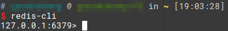
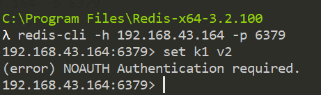

# Redis简介和环境搭建

## Redis简介

Redis是一款使用内存存储的高性能非关系型数据库，遵循BSD协议开源，和传统的关系型数据库相比，Redis的特点是：

1. 将数据存储在内存中，因此具有很高的读写性能
2. 可以使用Redis定义的命令，对特定的数据结构读写

在实际使用场景中，Redis通常作为主数据的辅助存储模块，用作缓存一些频繁进行读写的数据，或是用户的登录状态（session）等临时数据。尽管Redis也具有持久化功能，还有不完整的事务支持，但都是比较鸡肋的功能，一般不会使用。

除了Redis，还有以下几种常用的技术，可能和Redis解决的问题具有一定重叠：

* memcached：一个高性能分布式内存对象缓存系统
* MySQL的内存表（MEMORY引擎）：MySQL提供的一种将表结构保存在磁盘，但数据保存在内存中的存储引擎

## Redis环境搭建

这里使用的是Ubuntu16.04操作系统，安装Redis非常简单：

```
sudo apt-get install redis-server
```

Ubuntu软件源中的Redis版本较旧，这里安装的是3.0.6版本，如果想要安装最新版本的Redis，需要从Redis官网下载源码编译安装（其实很简单，Redis不需要什么特别复杂的依赖配置，进目录make就行），这里就不具体介绍了。

## 在终端中使用Redis

Redis提供了一个命令行客户端工具`redis-cli`，安装`redis-server`同时已经安装好了，在终端输入这条命令，就可以连接到Redis服务器打开交互式客户端了。



注：Redis服务器默认的运行端口为6379

## Linux下Redis服务的管理

使用`apt-get`安装的Redis已经配置好了服务，我们可以方便的使用`systemctl`对服务进行管理。

开机启动/不开机启动Redis
```
systemctl enable|disable redis-server
```

开启/关闭/重启/显示状态
```
systemctl start|stop|restart|status redis-server
```

## 远程登录

默认Redis客户端只能从`127.0.0.1`登录，但我们线上环境肯定不能把Redis和应用服务器放到同一台机器上，因此需要修改配置文件，启用远程登录。在Ubuntu下，找到`/etc/redis/redis.conf`，学习时出于方便考虑，直接将`bind 127.0.0.1`注释掉即可。`bind`用于实现访问IP的白名单，实际生产环境使用时应该根据需求进行配置，切忌直接把该配置注掉允许任何IP访问。

登录远程redis例子：

```
redis-cli -h 192.168.43.164 -p 6379
```

## 设置登录密码

Redis的权限管理功能非常弱（几乎没有），但其实还是可以设置一个密码，起到一定的安全防护（然而这个密码居然还是明文配置的）。在`redis.conf`中，找到`requirepass`设置，将其取消注释并设置我们自己的密码即可。

设置密码后重启`redis-server`，我们通过`redis-cli`依然可以连接，但是如果不使用密码就不能进行任何操作了。



我们需要在登录时指定密码，例如：

```
redis-cli -h 192.168.43.164 -p 6379 -a abc123
```
