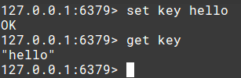
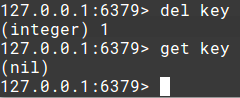
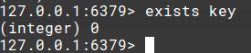
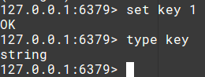
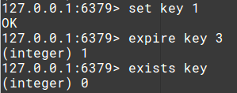

# Redis命令和数据结构

Redis支持5种数据结构：

* string 字符串
* hash 哈希表
* list 列表
* set 集合
* sorted set 有序集合，和无序集合的区别就是插入元素时要指定一个用于排序的分数（分数可重复）

Redis提供了一些操作这些数据结构的命令，下面从使用的角度对一些常用的命令进行介绍。

## Key 键

更通俗的可以理解为变量名，Redis中，我们基于某一种数据结构创建一个变量，我们需要提供一个变量名，以供对这个变量（键）进行操作。对于不同的数据结构，创建它都有不同的命令。

```
set       创建键
get       获取
del       删除键
exists    检查某个键是否存在
```

例子：创建一个字符串，然后获取这个字符串的值



例子：删除刚刚创建的字符串



例子：检查键是否存在



```
type    查看键对应的数据的类型
```



```
expire    设置某个键的销毁时间，单位是秒
```

例子：设置3秒后销毁key



## 数据结构及其操作

这部分命令实际上很简单，下面仅通过例子演示一些常用的操作，具体命令请参考[redis文档](https://redis.io/documentation)。

### 字符串

设置一个字符串Key
```
127.0.0.1:6379> set str "hello"
OK
```

取出字符串的值
```
127.0.0.1:6379> get str
"hello"
```

### 哈希表

为哈希表设置一个值
```
127.0.0.1:6379> hset ht key1 "val1"
(integer) 1
```

为哈希表设置多个值
```
127.0.0.1:6379> hmset ht key2 "val2" key3 "val3"
OK
```

取出哈希表中的值
```
127.0.0.1:6379> hget ht key1
"val1"
127.0.0.1:6379> hget ht key2
"val2"
127.0.0.1:6379> hget ht key3
"val3"
```

### 列表

插入列表（栈操作入栈）
```
127.0.0.1:6379> lpush list "val1"
(integer) 1
127.0.0.1:6379> lpush list "val2"
(integer) 2
127.0.0.1:6379> lpush list "val3"
(integer) 3
```

弹出列表（栈操作出栈）
```
127.0.0.1:6379> lpop list
"val3"
```

注：`lpush`和`lpop`有对应的`rpush`和`rpop`，两种结合起来可以实现栈和队列。

读取列表
```
127.0.0.1:6379> lrange list 0 2
1) "val2"
2) "val1"
```

### 集合

集合插入
```
127.0.0.1:6379> sadd s "aaa"
(integer) 1
127.0.0.1:6379> sadd s "bbb"
(integer) 1
127.0.0.1:6379> sadd s "ccc"
(integer) 1
```

读取集合所有元素
```
127.0.0.1:6379> smembers s
1) "bbb"
2) "ccc"
3) "aaa"
```

### 有序集合

向有序集合插入元素
```
127.0.0.1:6379> zadd z 0 "aaa"
(integer) 1
127.0.0.1:6379> zadd z 0 "bbb"
(integer) 1
127.0.0.1:6379> zadd z 1 "ccc"
(integer) 1
127.0.0.1:6379> zadd z 2 "ddd"
(integer) 1
```

按照分数排序读取有序集合的元素
```
127.0.0.1:6379> zrangebyscore z 0 1000
1) "aaa"
2) "bbb"
3) "ccc"
4) "ddd"
```

### 其他命令

选择一个数据库：
```
select 0
```

这里选中的是0号数据库，默认情况下Redis有0-15共16个数据库，默认操作的是0号数据库。

清空所有数据：
```
flushdb
```

注：虽然redis的数据是存储在内存中的，但是当redis-server关闭时，数据会自动进行持久化操作，所以重启redis服务并不能刷新数据库。
