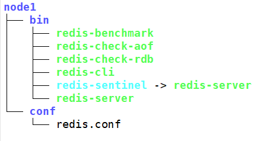
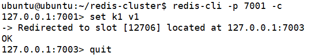

# Redis集群搭建

Redis自带集群功能，通过简单配置就能够实现分片和主备的高可用集群。

对于分片集群，没有主节点和从节点之分，客户端可以连接任一节点。此外，如果所有节点都没有备份，任何一个节点宕机都会导致整个集群不可用，Redis对于节点是否有效的检测需要一个投票机制，因此分片节点必须是奇数（这有点像ZooKeeper），一般来讲，每个分片节点都至少有一个备份节点，所以一个Redis分片集群一般至少有6个节点，否则还是单节点或是单节点主备吧。

## 环境搭建

由于找6台服务器或是虚拟机都太麻烦了，我们就用运行在不同端口的`redis-server`假装是一个集群的6个节点，这里我们使用`7001`到`7006`端口分配给6个Redis节点。

## 编译安装Redis

由于使用软件源安装Redis只能安装一个，这里我们只好手动编译安装6个，例子使用的是UbuntuServer，至于CentOS等也是差不多的操作，但可能有些区别。

在官网下载对应的压缩包解压，然后进入目录执行`make`即可编译了，如果没有安装编译器，请先执行`apt-get install build-essential`。

编译完成后，进入`src`，执行：

```
./configure --prefix=<你的安装路径>
make install
```

这些都是Make的基本操作，具体参考LinuxC编程相关章节。

## 节点配置文件

之前我的安装路径为`~/redis-cluster/node1/bin`，Redis可执行文件已经有了，但是还缺少配置文件，这里从之前Redis源码包中复制一份即可，我这里将其放在`~/redis-cluster/node1/conf/redis.conf`。



配置文件中有几处需要修改。

1. 找到`port`，将其改为该节点对应端口
2. 找到`cluster-enabled`，改为`yes`
3. 找到`daemonize`，改为`yes`，开启守护进程模式

## 启动节点

将`node1`复制为6份。


然后依次启动。

## 开启集群模式

此时虽然节点都启动了，但是集群模式还没有开启，节点之间互相还没有关联，集群需要通过Redis自带的`redis-trib.rb`脚本实现，它可以在编译结果的`src`文件夹下找到。

但是不得不吐槽的是这个Ruby脚本需要对应的解释器，而且还要安装一个依赖包，真不知道这里用Ruby是怎么想的，真的是相当麻烦，首先我们要安装Ruby：

```
apt-get intall ruby
```

然后使用`gem`安装Redis依赖：

```
gem install redis
```

但是由于众所周知的原因，`gem`源在大陆是不能直接访问的，如果无法通过包管理器下载，我们就只好手动把包下载下来安装，这里不多做介绍了。

最后执行Ruby集群搭建脚本即可。

```
./redis-trib.rb create --replicas 1 127.0.0.1:7001 127.0.0.1:7002 127.0.0.1:7003 127.0.0.1:7004 127.0.0.1:7005 127.0.0.1:7006
```

注意：`--replicas 1`表示每个节点有1个副本，因此这里6个节点中有3个主节点，3个副本节点。

## 访问集群

我们可以用`redis-cli`连接任意一个节点，操作会自动响应到某个分片节点上，但是要注意，连接时必须指定`-c`参数，否则集群是不起作用的。

```
redis-cli -p 7001 -c
```


