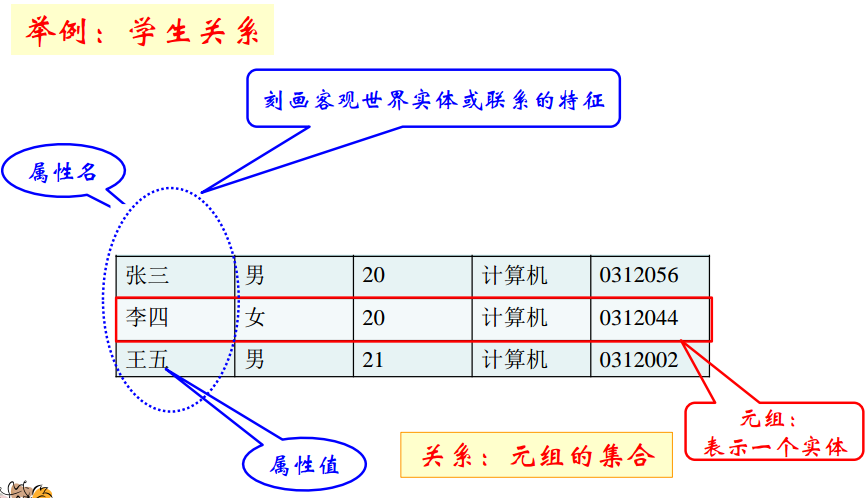

# 关系模型的基本概念

这一节介绍关系模型的基本概念。这里介绍的概念是关系型数据库基础理论中涉及的抽象概念，我们可以类比真实的数据库系统中，表，字段等概念结合学习。

## 关系

若干个数据之间可能具有某种联系，比如学号和姓名，一个人有唯一的学号和唯一的姓名（假设没有重名的人），这种联系在真实的数据库系统中，我们使用一张表来刻画，我们使用一个有意义的名字来命名这个表：如`t_student`。在关系型数据库理论中，我们使用术语“关系”来描述。

* 属性：用来指代关系表的列
  * 属性名：标识每个属性
  * 属性值：属性可能的取值
* 域：属性的所有可能取值，例如年龄属性`[0,200]`
  * 原子域：域中的取值不能再分
  * 空值(null)：值未知或不存在
* 域的笛卡尔积运算：所有域所有取值的一个组合，域中可以有相同的，结果不能重复
* 元组：每一个元素叫做一个n元组，如（张三，男，20，计算机，0312056）

## 关系的性质

* 不同列可以对应相同的域，为了加以区分，每列必须起个名字叫做属性
* 行和列的次序可以交换
* 任意两个元组不能完全相同
* 属性值必须取原子值

## 关系实例

一个关系的任何当前值是该关系的实例。如（张三，男，20，计算机，0312056）就是一个实例。这就像面向对象编程中类和实例之间的关系。

## 常见关系类型

### 基本关系

* 由用户定义，在数据库中实际存储的关系
* 可以查询与更新

### 中间结果关系

* 查询中产生的中间结果
* 在数据库中临时/永久存储
* 只可查询，不可更新

### 视图关系

* 用户根据需要定义的关系
* 定义在基本关系或视图上
* 只有模式，没有实例
* 没有对应的实际存储的数据
* 可查询，更新受限

注：一个视图可以对应一个基本表，也可以对应多个基本表。视图是基本表的抽象和在逻辑意义上建立的新关系​。

视图和数据表的区别：

* 视图是已经编译好的sql语句，而表不是。
* 视图没有实际的物理记录，而表有。
* 表是内容，视图是窗口。
* 表只用物理空间而视图不占用物理空间，视图只是逻辑概念的存在，表可以及时对它进行修改，但视图只能有创建的语句来修改。
* 表是内模式，视图是外模式。
* 视图是查看数据表的一种方法，可以查询数据表中某些字段构成的数据，只是一些SQL语句的集合。从安全的角度说，视图可以不给用户接触数据表，从而不知道表结构。
* 表属于全局模式中的表，是实表；视图属于局部模式的表，是虚表。
* 视图的建立和删除只影响视图本身，不影响对应的基本表。
