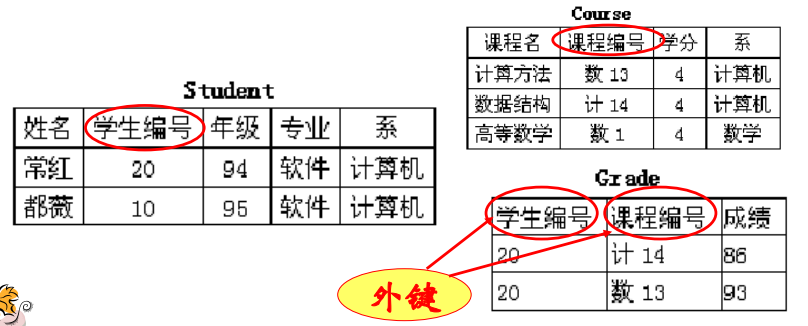

# 完整性约束

这一节我们介绍和数据库完整性约束相关的基本概念。和上节一样，这里介绍的是关系型数据库理论的抽象概念，我们可以类比真实的数据库系统，如MySQL来学习。

## 超码（superkey）

关系模式R(U)的属性集K是超码，如果K的值可以在R中唯一地标识一个元组。比如：学生表的学号，学号是不可能重复的。

## 候选码（候选键）

关系模式R(U)的属性集合k⊆U是候选码，如果：

* R(U)的任何关系实例的任意两个元组在属性集合k上的值都不相同； (唯一性)
* k的任何真子集都不满足条件(1)。 (最小性)

依据定义，显然一个关系模式可能具有多个候选键。例如：学生表，学号是超码，可作为候选码。（学号，姓名）也能作为候选码，因为任意两个学生的学号不同，（学号，姓名）肯定也是不同的。

## 主键（primary key）

主键是被数据库设计者选中的，用来在同一关系中区分不同元组的候选码。也就是说，主键是一种候选码。

选择原则：值从不或很少变化的，一般我们选取一个所有元组中唯一的属性，比如“学号”。

一个关系模式只能有一个主键。但是主键可能有多个属性组成（这在MySQL中叫做联合主键）

## 外键（foreign key）

设有关系模式S(U’)和R(U)，及属性集合X，X⊆U’，X⊆U，若X是S(U’)的主键，则称X是R(U)关于S(U’)的外键。这个定义太难懂了，我们结合数据库软件中的外键就很好理解了，下面是一个例子：

注：外键并不一定要与相应的主键同名，但一般情况下， 外键与相应的主键往往取相同的名字， 以便于识别。

## 其他概念

* 实体完整性约束：主键不能为空值且唯一，也就是MySQL中经常写的`UNIQUE NOT NULL`。
* 关联完整性约束：设X是关系模式R(U)关于关系模式S(U’)的外键，如果x是R(U)的关系实例的一个元组的外键值，则S(U’)实例中必存在一个元组T，T在X上的值为x，说白了就是MySQL中的外键约束。
* 语义完整性约束：这个很好理解，数据关系要符合语义。
* 函数依赖：这个比较复杂，内容很多，详见`数据库系统/逻辑数据库设计`相关章节。
