# 关系代数

关系代数是一种基于关系的数学运算规则，用于数据库理论中。这里要注意，关系代数和SQL查询语句不是一个东西，不要弄混了。SQL查询语句是可以经过优化，转化成关系代数表达式的高级语言。关系代数则是可以直接对应数据操作代码的一种数学运算。

## 代数操作符号

就像四则运算的加减乘除一样，关系代数中有一系列操作符，有些有对应的字母符号表示。

### 基本代数操作

* 选择：σ
* 投影：Π
* 并：U
* 差：-
* 笛卡尔积：x
* 重命名：ρ

### 附加的关系代数操作

* 交 ∩
* 自然连接 ⋈
* 除 ÷
* 赋值 =

### 扩展的关系代数操作

* 广义投影
* 聚集
* 外链接

## 基本代数操作详解

下面我们详细介绍关系代数中的各种操作。这里除了理解这些运算，还要注意关系代数表达式的写法。

### 选择（select）

从关系中选出满足条件的元组，选择条件可以是简单逻辑表达式，或者复合逻辑表达式。

例：从表Student（Sno，Sname，Ssex，Sdept）中查询所有计算机系同学：

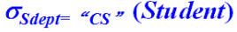

### 投影（Project）

从关系中选出若干列，组成新的关系。

例：取上段中Student表的学生编号和专业组成新关系。

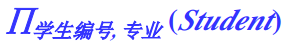

### 并（Union）

关系R和S的并：合成R和S的元组，组成新关系。

约束条件：关系R和S的属性个数需相同，且对于所有的属性i，R的第i个属性的域和S的第i个属性的域相同。

通俗的说，就像两张数据表，只有两张表的字段完全相同才能进行并运算。

### 差（Difference）

关系R和S的差：属于R但不属于S的关系。

约束条件同并。

### 笛卡尔积（Cartesian product）

将任意两个关系的信息组合在一起，R中有a个元素，S中有b个元素，RxS中有axb个元素。

注意：关系R和S的属性名不能重叠，如果重叠了，需要重命名，可以将关系名称附加到该属性上，如：R和S都有a属性，那么笛卡尔积结果中，两个`a`属性应该分别命名为`R.a`和`S.a`。

### 重命名（Rename）

将关系R重新命名为S，属性从左到右重新命名为A1，A2等，S与R具有完全相同的元组。

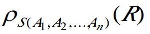

## 附加代数操作详解

### 交（Intersection）

关系R和S的交：既属于R又属于S的关系。显然，交运算能用差运算代替，这也是为什么交运算属于附加代数操作。

约束同并。

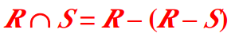

### θ连接（θ-join）

从R和S的笛卡尔积中选择属性满足一定条件的元组

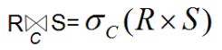

### 等值连接（EquiJoin）

相等关系的θ连接可以表示为等值连接

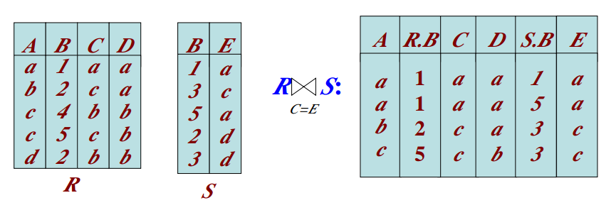

### 自然连接（NaturalJoin）

一种特殊的等值连接，两个关系中进行比较的必须是同名属性组，且在结果关系中将同名属性列去掉。

介绍上面两个连接的概念是为了引出自然连接，我们一般都是使用自然连接的。

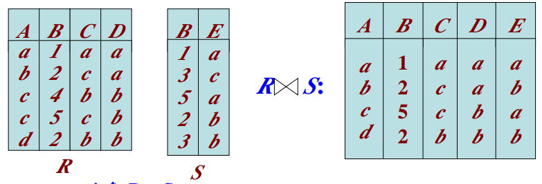

等价形式：

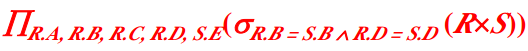

### 除（division）

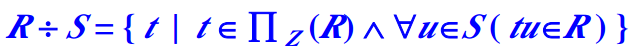

表R（X，Y）和表S（Y，F），R÷S其实就是判断关系R中X各个值的像集Y是否包含关系S中属性Y的所有值。

注：做题时，带有“所有”字样的，一般考虑用除。

例子：

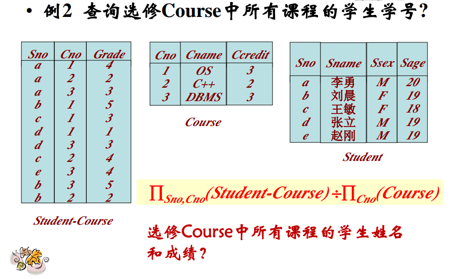

解释：

其实很好理解，首先Student-Course表做投影，我们把结果记为R，对Course做投影结果记为S。

R中对于X=a，有像集Y={1,2,3}，等于S中所有元素，因此a所属的元组在除运算结果中。b，c，d等元素也是同样判断方法。

## 扩展的关系代数操作

扩展关系代数操作可以实现无法用基本的关系代数表达式进行的查询。说白了就是数学家们定义了一堆运算，后来有人突然发现不够用，又加了几个，起个名就叫“XX扩展运算”，这样听起来比较高端。

下面介绍的关系代数运算在MySQL中都有对应的操作。

### 广义投影

将算术运算作为投影的一部分。

例：

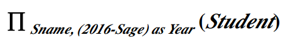

### 分组聚集

聚集函数：sum() count() min() max() avg() 等

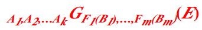

A是分组属性集合，F是聚集函数，B是聚集属性

例：统计男女职工工资总和

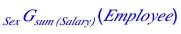

sex是分组，sum(salary)是统计工资总和的函数。返回结果也是一个关系模式实例，第一个字段是sex，第二个字段是工资总和。

### 外连接（outer-join）

连接运算的扩展，用来处理缺失值，不过几乎很少用到。

* 左外连接：左右关系做自然连接，取出左侧关系中所有与右侧关系的任一元组都不匹配的元组，用空值填充所有来自右侧关系的属性，再把所产生的元组加到自然连接的结果中
* 右外连接：类比左外连接
* 全外连接：类比左外连接

例：

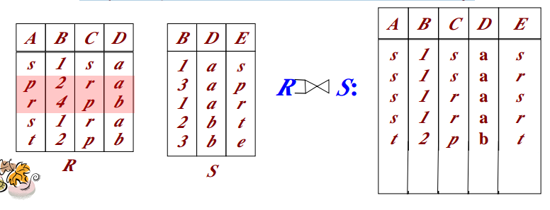

### 消除重复

消除重复元组

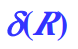
