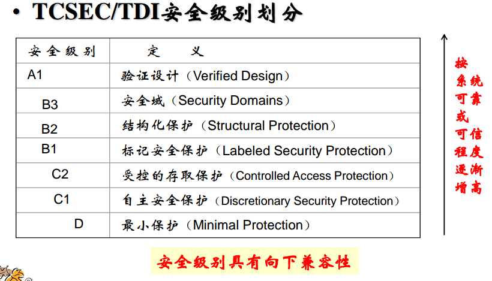
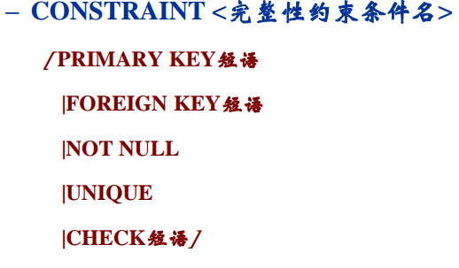

# 数据保护功能

为了保证数据库的安全可靠和正确有效，DBMS（数据库管理系统）必须提供统一的数据保护功能。这一节我们介绍和数据库系统安全性和完整性相关的概念。

注：安全性和完整性是系统安全中的两个概念，安全性指数据不被未授权访问，完整性指系统运行过程中，对数据进行不停的操作，但是能保证数据的正确性。

## 数据库安全性

数据库的任何部分都不允许受到恶意侵害或未经授权的存取或修改。



实现数据库安全性的基本机制：

* 用户登录控制
* 数据访问控制
* 审计机制
* 数据加密机制

### 用户登录控制

是系统提供的最外层安全保护措施，数据库提供用户名和口令。这一部分的详细内容可以参考`/数据库系统/MySQL数据库管理系统/用户权限管理`。

### 访问控制机制

1. 定义存取权限
2. 检查存取权限
3. 用户权限定义和合法权限检查机制一起组成了DBMS的安全子系统

**自主存取控制（C2）**：同一用户对不同的数据对象有不同的存取权限，不同的用户对于同一对象也有不同的权限，用户还可将其拥有的存取权限转授给其他用户，安全领域中也叫作DAC。

**强制存取控制（B1）**：每一个数据对象被标以一定的秘密等级，每一个用户也被授予某个秘密等级的许可证，只有合法许可的用户才能存取数据，安全领域中也叫作MAC。

**数据库角色**：是一组与数据库相关操作的权限，可以为一组有相同权限的用户创建一个角色，使用角色管理数据库权限可以简化授权过程。

其实这些概念在信息安全领域中，我们都十分熟悉了。

### 审计机制

审计功能会使用几个审计日志，记录用户对数据库的操作，DBA根据审计日志找出非法存取数据的人。C2以上安全级别的DBMS需要有审计功能。除此之外，日志还能用于数据恢复。

### 数据加密机制

将原始数据加密成密文存储。显然，数据加密和性能是不可兼得的。

## 数据库完整性

一般指语义完整性和事务完整性两方面。这里主要讨论语义完整性。为保证数据库中数据的正确性和相容性，需要有关系模型的完整性约束：

1. 域完整性
2. 实体完整性
3. 关联完整性（参照完整性）
4. 用户定义完整性

### 域完整性

域完整性保证关系表取值的合理性，包括检查是数据表中该值否合理（CHECK），默认值（DEFAULT），唯一（UNIQUE），不为空（NOT NULL）等。在定义数据表（CREATE TABLE）时定义。

### 实体完整性

指关系的主码不能重复也不能为空（UNIQUE NOT NULL）。

插入或对主码进行更新操作时，会按照实体完整性进行检查，不符合实体完整性约束的数据拒绝插入。

### 关联完整性

定义数据表时，使用FOREIGN KEY定义外码，使用REFERENCE指定这些外码关联哪些表主码。

### 完整性约束命名子句



例子：

```sql
CREATE TABLE Student
(
    Sno NUMERIC(6)
    CONSTRAINT C1 CHECK (Sno BETWEEN 90000 AND 99999),
    Sname CHAR(20)
    CONSTRAINT C2 NOT NULL,
    Sage NUMERIC(3)
    CONSTRAINT C3 CHECK (Sage < 30),
    Ssex CHAR(2)
    CONSTRAINT C4 CHECK (Ssex IN ( '男'， '女')),
    CONSTRAINT StudentKey PRIMARY KEY(Sno)
);
```

注：这个例子代码只是为了说明SQL中能够像这样定义完整性约束，不具体指某个数据库系统。
