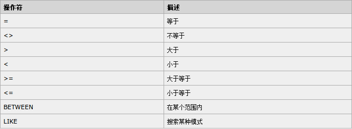
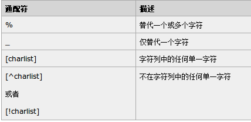

# SQL数据操作语句

从本篇开始，我们讲解SQL语言相关的内容，由于各个关系型数据库对SQL语言的支持情况可能略有不同，文章中我们尽量避免使用某一数据库专用的SQL语句，如果遇到，会特别说明。

## SQL语言简介

SQL是访问和处理RDBMS（关系型数据库）的结构化查询语言。

SQL对大小写不敏感，但是建议按照规范书写。

SQL主要分为DML（数据操作语言）包括增删改查，DDL（数据定义语言）创建数据库，表等。

## SELECT语句

从表中选取数据，结果存储在结果集中。使用例子：

```sql
SELECT 列名称 FROM 表名称
SELECT * FROM 表名称
```

注意：
* `*`表示选取所有列
* 操作数据库的语言通常提供了在结果集中导航的函数操作

### SELECT DISTINCT

表中选取的某一列可能包含重复值，有时希望仅列出不同（distinct）的值。

```sql
SELECT DISTINCT 列名称 FROM 表名称
```

### WHERE子句

WHERE用于规定SELECT选取的范围。

```sql
SELECT 列名称 FROM 表名称 WHERE 列 运算符 值
```

WNERE子句可用的运算符：



注：

* 某些数据库中，`<>`可写作`!=`。
* SQL中使用单引号围绕字符串字面值，通常使用单引号（大部分数据库也接受双引号），但要注意：数字值不能用引号，SELECT 的列名等不是字符串，不能用引号，例子：`SELECT * FROM Persons WHERE FirstName='Bush'`

### LIKE操作符

LIKE用于在WHERE子句中指定搜索模式。

```sql
SELECT column_name
FROM table_name
WHERE column_name LIKE pattern
```

LIKE中，`%`作为通配符，如`N%`匹配以N开头的数据，`%lon%`表示含有lon子串的数据，除此之外，还有一些其他通配符。



### IN操作符

IN操作符用于在WHERE中规定多个取值范围。

```sql
SELECT column_name
FROM table_name
WHERE column_name IN (value1,value2,...)
```

value可以是字符串，数字，日期，或子查询的结果集。

### BETWEEN操作符

BETWEEN选取介于两个值之间的数据范围。不常用。

```sql
SELECT column_name
FROM table_name
WHERE column_name
BETWEEN value1 AND value2
```

注：不同数据库对BETWEEN可能实现不一样。

### IS NULL/IS NOT NULL

注意NULL类型不能使用`=`，`！=`等符号判断，如果那样做，它永远是false。应该使用IS NULL/IS NOT NULL判断NULL类型。

### ALIAS别名

使用别名可以简化WHERE中条件语句。

```sql
SELECT column_name
FROM table_name
AS alias_name
```

使用实例：

```sql
/*使用别名*/
SELECT po.OrderID, p.LastName, p.FirstName
FROM Persons AS p, Product_Orders AS po
WHERE p.LastName='Adams' AND p.FirstName='John'
/*不使用别名*/
SELECT Product_Orders.OrderID, Persons.LastName, Persons.FirstName
FROM Persons, Product_Orders
WHERE Persons.LastName='Adams' AND Persons.FirstName='John'
```

### LIMIT（TOP）子句

LIMIT子句规定返回数据的数目，经常用于分页查询。SQL Server是TOP语法，MySQL和Oracle则是LIMIT语法。例子：

```sql
SELECT * FROM 表名 LIMIT 0,10
```

### AND/OR

AND和OR运算符用于基于一个以上的条件对记录进行过滤，可在WHERE子句中把多个条件连接起来。

例子：

```sql
SELECT * FROM Persons WHERE FirstName='Thomas' AND LastName='Carter'
```

### ORDER BY/ORDER BY DESC

ORDER BY用于对结果集升序排序。DESC则是降序排序。通常用于根据学号列出学生，根据日期列出邮件等需求。

例子：

```sql
/*字母序升序*/
SELECT Company, OrderNumber FROM Orders ORDER BY Company
/*Company字母序升序，OrderNumber数字升序*/
SELECT Company, OrderNumber FROM Orders ORDER BY Company, OrderNumber
/*字母序降序*/
SELECT Company, OrderNumber FROM Orders ORDER BY Company DESC
```

### UNION/UNION ALL

UNION可以合并两个SELECT操作的结果集，默认会进行去重操作；UNION ALL也是合并结果集，但是不去重。

```sql
/*去重合并*/
SELECT column_name FROM 表名称1
UNION
SELECT column_name FROM 表名称2
/*不去重合并*/
SELECT column_name FROM 表名称1
UNION ALL
SELECT column_name FROM 表名称2
```

注意：最好不要在同一个表上用UNION，因为查询同一个表，用WHERE的AND/OR等操作指定条件效率更高。

### 子查询

查询结果集可以作为WHERE条件，因此可以实现子查询，子查询语义清晰，但多表连接查询理论上更加高效。实际上的效率，由于数据库的实现不同，可能有的数据库对子查询进行了优化，有的没有，具体应该根据所使用数据库进行调整。

## INSERT语句

用于向数据表中插入数据。

```sql
/*直接插入*/
INSERT INTO 表名称 VALUES (值1, 值2,....)
/*指定列名插入*/
INSERT INTO table_name (列1, 列2,...) VALUES (值1, 值2,....)
```

## UPDATE语句

用于更新数据表中的数据。

```sql
UPDATE 表名称 SET 列名称 = 新值 WHERE 列名称 = 某值
```

使用例子：

```sql
/*更新一列*/
UPDATE Person SET FirstName = 'Fred' WHERE LastName = 'Wilson'
/*更新多列*/
UPDATE Person SET Address = 'Zhongshan 23', City = 'Nanjing' WHERE LastName = 'Wilson'
```

## DELETE语句

删除数据表中的一行或所有行

```sql
DELETE FROM 表名称 WHERE 列名称 = 值
DELETE * FROM 表名称
```
