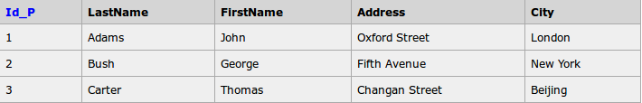
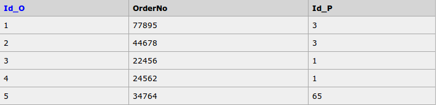
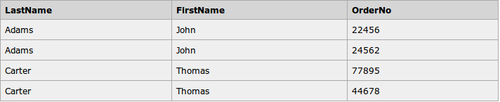

# 子查询和连接查询

查询结果集可以用作WHERE子句的条件，这种查询方式叫做子查询。

JOIN用于根据两个或多个表中的关系，从这些表中查询数据。多个表通使用主键和外键连接起来。

理论上，连接查询效率更高，但是考虑数据库实现不同，是否有针对子查询的优化，实际上的效率不好对比。而子查询显然可读性更好，对于非常复杂的业务需求，可能难以写出连接查询。

例子：

Persons表



Orders表



子查询方式：

```sql
SELECT Persons.LastName, Persons.FirstName, Orders.OrderNo
FROM Persons, Orders
WHERE Persons.Id_P = Orders.Id_P
```

内连接方式：

```sql
SELECT Persons.LastName, Persons.FirstName, Orders.OrderNo
FROM Persons
INNER JOIN Orders
ON Persons.Id_P = Orders.Id_P
ORDER BY Persons.LastName
```

上述代码中使用了INNER JOIN（内连接）查询。

## INNER JOIN/LEFT JOIN/RIGHT JOIN/FULL JOIN

* INNER JOIN（内连接）只返回两个两个表中连接字段相等的行，最常用。
* LEFT JOIN（左外连接）返回左表所有行，和右表中连接字段相等的行。
* RIGHT JOIN（右外连接）类比左外连接。
* FULL JOIN（全连接）类比左右外链接，MySQL不支持，实际上也不需要这种操作。

连接查询过程：

以上面例子的内连接查询为例，首先`FROM Persons INNER JOIN Orders ON Persons.Id_P = Orders.Id_P`，就是生成内连接所需要的表，从这个连接生成的新表中查询。由于两个表中，Id_P相同的行有Persons表第1,3行，Orders表1-4行，因此这些行组成了如图所示的内连接新表，也就是需要的结果集。


