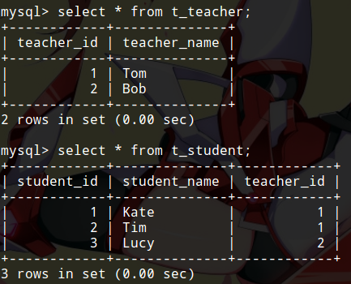
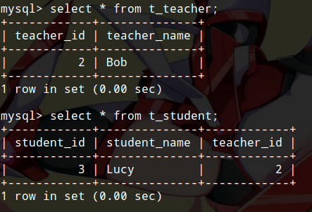
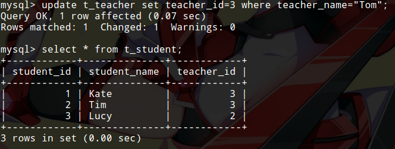

# 级联数据库操作语句

级联查询前面已经介绍过了，因为查询是数据库操作中使用最多的操作，级联查询是比较复杂的，而且涉及到性能问题。这篇笔记记录如何实现级联更新和删除。

是否有级联插入呢？虽然不常见，实际上却可能有这样的需求，但级联插入建议使用触发器实现。有关触发器，将在具体数据库的相关章节介绍。至于级联更新和级联删除，实在是太常用了。复杂的级联更新，删除也可以使用触发器，但下面我们介绍一个更简单常用的方法，建表时指定外键的级联操作。

## 一个例子

我们这里以MySQL语法进行介绍，举一个最简单的使用场景例子。

我们有一个老师表`t_teacher`，学生表`t_student`，学生持有老师ID的外键，因此这是一个典型的一对多关系。

```sql
create table t_teacher(
  teacher_id bigint primary key,
  teacher_name varchar(20)
);
create table t_student(
  student_id bigint primary key,
  student_name varchar(20),
  teacher_id bigint not null,
  foreign key (teacher_id) references t_teacher (teacher_id)
);
```

我们插入几条测试数据：

```sql
insert into t_teacher values (1, "Tom");
insert into t_teacher values (2, "Bob");

insert into t_student values (1, "Kate", 1);
insert into t_student values (2, "Tim", 1);
insert into t_student values (3, "Lucy", 2);
```

## 级联删除

现在我们想实现，删除名字为“Tom”的老师，就把他关联的学生全部删除。

较差的实现方式：

1. 查询`teacher_name="Tom"`的老师，得到其`teacher_id`
2. 从`t_student`中删除`teacher_id`为`1`的所有学生
3. 从`t_teacher`中删除`teacher_id`为`1`的老师

这种操作就比较麻烦了，如果是使用Java操作数据库，不仅要编写好几条SQL语句，还要多执行一次查询操作

较好的解决办法：

定义外键时这样写：
```sql
foreign key (teacher_id) references t_teacher (teacher_id) on delete cascade
```

`on delete cascade`代表`t_teacher`中某个数据项删除时，其关联的`t_student`表中的数据也会级联删除。如果你已经建好表了，也可以使用`alter table`语句修改外键。

现在我们试验一下，删除之前是这样的：



执行删除语句：

```sql
delete from t_teacher where teacher_name="Tom";
```

删除之后：



这确实是我们想要的结果。

## 级联更新

级联更新，举个例子就是修改`t_teacher`的主键，`t_student`的外键值也跟着更改。级联更新不太常用，因为我们通常不会随意修改主键。

如果想要使用级联更新，像下面这样定义外键就可以了。
```sql
foreign key (teacher_id) references t_teacher (teacher_id) on update cascade
```

我们还是使用前面插入的数据作为例子，执行更新语句：



我们修改了教师表中一条数据的主键，学生表的外键值也级联更新了。

## 同时设置级联删除和级联更新

两个级联操作全部指定给外键就行了。
```sql
foreign key (teacher_id) references t_teacher (teacher_id) on delete cascade on update cascade
```

## 除了cascade我们还有哪些选项

* `restrict` 默认行为（默认强制外键约束），无需手动指定，这种情况下直接删除或更新被外键关联的数据项是不允许的，SQL会报错
* `cascade` 就是上面介绍的级联更新和删除
* `no action` 删除或更新被外键关联的数据不会影响持有外键的数据
* `set null` 删除或更新被外键关联的数据会把该外键值设为null，这个应用也很多，比如上面例子中，我们如果想要删除教师后保留学生信息，就可以使用这个选项
