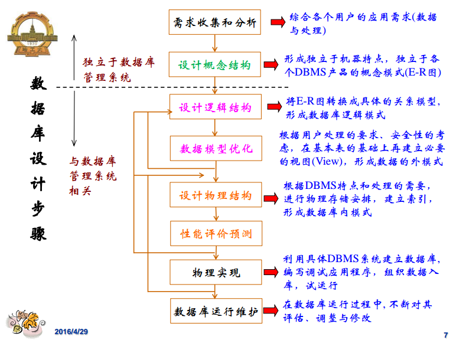

# 数据库设计概述

从本篇笔记开始，我们讲述和数据库设计有关的内容，说白了就是讲解如何定义一个“好”的数据关系。这里我们依然是使用抽象的关系数据库理论对数据库设计中的概念进行描述，当然这可能很难理解，而且有很多难懂的概念，可以类比现实生活中的数据关系进行思考。

## 什么是数据库设计

对于一个给定的应用领域，设计优化的数据库逻辑和物理结构，使之满足用户的信息管理要求和数据操作要求，有效的支持各种应用系统的开发和运行。

* 信息管理要求：数据库中应该存储管理哪些数据对象。
* 数据操作要求：对数据对象需要进行哪些操作，如增、删、改、查、统计等。

## 数据库设计目标

为用户和各种应用系统提供一个信息基础设施和高效率的运行环境。

* 数据存取高效率
* 存储空间利用率高
* 运行管理效率高

## 数据库设计特点

* 结构设计：概念结构设计，逻辑结构设计，物理结构设计
* 行为设计：功能模型，事务设计，应用设计
* 二者结合

## 数据库设计步骤

数据库的设计步骤，一般都是结合在软件系统的设计步骤中的。

## 什么是需求分析

需求分析就是分析用户的要求，是数据库设计的起点。其结果是否准确反应了用户的实际要求，将直接影响到后面各个阶段的设计，并影响到设计结果是否合理和实用。

### 需求分析的任务

* 详细调查现实世界要处理的对象（组织，部门，企业等）
* 充分了解原系统（手工系统或计算机系统）工作概况
* 明确用户的各种需求
* 在此基础上确定新系统的功能
* 新系统必须充分考虑今后可能的扩充和改变

### 需求分析的重点

#### 信息要求

* 用户需要从数据库中获得信息的内容与实质
* 由用户的信息要求可以导出数据要求，即在数据库中需要存储哪些数据

#### 处理要求

* 用户要完成什么处理功能
* 对处理的响应时间要求
* 对处理方式的要求

#### 安全性与完整性要求

### 需求分析的步骤

1. 应用领域的调查分析
2. 定义数据库支持的信息与应用
3. 定义数据库操作任务
4. 定义数据字典（数据库中数据的描述，即元数据）
4. 预测应用领域的未来改变
