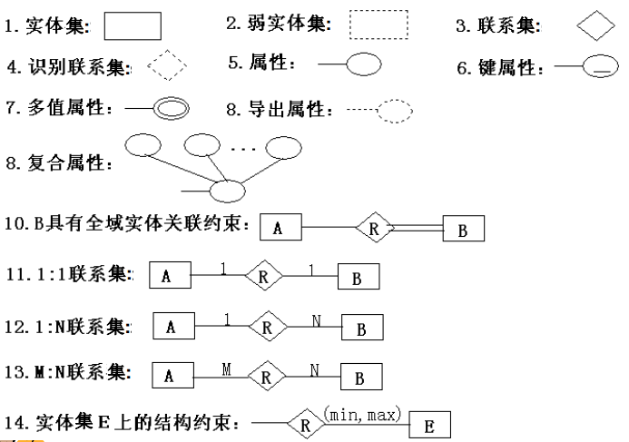
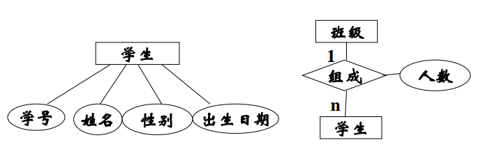
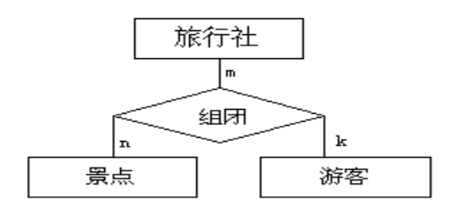
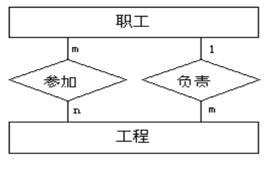
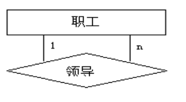

# 概念数据库设计

概念数据库设计，说得通俗一点，就是从需求分析中找出实体和关系，把这些东西理清。我们可以画一张图表示这些实体和关系，那就是ER图。实际上概念数据库设计没什么特别的方法，就是根据常识，整理好需求中给出的信息。本篇笔记主要摘录了课件上的一些有关概念数据库设计的知识，是比较枯燥无聊的，说它有用其实也没什么用，说它是废话其实还不是，比较鸡肋。除此之外还有一些ER图画法相关的内容，非常简单，记录下来以备随时查阅。

## 什么是概念数据库设计

概念数据库设计包括：

* 概念数据库模型设计：以需求分析阶段所识别的数据项和引用领域的未来改变信息为基础，使用高级数据模型建立概念数据库模式。
* 事务设计：考察概念分析阶段提出的数据库操作任务，形成数据库事务的高级说明。

## 概念数据库模式设计的目标

* 准确描述应用领域的信息模式，支持用户的各种应用。
* 既便于转换为逻辑数据库模式，又便于用户理解。

注意：概念数据库模式独立于任何实际存在的DBMS，是抽象的概念。

## 实体-联系模型（Entity Relationship Model 简称ER模型）

实体联系模型是用于概念数据库设计的高级数据模型，可以简单的表示成“实体-联系”图，即ER图。

ER模型的三个主要元素：

* 实体
* 属性
* 联系

### ER模型基本概念

* **实体**：ER模型的基本对象。实体是现实世界中各种事物的抽象。实体可以是物理存在的事物，如人，汽车等，也可以是抽象的概念，如课程等。
* **实体集**：是相同类型的实体的集合。实体集不必互不相交。
* **属性**：每个实体都有一组特征或性质，称为实体的属性，实体属性的一组特定值确定了一个特定的实体，实体的属性值是数据库中存储的主要数据。如：学生的名字，年龄等。
* **导出属性**：从其他的属性或有关实体可以计算出的属性叫做导出属性，如：从生日属性导出年龄属性。
* **空值**：某些情况下，实体的某些属性没有适当的值可设置，这些属性使用称为“空值”的特殊值。
* **码**：ER模型中每个实体集中，由一个或多个属性组成码，用于区别不同实体。
  * 主码
  * 超码
  * 候选码
* **联系**：不同实体集之间的关联。
  * 一对一
  * 一对多
  * 多对多
* **联系集**：同类联系的集合。一个联系集关联的实体集的数量叫做这个联系集的阶，阶为n的联系集叫n元联系集。实体之间的联系可以用联系集定义，也可以用实体属性表示，如：用“学生”实体集的“所属专业”属性表示和“专业”实体集之间的联系。
* **联系集的属性**：描述性属性。如“学生”和“课程”之间，有“分数”属性。
* **弱实体**：现实世界中存在这样一些实体集，没有足够的属性形成自己的主码。为了区分各个实体，他们必须与其他实体集相关联。这样的实体集称为弱实体集。与弱实体集相关的实体集成为识别实体集（主实体集），其之间的联系称为识别联系，一对多关系，弱实体集为多方。弱实体集必须有一个或多个属性，能和主实体集的主码结合，形成相应弱实体集的主码。这样的弱实体属性称为弱实体集的部分码。

## 实体-联系图（ER图）

ER图是表示ER模型的图形工具。

### ER图基本符号

### ER图简单例子

## 概念数据库设计的基本步骤

1. 确定实体集，实体集的属性，主码
2. 确定实体集之间的联系和其相关约束
3. 形成概念数据库的ER图

## 概念数据库的设计方法

### 集中式设计

合并在需求分析阶段得到的各种需求，设计一个概念数据库模式，满足所有的需求。

实际上一般中，小型的项目都是这样设计的。

### 视图综合设计

1. 视图设计：根据每个应用的需求，独立的为每个用户和应用设计一个概念数据库模式，每个应用的概念数据库模式称为一个视图。
2. 视图合并：把所有视图合并成一个概念数据库模式

视图如何合并？

1. 首先遵循局部视图设计，生成局部ER图
2. 识别局部ER模型的冲突：命名冲突，模式结构冲突，值域冲突，约束冲突。
3. 修改局部模式
4. 局部模式合并
5. 优化全局模式

### 设计策略

* 自顶向下：首先定义全局概念结构框架，然后逐步细化
* 自底向上：首先定义各局部应用的概念结构，然后把他们集成起来，得到全局概念结构

## 事务设计

事物是一个或多个操作构成的集合，这组操作满足原子性。事务设计，需要定义事物的功能，说明事物的输入输出。
