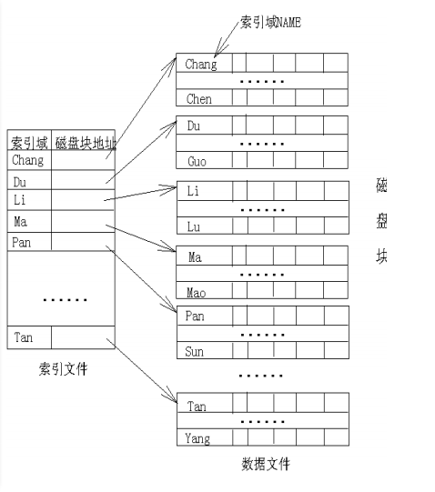

# 关系数据库系统的物理存储结构

从这篇笔记开始，我们讲解有关数据库实现的相关概念和算法。本篇笔记主要记录数据库系统底层的物理存储结构，索引等相关概念。

数据库管理系统的数据操作算法、查询优化处理方法和事务处理算法与数据库的物理存储结构密切相关。在讨论物理存储结构时，我们不再关心应用程序员如何看待数据，而主要考虑如何在外存储器上以最优化的方式存放数据。物理存储结构的设计主要考虑数据库的操作效率、响应时间和空间利用率。

## 数据库存储设备

数据库通常存储在辅助存储设备上。

* 磁带 磁带一般作为数据库的副本备份，实现系统的故障恢复
* 磁盘 直接存储数据库，用户操作在磁盘上进行
* PCM NAND等新技术

一次磁盘读写需要毫秒级的时间，和CPU/主存的速度相比非常慢，所以磁盘读写是数据库应用的瓶颈。数据库的物理存储结构，数据库操作算法和查询优化的研究都把最小化存盘读写次数作为重要目标之一。

### 磁盘缓冲区技术

主存和磁盘之间传送数据块时，使用缓冲区平衡两者的速度。

### 磁盘容错技术

* RAID0 没有容错，最大化读写性能
* RAID1 每个数据盘附加一个镜像盘，缺点：系统崩溃两个盘都会故障
* RAID4 使用一个磁盘存储其他磁盘对应位的奇偶校验，因此如果任何一个磁盘发生故障，可以通过其他所有磁盘算出该磁盘的数据，缺点：冗余磁盘读写次数太多
* RAID5 每个磁盘作为某些磁盘扇区的冗余磁盘

## 磁盘文件

数据在磁盘上有多种存储方式，下面我们先不考虑实际使用中的情况，介绍几种可行的方案。

### 有关磁盘文件的基本概念

#### 数据项

表示关系数据库中元组的属性值，如：姓名，年龄等。数据项具有类型，如integer等。

#### 文件记录

数据项的集合，对应于一个关系元组。按存储的记录数量可以分为定长纪录，非定长记录，按存储方法可以分为跨块存储（一个记录可以存储在多个文件块），非跨块存储。

#### 文件块

记录的集合，一个文件块对应一个磁盘块，注意：概念上一个文件块不是对应文件系统上一个`xxx.txt`，而是一个磁盘块。

### 磁盘文件中记录的存储方式

#### 无序文件

记录随机存储在文件块中，新纪录存储在文件末尾，无序文件通常与索引一起使用，提升存取效率。

* 查询操作：无序文件查找操作必须遍历所有记录，直到找到需要的记录或遍历完成，因此查找效率较低。
* 插入操作：无序文件头存储它的最后一个磁盘块的地址，插入记录时，根据文件头加载磁盘块到磁盘缓冲区，插入内容到缓冲区，缓冲区回写。
* 删除操作：
  * 方法1：首先遍历得到被删除记录所在磁盘块，读入磁盘缓冲区并删除，缓冲区回写。这种方法会造成文件中出现空闲的存储空间，需要周期性整理空间。
  * 方法2：为每个存储空间增加删除标志位，删除时标志位置1，也需要定期整理存储空间。
  * 方法3：对于定长记录文件，直接将末尾记录覆盖待删除记录。
* 修改操作：
  * 定长记录：将待修改记录存入缓冲区，修改并回写。
  * 变长记录：先删除后插入。

#### 有序文件

记录按某个域的值大小顺序排列。注：不一定是连续的。

* 查询操作：如果查找操作条件定义在排序域上，可以使用二分查找，时间复杂度O(logN)，否则要遍历。
* 插入操作：必须找到待插入位置，并移动其后的所有记录。该操作非常耗时。因此每次插入后，可以在其后面预留一段空间，以备其他插入，也可以将插入的数据先写入临时文件，然后慢慢整理。
* 删除操作：可以使用标志位+定期整理的方法。
* 修改操作：
  * 定长记录：修改非排序域，先插入再删除，修改排序域，需要修改记录的存储位置。
  * 变长记录：先插入后删除。

### 磁盘文件的存储方法

* 连续存储：按文件块顺序，存储在磁盘块上，存储整个文件效率高，文件扩充困难。
* 链接存储：每个文件块增加指向下一个文件块的磁盘块指针。缺点是遍历速度慢。
* 索引存储：维护索引表，包含指向文件块的指针。

### 索引文件

索引是一种数据结构，通常是有序文件。索引记录称为索引项，存放索引域值和所在地址。索引记录通常按索引域排序。

* 稀疏索引：对记录按索引关键字分组，每组对应一个索引项。
* 稠密索引：每个记录对应一个索引项。

索引文件可以形成多级索引。

#### 主索引

主索引例子如图：

数据按主键值排序，主索引存储一个分组的第一条数据键值和磁盘块地址。

显然，主索引是稀疏索引。

#### 聚集索引

聚集索引和主索引区别是索引域不是主键。

被索引域同样需要排序，聚集索引是稀疏索引。

#### 辅助索引

辅助索引建立在文件的非排序域上，但辅助索引文件是有序文件。

显然这种索引是稠密索引。

#### Hash索引

文件被划分为n个hash桶，每个桶对应一个磁盘块，统一对记录的一个属性作hash，结果作为桶编号，通过桶编号，找到磁盘块地址。

hash冲突，最简单的办法是使用链表解决：

查询到某个链表时，只能遍历。

插入删除操作较为简单，这里就不叙述了。

Hash文件优点显而易见，这里看看它的缺点：hash桶数量不变，文件记录少时，会浪费大量存储空间，文件记录多时，链表很长，效率较差。

#### 树型动态Hash索引

为了解决Hash桶数量不可变，我们介绍一种能够动态分配Hash桶的方案。该方案使用二叉树解决这个问题。

初始时只有一个hash桶B，B溢出时，就分成两个桶B1，B2，B中记录hash第一位为1的进入B1，为0的进入B2，B1或B2桶再次溢出就再根据hash值第二位次划分为两部分。

如图所示，最终形成了路径分为0-1的二叉树：

查询时，根据记录hash值的前几位，在树中搜索就可以找到对应的hash桶了。

#### 可扩展动态Hash索引

我们还有一些其他的解决方案可以扩展Hash索引，这里再介绍一个将Hash索引数组翻倍的方式。

图中，每个Hash索引目录项指向一个Hash桶，我们假设一个桶能放4条记录，全局位深度为2表示我们取哈希值后两位建立索引表（当然不一定必须是后两位）。

现在在上图基础上，插入值d1，假设hash(d1)=0b1101，指向b桶，b桶未满，将d1插入b桶。

插入值d2，假设hash(d2)=10100，指向a桶，但是a桶满了，这时我们将a桶分裂为两个桶，其局部位深度+1，变为3，全局位深度也要+1，变为3，a桶中所有数据需要重新分配，Hash索引表由于多出一倍的长度，也要将新增的一半索引表的指向根据原表进行更新。

#### B树文件索引和B+树文建索引

请参考数据结构相关章节。

推荐一个网址[http://goneill.co.nz/btree-demo.php](http://goneill.co.nz/btree-demo.php)，里面可以演示B+树的插入删除等操作，不会的时候看一眼立刻就明白了。
