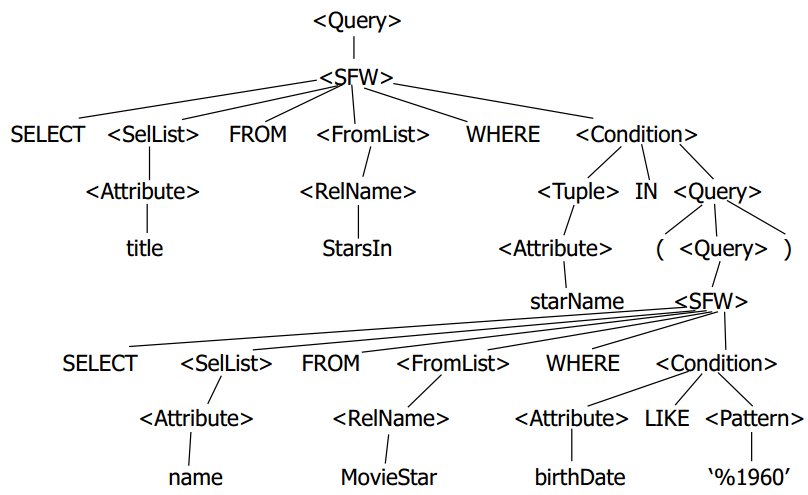
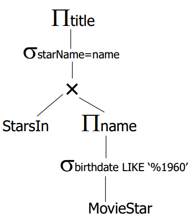
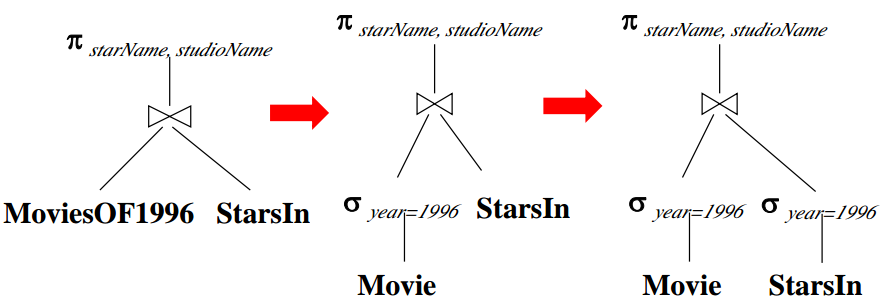

# 查询处理和优化

我们向数据库发送SQL语句，数据库解析SQL语句并执行查询，这中间需要一个转化的过程，而且这个过程能够将性能较差的SQL语句优化为高性能的查询。这篇笔记记录了从SQL语句转化为关系代数表达式的过程和其优化算法。

## 基本概念

* SQL语句的语法树：select，from等关键字组成的语法树
* 逻辑查询计划树：由基本关系代数操作符组成的查询计划树
* 物理查询计划树：由物理操作符组成的查询计划树，实际上所谓的“物理操作符”就是执行屋里查询的函数代码了

例子：找到1960年出生的影星参演的电影名字
```sql
SELECT title FROM StarsIn
WHERE starName IN (
  SELECT name
  FROM MovieStar
  WHERE birthdate LIKE ‘%1960’
);
```

语法树



逻辑查询计划树



## 实现关系代数操作的算法

我们要把逻辑查询计划树转化为物理查询计划树，就需要考虑关系代数操作符的具体实现。

### 选择操作

选择操作的实现和在线性数据结构中，查找一个元素类似，但是数据库中的数据不可能一下子全部加载到内存中，因此实现上稍微麻烦一些。

* 线性搜索：就是遍历了。
* 二元搜索：这个也很好理解，但是要求数据是有序的。
* 使用索引搜索：索引可以加快搜索过程，这个实现就比较灵活了，也没有固定的标准，索引可以是B+树，也可以是Hash实现，可以存储在磁盘块上，也可能在内存中。

### 投影操作

这个没什么说的，非常容易。取出指定数据需要投影的某个属性就行了。

### 连接操作

连接操作就比较麻烦了，我们有三种算法可供参考，这里就不给出具体实现了，只是大致说一下思路。

#### Nest Loop Join

说白了就是嵌套循环，最基础的思想。但是实现起来并不容易，因为我们每次只加载若干个块到内存缓冲区，而不是全部数据。这三种算法对IO的控制实现起来都是难点。

#### Sort Merge Join

此算法要求待连接的个数据表都是已排序的。一般连接都是通过主外键进行的，这里就要求数据在主键上是插入有序的。这么一说我们就理解了，由于数据是有序的，遍历的时候就能省去一切步骤。

#### Hash Join

这个算法使用哈希函数h(x)，分别对关系模式R和S遍历，将要连接的字段放入hash桶，然后将相同hash桶的两组数据进行连接。

### 集合操作算法

这个就比较简单了，比如并集就是把数据合一块然后去重，差集就是嵌套遍历。当然在有序数据上，我们也能够进行一些优化。

## 查询计划树优化

上面讲的几种算法和优化实现是对应于逻辑查询计划树转物理查询这个过程的，下面我们看看逻辑查询计划树本身能够进行哪些优化。

### 选择下推

例子：



选择下推能够明显减少计算量和内存占用。

### 投影下推

投影操作也能进行下推，但是要注意不能推到连接操作下面去。
