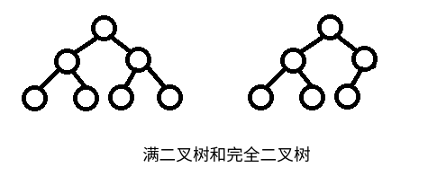

# 二叉树

二叉树是一种特殊的树结构，每一个父节点有至多两个子节点，分别叫做左子树和右子树。二叉树和基于二叉树衍生出的更复杂的结构不仅实际编程中比较常用，相关题目中也经常出现。

## 二叉树的性质

1. 二叉树第n层至多有2^(n-1)个节点
2. 二叉树叶节点数为m，度为2的节点数为n，则m=n+1（这里度指子节点数）

### 满二叉树

一棵深度为k，且有2^k-1个节点称之为满二叉树。

特点：除叶子结点外的所有结点均有两个子结点，节点数达到最大值，所有叶子结点必须在同一层上。

### 完全二叉树

深度为k，有n个节点的二叉树，当且仅当其每一个节点都与深度为k的满二叉树中，序号为1至n的节点对应时，称之为完全二叉树。

满二叉树也是完全二叉树。

## 二叉树的存储方式

* 二叉链表：最常见的二叉树表示方式，每一个节点有两个指针，分别指向该节点的左子节点和右子节点
* 数组：用数组表示的二叉树通常是完全二叉树，而且数组不便于随机插入删除，因此二叉树的数组表示很少见，堆结构通常使用数组进行表示

## 二叉树的遍历

二叉树遍历顺序有4中：

* 前序遍历：根节点->左子树->右子树
* 中序遍历：左子树->根节点->右子树
* 后序遍历：左子树->右子树->根节点
* 层序遍历：按照二叉树每一层，从左到右的顺序遍历

### 常见考题

问题：已知前序遍历序列和中序遍历序列，求后序遍历序列？

问题：求二叉树中叶节点个数？

问题：求二叉树高度？

问题：求两个节点最近公共祖先？
