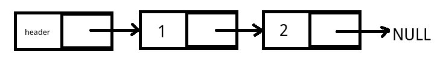
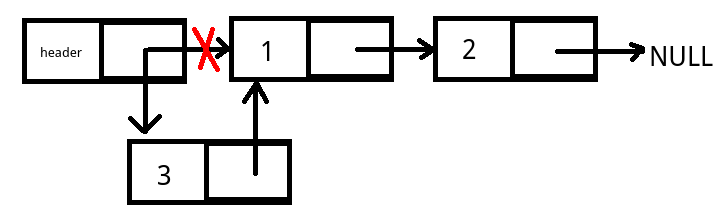
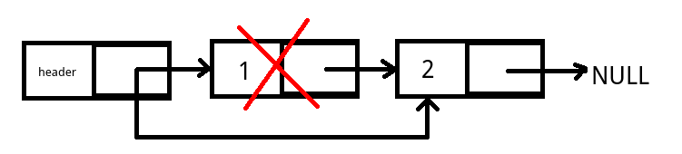

# 单链表

单链表是除了数组外，另一种很常用的线性数据结构。和数组不同，单链表的每个节点包含指向下一个节点的指针，相邻节点的内存，可能不是连续分配的。

## 单链表的结构

我们可以定义一个结构体来表示单链表：
```c
struct Node
{
	int value;
	struct Node *next;
};
```

其中，`value`表示链表节点的值，这里为了方便使用了`int`类型，实际使用时，通常可能是字符串，甚至指向其他的结构体指针。`next`表示指向下一个节点的指针，如果没有下一个节点，就指向NULL。



我们注意到，我们为链表设置了一个头节点`header`，这个节点也是一个Node结构体，但是它不表示实际的值，只表示链表的“头部”。当链表为空时，`header->next`为NULL。为什么这么设计呢？如果不设置头结点，直接用NULL表示链表为空，其实也是可以的，但是写起来比较麻烦。比如我们编写一个向链表插入元素的函数`void appendNode(struct Node *header, struct Node *newNode)`，如果我们希望向一个空链表插入元素，那么`header`参数我们怎么传递呢？恐怕要弄出二级指针，函数体里也要判断一下，如果是NULL怎样，不是NULL又怎样。但是设置一个头结点就方便了许多，我们直接从`header->next`上操作链表，写起来比较简单。

## 插入和删除



插入过程首先要定位到待插入索引位置前面的那个节点，然后按上图改变一下指针就行了。



删除也是首先定位到待删除节点前面的节点，然后修改指针，使指针跨过被删除的节点即可。

* 插入和删除时，要注意当被插入或删除的节点是第一个，或最后一个节点时的可能有的特殊情况。具体可以参考下面的实现代码。
* 删除时应该注意，不要忘了free掉不用的内存。

## 搜索

数组可以直接使用下标访问元素，例如`arr[1]`，表示访问`*(arr + 1)`这个元素，我们通过数组的基地址`arr`和偏移量`1`，很容易计算出待访问的元素地址。但是链表就比较困难了，我们只能从header节点开始，一步步遍历，直到找到我们需要的那个元素。


## C语言代码实现

下面是单链表数据结构和其常用操作：

```c
#include <stdio.h>
#include <stdlib.h>

struct Node
{
	int value;
	struct Node *next;
};

/*分配新节点*/
struct Node *mallocNewNode(void);
/*释放节点内存*/
void freeNode(struct Node *node);
/*在链表末尾加入节点*/
void appendNode(struct Node *header, struct Node *newNode);
/*随机插入节点，如果index<0报错退出，如果index>len(list)则插到最后*/
void insertNode(struct Node *header, struct Node *newNode, int index);
/*随机删除节点，节点不存在则报错退出*/
void deleteNode(struct Node *header, int index);
/*根据索引返回值，索引不存在则报错*/
int getNode(struct Node *header, int index);
/*根据值查找节点序号，不存在返回-1*/
int searchNode(struct Node *header, int value);
/*释放整个链表的内存*/
void freeLinkedList(struct Node *header);
/*打印整个链表*/
void printLinkedList(struct Node *header);

struct Node *mallocNewNode(void)
{
	struct Node *newNode = (struct Node *) malloc(sizeof(struct Node));
	newNode->next = NULL;
	newNode->value = 0;
	return newNode;
}

void freeNode(struct Node *node)
{
	free(node);
}

void appendNode(struct Node *header, struct Node *newNode)
{
	struct Node *p = header;
	while (p->next != NULL)
	{
		p = p->next;
	}
	p->next = newNode;
}

void insertNode(struct Node *header, struct Node *newNode, int index)
{

	if (index < 0)
	{
		fprintf(stderr, "索引不能为负数\n");
		exit(EXIT_FAILURE);
	}

	struct Node *p = header;
	for (int i = 0; i < index; i++)
	{
		if (p->next == NULL)
		{
			break;
		}
		else
		{
			p = p->next;
		}
	}
	struct Node *q = p->next;
	p->next = newNode;
	newNode->next = q;
}

void deleteNode(struct Node *header, int index)
{
	if (index < 0)
	{
		fprintf(stderr, "索引不能为负数\n");
		exit(EXIT_FAILURE);
	}

	struct Node *p = header;
	int i = 0;
	while(p->next != NULL)
	{
		if(i == index)
		{
			break;
		}

		p = p->next;
		if(p == NULL)
		{
			fprintf(stderr, "索引不存在\n");
			exit(EXIT_FAILURE);
		}
		i++;
	}

	struct Node *q = p->next;
	if(q == NULL)
	{
		fprintf(stderr, "索引不存在\n");
		exit(EXIT_FAILURE);
	}
	p->next = q->next;
	freeNode(q);
}

int searchNode(struct Node *header, int value)
{
	struct Node *p = header->next;
	int index = 0;
	while (p != NULL)
	{
		if (p->value == value)
		{
			return index;
		}
		else
		{
			index++;
			p = p->next;
		}
	}
	return -1;
}

int getNode(struct Node *header, int index)
{
	if (index < 0)
	{
		fprintf(stderr, "索引不能为负数\n");
		exit(EXIT_FAILURE);
	}
	struct Node *p = header->next;
	for(int i = 0; i < index; i++)
	{
		if(p == NULL)
		{
			fprintf(stderr, "索引不存在\n");
			exit(EXIT_FAILURE);
		}
		p = p->next;
	}
	if(p == NULL)
	{
		fprintf(stderr, "索引不存在\n");
		exit(EXIT_FAILURE);
	}
	return p->value;
}

void freeLinkedList(struct Node *header)
{
	struct Node *p = header;
	while (p != NULL)
	{
		struct Node *q = p;
		p = p->next;
		freeNode(q);
	}
}

void printLinkedList(struct Node *header)
{
	struct Node *p = header->next;
	while (p != NULL)
	{
		printf("%d ", p->value);
		p = p->next;
	}
	printf("\n");
}
```

## 链表和数组的比较

实际编程中，我们一般使用编程语言标准库提供的数据结构库，比如Java的`LinkedList`和`ArrayList`，分别代表链表和数组。对于数据规模不大的情况，实际上两者没什么区别，我们统一使用`ArrayList`即可，数据很多时，就要考虑数组和链表的特性了，数组随机访问的开销很小，但是随机插入删除的开销非常大，链表则正相反。
