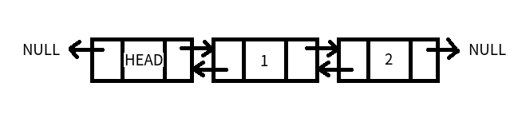
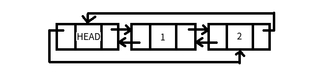

# 双向链表

普通的单链表每一个节点有一个指向后继元素的指针，而双向链表每个节点则有两个指针，一个指向前驱元素，一个指向后继元素。



我们可以发现，双向链表的优点就是通过任意一个节点，都能立刻找到其前一个节点或后一个节点。而对于普通链表，查找一个节点的前驱节点就需要遍历才能得到。因此某些情况下，双向链表更加节省时间。

## 双向链表的添加和删除

```c
#include <stdio.h>
#include <stdlib.h>

struct Node
{
	int number;
	struct Node *prev;
	struct Node *next;
};

//初始化空的双向链表
struct Node *initLinkedList();
//销毁双向链表
void freeLinkedList(struct Node *head);
//插入节点
void insert(struct Node *head, struct Node *node, int index);
//删除节点
void delete(struct Node *node);
//打印双向链表
void displayLinkedList(struct Node *head);

int main()
{
	struct Node *linkedList = initLinkedList();

	//测试 插入节点
	struct Node *newNode1 = (struct Node *)malloc(sizeof(struct Node));
	newNode1->number = 1;
	insert(linkedList, newNode1, 0);
	displayLinkedList(linkedList);

	struct Node *newNode2 = (struct Node *)malloc(sizeof(struct Node));
	newNode2->number = 2;
	insert(linkedList, newNode2, 0);
	displayLinkedList(linkedList);

	struct Node *newNode3 = (struct Node *)malloc(sizeof(struct Node));
	newNode3->number = 3;
	insert(linkedList, newNode3, 5);
	displayLinkedList(linkedList);

	//测试 删除节点
	delete(newNode3);
	displayLinkedList(linkedList);

	delete(newNode2);
	displayLinkedList(linkedList);

	freeLinkedList(linkedList);

	return 0;
}

struct Node *initLinkedList()
{
	struct Node *newNode = (struct Node *)malloc(sizeof(struct Node));
	newNode->prev = NULL;
	newNode->next = NULL;
	return newNode;
}

void freeLinkedList(struct Node *head)
{
	struct Node *p = head;
	while(p != NULL)
	{
		struct Node *p_next = p->next;
		free(p);
		p = p_next;
	}
}

void insert(struct Node *head, struct Node *node, int index)
{
	struct Node *p = head;
	for(int i = 0; i < index; i++)
	{
		if(p->next != NULL)
		{
			p = p->next;
		}
		else
		{
			break;
		}
	}

	if(p->next == NULL)
	{
		p->next = node;
		node->prev = p;
		node->next = NULL;
	}
	else
	{
		struct Node *p_temp = p->next;
		p->next = node;
		node->prev = p;
		node->next = p_temp;
		p_temp->prev = node;
	}
}

void delete(struct Node *node)
{
	if(node->prev == NULL)
	{
		fprintf(stderr, "不能删除头节点\n");
		exit(EXIT_FAILURE);
	}
	else
	{
		struct Node *p_prev = node->prev;
		struct Node *p_next = node->next;
		p_prev->next = p_next;
		if(p_next != NULL)
		{
			p_next->prev = p_prev;
		}
		free(node);
	}
}

void displayLinkedList(struct Node *head)
{
	struct Node *p = head->next;
	while(p != NULL)
	{
		printf("%d ", p->number);
		p = p->next;
	}
	printf("\n");
}
```

双向链表的添加和删除和单链表差不多，无非就是需要同时顾及前驱和后继两个指针，以及需要对前驱节点，待操作节点，和后继节点三处进行修改。

# 双向循环链表

双向链表可以和循环链表结合起来使用。其特点如下图：



双向循环链表在Linux内核中有大量的应用。

注：有头节点的空的双向循环链表，其前驱指针和后继指针都指向头节点。
