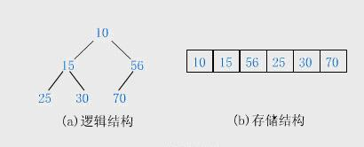
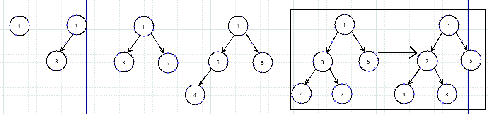
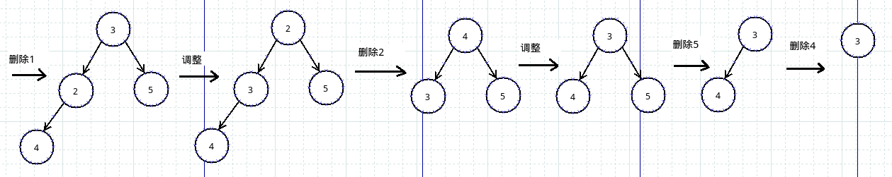

# 堆

传统二叉树使用二叉链表表示，优点是便于插入删除，缺点是占用存储空间大，遍历速度慢，对于完全二叉树，使用数组表示更好，堆是一种完全二叉树。

# 堆的性质

1. 父节点的值全部大于等于（或小于等于）任何一个子节点的值，被称为大根堆（小根堆）。
2. 每个节点的左子树和右子树都是一个大根堆或小根堆。

一个小根堆例子：



堆的数组表示：

1. 索引为i（i>0）的节点，父节点索引为（i-1）/2
2. 索引为i的节点左子树索引为2xi+1，右子树为2xi+2

# 堆的插入和删除

这里都以小根堆为例

## 插入

例：插入1 3 5 4 2



堆插入的过程：

1. 插入一个元素，将其直接插入数组的末尾
2. 比较新插入的元素和其父节点
  * 如果父节点小于新插入的节点，插入完成
  * 如果父节点大于新插入的节点，如上图插入2时，父节点是3，就将2和3调换，然后继续比较2和1，直到堆顶

## 删除



堆删除过程：

1. 堆只能删除堆顶元素，用数组表示堆时，直接将数组末尾元素覆盖到堆顶，堆大小减1
2. 从堆顶开始调整，比较堆顶和两个子节点
  * 如果堆顶小于两个子节点，删除完成
  * 如果子节点有大于堆顶的，堆顶元素和子节点中较小的元素交换，例如上图中1,2步，2和3交换，然后继续比较3和4，直到堆底

# 堆实现和堆排序

利用堆的插入和删除，可以完成排序操作。将无序的数组全部元素插入堆中，每次取堆顶元素，输出的就是有序的数组。

堆和堆排序例子：
```c
#include <stdio.h>
#include <stdlib.h>
#include <time.h>

struct heap
{
	int *arr;
	int len;
};

/*插入一个元素*/
void insert(struct heap *h, int x);
/*判断堆是否为空*/
int empty(struct heap *h);
/*删除堆顶元素*/
void delete(struct heap *h);
/*获得堆顶元素*/
int top(struct heap *h);
/*交换两个数*/
void swap(int *a, int *b);

int main(void)
{
	struct heap h;
	h.arr = malloc(sizeof(int) * 1024);
	h.len = 0;

	//产生随机数
	srand((unsigned) time(NULL));
	for(int i = 0; i < 1024; i++)
	{
		insert(&h, rand() % 10000);
	}

	//堆排序输出
	for(int i = 0; i < 1024; i++)
	{
		int j = top(&h);
		delete(&h);
		printf("%d ", j);
	}

	printf("\n");

	free(h.arr);
	return 0;
}

void swap(int *a, int *b)
{
	int temp = *a;
	*a = *b;
	*b = temp;
}

void insert(struct heap *h, int x)
{
	h->arr[h->len] = x;
	h->len++;
	int i = h->len - 1;
	while(i != 0)
	{
		int j = (i - 1) / 2;
		if(x >= h->arr[j])
		{
			break;
		}
		else
		{
			swap(&h->arr[i], &h->arr[j]);
		}
		i = j;
	}
}
int empty(struct heap *h)
{
	if(h->len == 0)
	{
		return 1;
	}
	else
	{
		return 0;
	}
}
void delete(struct heap *h)
{
	h->arr[0] = h->arr[h->len - 1];
	h->len--;
	if(h->len == 0)
	{
		return;
	}
	else
	{
		int i = 0;
		while(1)
		{
			int j = 2 * i + 1;
			int k = 2 * i + 2;

			if(h->arr[j] > h->arr[k])
			{
				swap(&j, &k);
			}

			if(j < h->len && h->arr[i] > h->arr[j])
			{
				swap(&h->arr[i], &h->arr[j]);
				i = j;
			}
			else if(k < h->len && h->arr[i] > h->arr[k])
			{
				swap(&h->arr[i], &h->arr[k]);
				i = k;
			}
			else
			{
				break;
			}
		}
	}
}

int top(struct heap *h)
{
	return h->arr[0];
}

```
