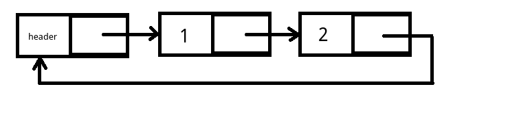

# 循环链表

循环链表和普通的链表的唯一区别就是，循环链表的最后一个节点的指针不是指向NULL，而是指向链表的第一个节点。



循环链表和普通链表的基本操作代码都差不多，唯一要注意的是，环形链表判断一个节点是否是最后一个节点代码为：

```c
if(node->next == head)
```

同样原理，判断链表为空代码为：

```c
if(head->next == head)
```

## 循环链表的应用场景

### 环形遍历

观察循环链表的特点，我们可以发现：从链表的任意一个元素出发，都能够遍历到链表的每一个元素，因此所有元素可以看作是形成了一个环。实际上，通过数组或单链表加一个计数器的逻辑，也能解决此类问题，代码也并不难写。

#### 约瑟夫环问题

题目：若干犹太人与Josephus及他的朋友（共41人）躲到一个洞中，其他犹太人决定宁愿死也不要被敌人抓。于是决定了自杀方式，41个人排成一个圆圈，由第1个人开始报数，每报数到第3人该人就必须自杀。然后下一个重新报数，直到所有人都自杀身亡为止。求出所有人的自杀顺序。

这个题目的解决方法之一就是使用循环链表模拟游戏过程，按照规则删除节点，直到循环链表为空。

实现代码
```c
#include <stdio.h>
#include <stdlib.h>

struct Node
{
	int number;
	struct Node *next;
};

int main()
{
	//初始化链表头节点
	struct Node *head = (struct Node *)malloc(sizeof(struct Node));
	head->number = 1;

	//初始化环形链表的41个节点
	struct Node *prev = head;
	for(int i = 2; i <= 41; i++)
	{
		struct Node *newNode = (struct Node *)malloc(sizeof(struct Node));
		newNode->number = i;
		prev->next = newNode;
		prev = newNode;
	}
	prev->next = head;

	//遍历节点并按照规则依次删除
	struct Node *p = prev;
	while(p->next != p)
	{
		struct Node *p_prev = p;
		for(int i = 0; i < 3; i++)
		{
			p_prev = p;
			p = p->next;
		}

		//打印要删除的节点的号码
		printf("%d ", p->number);

		//节点的删除操作
		p_prev->next = p->next;
		free(p);
		p = p_prev;
	}
	printf("%d\n", p->number);
	free(p);

	return 0;
}
```

上述代码其实就是将循环链表看成一个环，循环遍历。这里要注意的是，为了遍历操作的实现方便，上面问题中实际上并没有使用“头指针”这个概念（head指向的节点也赋予值了），循环链表时刻都是指针`p`持有的。如果不这样编写，遍历时还要考虑`p`指向`head`时将其跳过，比较麻烦。

注意：删除一个节点后，`p`指向的`p_prev`，否则下一次遍历起点是一个不存在的节点。

运行结果：

```
3 6 9 12 15 18 21 24 27 30 33 36 39 1 5 10 14 19 23 28 32 37 41 7 13 20 26 34 40 8 17 29 38 11 25 2 22 4 35 16 31
```

### 尾指针

通常我们都使用指向头结点的指针来持有一个链表，对于环形链表，我们还可以使用指向尾节点的指针（简称尾指针）。当链表为空时，尾指针就是头指针，链表不为空时，`尾指针->next`就是头指针。

#### 链表合并问题

题目：现有链表A（A1，A2，A3，...，Am）和链表B（B1，B2，B3，...，Bn），将其合并为链表AB（A1，...，Am，B1，...，Bn）。编写出合并的代码。

如果使用普通链表，合并操作时，必然会遍历链表A，如果使用尾指针持有的循环链表，就可以省去这步遍历了。

```c
#include <stdio.h>
#include <stdlib.h>

struct Node
{
	int number;
	struct Node *next;
};

//打印循环链表
void printLinkedList(struct Node *node);
//使用尾指针连接链表
void concatLinkedList(struct Node *tailA, struct Node *tailB);

int main()
{
	//初始化链表A:1 2 3 和 B:4 5 6
	struct Node *headA = malloc(sizeof(struct Node));
	headA->number = 1;
	struct Node *p = headA;
	for(int i = 2; i <= 3; i++)
	{
		struct Node *newNode = malloc(sizeof(struct Node));
		newNode->number = i;
		p->next = newNode;
		p = newNode;
	}
	p->next = headA;
	struct Node *tailA = p;

	struct Node *headB = malloc(sizeof(struct Node));
	headB->number = 4;
	p = headB;
	for(int i = 5; i <= 6; i++)
	{
		struct Node *newNode = malloc(sizeof(struct Node));
		newNode->number = i;
		p->next = newNode;
		p = newNode;
	}
	p->next = headB;
	struct Node *tailB = p;

	concatLinkedList(tailA, tailB);
	printLinkedList(headA);

	return 0;
}

void printLinkedList(struct Node *node)
{
	struct Node *p = node;
	while(p->next != node)
	{
		printf("%d ", p->number);
		p = p->next;
	}
	printf("%d ", p->number);
}

void concatLinkedList(struct Node *tailA, struct Node *tailB)
{
	struct Node *newHead = tailA->next;
	tailA->next = tailB->next;
	tailB->next = newHead;
}
```

实际上合并造作就是`concatLinkedList()`里的三行代码，由于我们事先知道了链表的最后一个节点，而通过最后一个节点又能很方便的知道链表的头节点，因此合并操作就十分简单了。

这里要注意，上面没有使用一个空节点表示头节点，如果一定要把头节点表示出来，合并操作时，就要注意跳过B的头节点。
