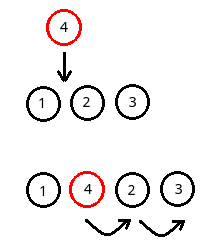

# 数组

数组是最基础的线性表结构，用于按一定顺序存储某一类型的数据。

数组是连续分配的内存地址，因此如果想要查找数组中的某一元素，也只能顺序遍历，当然如果数组经过排序，还可以使用二分查找等方法加快速度。

C语言中，数组可以在直接栈上分配，也可以使用`malloc`在堆上分配。使用哪种方式，要根据实际使用情况进行选择，这涉及到操作系统的知识，具体请参考操作系统相关章节。本篇笔记只讨论抽象意义上的“数据结构”。

# 数组常用操作

下面例子演示了数组的常用操作，为了突出是数组这种“数据结构”，因此将C语言的数组进行了简单的封装。

```c
#include <stdio.h>
#include <stdlib.h>

struct array
{
	int *arr;
	int len;
	int current;
};

/*创建数组*/
void init(struct array *array, int len);
/*销毁数组*/
void destroy(struct array *array);
/*清空数组*/
void makeEmpty(struct array *array);
/*在末尾插入元素*/
void push(struct array *array, int x);
/*在末尾删除元素*/
int pop(struct array *array);
/*设置某个元素的值*/
void set(struct array *array, int i, int x);
/*获取某个元素*/
int getValue(struct array *array, int i);
/*获得某个元素的索引*/
int getIndex(struct array *array, int x);
/*第i个元素后插入x*/
void insert(struct array *array, int i, int x);
/*删除索引为i的元素*/
void delete(struct array *array, int i);

void init(struct array *array, int len)
{
	array->arr = (int *)malloc(sizeof(int) * len);
	array->len = len;
	array->current = -1;
}

void destroy(struct array *array)
{
	free(array->arr);
}

void makeEmpty(struct array *array)
{
	array->current = -1;
}

void push(struct array *array, int x)
{
	if(array->current < array->len - 1)
	{
		array->current++;
		array->arr[array->current] = x;
	}
	else
	{
		fprintf(stderr, "数组顶端溢出");
		exit(EXIT_FAILURE);
	}
}

int pop(struct array *array)
{
	if(array->current > -1)
	{
		int result = array->arr[array->current];
		array->current--;
		return result;
	}
	else
	{
		fprintf(stderr, "数组底端溢出");
		exit(EXIT_FAILURE);
	}
}

void set(struct array *array, int i, int x)
{
	if(i >= 0 && i <= array->current)
	{
		array->arr[i] = x;
	}
	else
	{
		fprintf(stderr, "数组访问越界");
		exit(EXIT_FAILURE);
	}
}

int getValue(struct array *array, int i)
{
	if(i >= 0 && i <= array->current)
	{
		return array->arr[i];
	}
	else
	{
		fprintf(stderr, "数组访问越界");
		exit(EXIT_FAILURE);
	}
}

int getIndex(struct array *array, int x)
{
	int result = -1;
	for(int i = 0; i < array->len; i++)
	{
		if(array->arr[i] == x)
		{
			result = i;
			break;
		}
	}
	return result;
}

void insert(struct array *array, int i, int x)
{
	int cur = array->current;
	if(i >= 0 && i <= cur)
	{
		if(cur == array->len - 1)
		{
			fprintf(stderr, "数组溢出");
			exit(EXIT_FAILURE);
		}
		else
		{
			while(cur > i)
			{
				array->arr[cur + 1] = array->arr[cur];
				cur--;
			}
			array->arr[cur] = x;
			array->current++;
		}
	}
	else
	{
		fprintf(stderr, "数组访问越界");
		exit(EXIT_FAILURE);
	}
}

void delete(struct array *array, int i)
{
	if(i >= 0 && i <= array->current)
	{
		while(i < array->current)
		{
			array->arr[i] = array->arr[i + 1];
			i++;
		}
		array->current--;
	}
	else
	{
		fprintf(stderr, "数组访问越界");
		exit(EXIT_FAILURE);
	}
}
```

其中，要注意的是`void insert(struct array *array, int i, int x)`和`void delete(struct array *array, int i)`这两个函数，由于数组的特性，随机插入和随机删除是开销很大的操作，它的时间复杂度的O(n)的，因为数组这种线性结构是连续分配的内存，如果要在中间插入一个元素，必须将后面的元素全部后移。

插入的例子：



如图，插入时，待插入后面的小球被“挤的”整体后移。

删除则正相反。删除点后的小球会整体前移。
