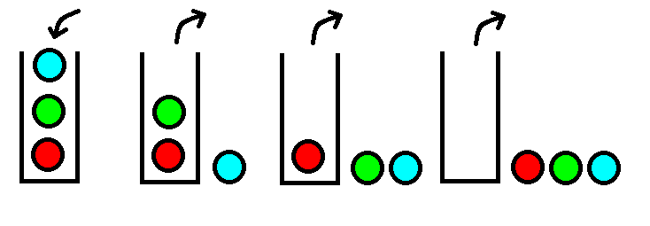

# 栈

栈是十分常用的数据结构，许多算法都需要栈结构的支持。我们使用高级编程语言时，其函数功能也是通过返回地址进入栈实现的，只不过这些过程是操作系统为我们实现的。

栈有很多实现方式，可以用数组或链表等结构实现，实际情况下，应该根据使用场景不同进行选择。Java中，Stack类就是基于Vector（变长数组）进行实现的。这并不意味着，所有情况下Stack类都满足我们的需求。

栈的特点一个词概括就是`先进后出`，就像一个桶，按顺序往里面扔球，然后一个一个球往外拿，最先拿出来的是最后扔进去的球。



如图：放球顺序是红绿蓝，拿球顺序就是蓝绿红了。

## 栈的基本操作

栈的基本操作有push进栈，pop出栈，peek查看栈顶元素，clear清空栈，isEmpty栈是否为空。下面代码中，使用最简单的定长数组，实现一个栈结构。

```c
#include <stdio.h>
#include <stdlib.h>

struct Stack
{
	int container[100];
	int top;
};

void initStack(struct Stack *stack);
void push(struct Stack *stack, int i);
int pop(struct Stack *stack);
int peek(struct Stack *stack);
int isEmpty(struct Stack *stack);
void clear(struct Stack *stack);

void printStack(struct Stack *stack);

int main()
{
	//初始化
	struct Stack s;
	initStack(&s);
	printStack(&s);
	//测试进栈
	push(&s, 1);
	printStack(&s);
	push(&s, 2);
	printStack(&s);
	push(&s, 3);
	printStack(&s);
	//测试出栈
	pop(&s);
	printStack(&s);
	//测试清空
	clear(&s);
	printStack(&s);
	return 0;
}

void initStack(struct Stack *stack)
{
	stack->top = -1;
}

void push(struct Stack *stack, int i)
{
	stack->top++;
	stack->container[stack->top] = i;
}

int pop(struct Stack *stack)
{
	if(stack->top == -1)
	{
		fprintf(stderr, "栈为空\n");
		exit(EXIT_FAILURE);
	}
	else
	{
		int result = stack->container[stack->top];
		stack->top--;
		return result;
	}
}

int peek(struct Stack *stack)
{
	if(stack->top == -1)
	{
		fprintf(stderr, "栈为空\n");
		exit(EXIT_FAILURE);
	}
	else
	{
		return stack->container[stack->top];
	}
}

int isEmpty(struct Stack *stack)
{
	if(stack->top == -1)
	{
		return 1;
	}
	else
	{
		return 0;
	}
}

void clear(struct Stack *stack)
{
	stack->top = -1;
}

void printStack(struct Stack *stack)
{
	if(stack->top != -1)
	{
		for(int i = 0; i <= stack->top; i++)
		{
			printf("%d ", stack->container[i]);
		}
		printf("\n");
	}
	else
	{
		printf("栈为空\n");
	}
}
```

运行结果：

```
栈为空
1
1 2
1 2 3
1 2
栈为空
```

注意：上述代码中，规定了数组大小为100，但是没有在入栈时考虑数组溢出的情况。实际应用中，需要多方面考虑周全。

## 栈的应用场景

栈的应用非常多，下面举几个常见的例子。

### 逆序功能

题目：将十进制数转换为二进制。

我们知道，把十进制数转换为二进制，将十进制数不停除以2，余数就是二进制各位上的值了。

例如`num=16`
```
16 / 2 = 8 ... 0
8  / 2 = 4 ... 0
4  / 2 = 2 ... 0
2  / 2 = 1 ... 0
1  / 2 = 0 ... 1

结果为10000
```

```c
int main()
{
	struct Stack s;
	initStack(&s);

	int num;
	scanf("%d", &num);
	while(1)
	{
		int remain = num % 2;
		push(&s, remain);
		num /= 2;
		if(num == 0)
		{
			break;
		}
	}

	while(isEmpty(&s) != 1)
	{
		printf("%d", pop(&s));
	}
	printf("\n");

	return 0;
}
```

栈在这里起的作用实际上是作为一个容器和实现一个序列的逆序。

### 记忆功能

给定一个`(`和`)`组成的字符串序列，判断其括号是否匹配。例如`(())`，`(()())`是合法的，`)(`是不合法的。

```c
int main()
{
	struct Stack s;
	initStack(&s);

	char input[100];
	scanf("%s", input);

	char *p = input;
	while(*p != '\0')
	{
		if(isEmpty(&s))
		{
			push(&s, *p);
		}
		else
		{
			char top = peek(&s);
			if(top == '(' && *p == ')')
			{
				pop(&s);
			}
			else
			{
				push(&s, *p);
			}
		}
		p += 1;
	}
	if(isEmpty(&s))
	{
		printf("合法\n");
	}
	else
	{
		printf("不合法\n");
	}

	return 0;
}
```

合法的括号序列的规则是显而易见的：

1. 一个`(`肯定有一个`)`和它对应，且在序列中，左括号先出现。
2. 最基本的合法的输入序列是`()`，且如果是一个输入是合法的，一对括号之间，中间如果不为空，就一定是隔着一个合法的子序列。

这个问题的想法是这样的：遍历输入序列的每个字符，当栈顶元素为`(`，待操作的字符为`)`时，对栈执行`pop()`，否则待操作元素入栈。这样，合法的输入最终栈会变为空。在这个问题中，我们利用栈“记住”了一些元素，然后进行匹配。
