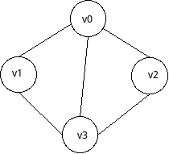
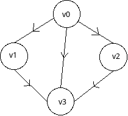

# 邻接矩阵

邻接矩阵是图的表示方法之一。这种数据结构表示图结构，简单清晰，容易理解。下面介绍什么是邻接矩阵以及如何用邻接矩阵表示图结构。

## 邻接矩阵和图

我们看一个无向图的例子：



这个结构很简单，只有四个顶点。我们想要表示一个图结构，实际上就是想办法用一个数据结构，将这个图的顶点和边表示出来。邻接矩阵是这样设计的：

```
   v0 v1 v2 v3
v0  0  1  1  1
v1  1  0  0  1
v2  1  0  0  1
v3  1  1  1  0
```

一个矩阵的行和列都表示图的所有顶点，比如：`[v0,v1]`这个位置的值为`1`，就代表顶点`v0`和`v1`之间是连接的，为`0`则代表两个顶点不连接。

我们发现，无向图中，由于没有方向，如果`[v0,v1]`为`1`，那么`[v1,v0]`也为`1`，最终导致的结果就是这个矩阵的对称的。

那么对于有向图，无非就是在上面的基础上修改一下了：



我们规定`[v0,v1]`值为`1`表示`v0`有一条有向边指向`v1`，而`[v1,v0]`值为`0`，因为`v1`没有一条有向边指向`v0`。

在邻接矩阵中，我们可以规定，行坐标表示源节点，列坐标表示目标节点。当然反过来也没问题。

那么结果就是这样了：
```
   v0 v1 v2 v3
v0  0  1  1  1
v1  0  0  0  1
v2  0  0  0  1
v3  0  0  0  0
```

## 邻接矩阵的适用场景

当矩阵很大时，如果矩阵比较稀疏（也就是说顶点很多，但是边比较少），这时使用邻接矩阵十分浪费空间，因为无论有多少条边，我们都必须表示顶点数的二次方大小的矩阵。

但相反的情况，矩阵不是很大，也不是稀疏矩阵，此时使用邻接矩阵就很方便了，因为我们可以用定长二维数组表示矩阵，我们直接使用类似`arr[x][y]`的方式就能随机访问任意一个矩阵值（也就是图的边）。
