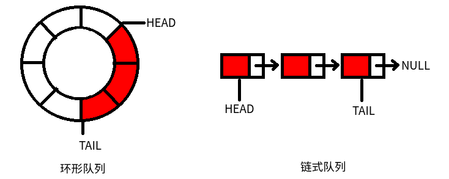

# 队列

队列是一个应用十分广泛的数据结构，和栈类似，也是可以基于任何一种线性表结构来实现。栈的特点是`后进先出`，队列正相反，是`先进先出`。

队列的一个最常见的使用场景就是GUI程序，我们点击界面上的一个区域，或是键盘按下某个键，实际上是不能立即响应的，因为如果代码写成立即对操作做出响应，如果CPU运行较慢，后一个操作就可能覆盖前一个操作。因此我们需要一个容器存储所有的操作，响应操作的代码从容器中按顺序或优先级读取操作，依次响应，队列就是满足这种需求的数据结构。

## 环形队列和链式队列

和栈相同，队列的基本操作也有push进队列，poll出队列，peek查看队列头元素，clear清空队列，isEmpty队列是否为空。

根据队列的特点，用数组实现时，队列起始位置不一定是数组索引`0`的位置，队列的元素还可能跨过数组最后一个元素，又从数组开头位置占用空间，因此我们需要在遍历队列时注意，遍历到数组最后一个元素时，跳至数组第一个元素（也就是把数组头尾连起来，规定arr[len-1]的下一个元素是arr[0]），而用链表实现代码就简单许多。但是究竟用数组还是链表，还应该根据实际需求，合理选择。数组实现的队列一般叫做“环形队列”，链表实现的队列我们叫做“链式队列”。



环形队列和链式队列的push和poll操作都是O(1)的，但是环形队列大小预先分配，链式队列频繁插入删除时，需要频繁分配和释放内存，有一定的性能开销。链式队列的指针域会额外占用一定的内存空间，但是不像环形队列一样预先分配内存，内存分配上更加灵活。

### 环形队列的实现

环形队列实现的关键就是下标的确定，和队列为空、队列已满的判断条件。

* 如何判断队列为空：这里我们使用一个标志位`isEmpty`，当队列`head == tail && isEmpty == false`时，再poll一个元素队列就为空，此时设置空标志位；队列为空时，插入一个元素，就取消空标志位。
* 如何判断队列已满：如果再插入一个元素，`head == tail`，那么队列当前已经是满的状态了，不允许插入。
* 下标的判断：队列中不停插入元素，当前最后一个元素的数组索引是`tail`，那么再插入一个元素后，索引就是`(tail + 1) % QUEUE_SIZE`。

下面给出环形队列的实现代码
```c
#include <stdio.h>
#include <stdlib.h>

#define QUEUE_SIZE 5

struct RingQueue
{
	int head;
	int tail;
	int isEmpty;
	int container[QUEUE_SIZE];
};

//初始化环形队列
void initRingQueue(struct RingQueue *rq);
//元素入队列
void push(struct RingQueue *rq, int i);
//元素出队列
int poll(struct RingQueue *rq);
//查看队列头部元素
int peek(struct RingQueue *rq);
//清空队列
void clear(struct RingQueue *rq);
//返回队列是否为空
int isEmpty(struct RingQueue *rq);
//打印队列（按照从队列头到尾的顺序，不是打印容器数组）
void display(struct RingQueue *rq);

int main()
{
	struct RingQueue *rq = malloc(sizeof(struct RingQueue));
	initRingQueue(rq);

	//测试
	push(rq, 1);
	display(rq);
	push(rq, 2);
	display(rq);
	push(rq, 3);
	display(rq);
	push(rq, 4);
	display(rq);
	push(rq, 5);
	display(rq);

	poll(rq);
	display(rq);
	poll(rq);
	display(rq);

	push(rq, 6);
	display(rq);
	push(rq, 7);
	display(rq);

	clear(rq);
	display(rq);

	free(rq);
	return 0;
}

void initRingQueue(struct RingQueue *rq)
{
	rq->head = 0;
	rq->tail = 0;
	rq->isEmpty = 1;
}

void push(struct RingQueue *rq, int i)
{
	if(rq->isEmpty)
	{
		rq->container[rq->head] = i;
		rq->isEmpty = 0;
	}
	else
	{
		int nextTailPosition = (rq->tail + 1) % QUEUE_SIZE;
		if(nextTailPosition == rq->head)
		{
			fprintf(stderr, "队列已满\n");
			exit(EXIT_FAILURE);
		}
		else
		{
			rq->container[nextTailPosition] = i;
			rq->tail = nextTailPosition;
		}
	}
}

int poll(struct RingQueue *rq)
{
	if(rq->isEmpty)
	{
		fprintf(stderr, "队列为空\n");
		exit(EXIT_FAILURE);
	}
	else
	{
		int result;
		if(rq->head == rq->tail)
		{
			result = rq->container[rq->head];
			rq->isEmpty = 1;
		}
		else
		{
			int nextHeadPosition = (rq->head + 1) % QUEUE_SIZE;
			result = rq->container[rq->head];
			rq->head = nextHeadPosition;
		}
		return result;
	}
}

int peek(struct RingQueue *rq)
{
	if(rq->isEmpty)
	{
		fprintf(stderr, "队列为空\n");
		exit(EXIT_FAILURE);
	}
	else
	{
		return rq->container[rq->head];
	}
}

void clear(struct RingQueue *rq)
{
	rq->head = 0;
	rq->tail = 0;
	rq->isEmpty = 1;
}

int isEmpty(struct RingQueue *rq)
{
	if(rq->isEmpty)
	{
		return 1;
	}
	else
	{
		return 0;
	}
}

void display(struct RingQueue *rq)
{
	if(rq->isEmpty)
	{
		printf("队列为空\n");
	}
	else
	{
		int p = rq->head;
		while(p != rq->tail)
		{
			printf("%d ", rq->container[p]);
			p = (p + 1) % QUEUE_SIZE;
		}
		printf("%d\n", rq->container[p]);
	}
}
```

### 链式队列的实现

链式队列实现比较简单，基本在链表基础上修改一下就行了，这里就不多写了。

## 优先队列

普通队列的特点是`先进先出`，优先队列则是人为的给每一个元素设置一个优先级，优先级最高的元素最先出队列。基于这个特点，我们会立刻发现使用线性的链表或是数组都不能满足这个需求，因为队列每插入一个元素，都要按照优先级进行排序，随机插入开销很大的数组肯定是不行的，链表也是需要多次遍历并比较大小才能做到，因此最好的实现是使用堆结构（当然堆也是数组或二叉链表实现的）。大根堆的堆顶永远是值最大的元素（这里的值指优先级），堆只能从堆顶删除元素，因此堆结构天然的就是一个优先队列。

具体见`数据结构/堆`章节。
