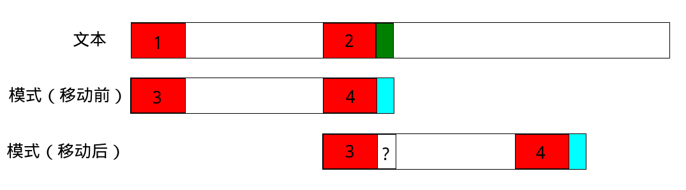

# KMP字符串匹配

KMP是一个简单，但是又很难理解的算法，我曾经理解过几次，又忘了几次，又重学了几次，似乎每次都会被各种博客深深的坑一把，这不得不吐槽下，各种“大神”的博客，东抄西抄的先不说，写的代码竟然还是错的，不仅代码是错的，原理写的还几乎看不懂，不仅写的原理看不懂，下面评论还有人叫好。

最奇葩的是有一哥们写的KMP，next数组是错的，字符串匹配结果还是对的，研究了半天，发现那个算法虽然也能匹配，但是根本没达到KMP的效果。。。

这回课程又涉及到字符串匹配，我一定把KMP弄懂，并记录下来，以后忘了直接看我自己写的代码。

## 字符串匹配问题

字符串匹配技术应用广泛，其解决的问题就是在给定的字符流中，查找满足某些指定属性的字符串。

### 基本术语

* 文本 我们从文本中查找/替换信息。
* 模式 模式定义了怎样从文本中查找/替换信息，字符串匹配问题中，模式也是一个字符串，我们需要从文本中查找模式字符串。

最简单的字符串匹配我想不需要多介绍了，模式一次移动一个字符，对应遍历模式和文本，若全相同则匹配成功，有一个字符不相同则匹配失败，模式前移一个字符继续匹配。这种最基本的算法叫BF（Brute-Force）算法。

BF算法没有考虑匹配成功的前缀信息，实际上这部分信息（前缀模式：模式中不同部分存在相同子串）也可以利用起来，使模式向前推进若干字符，而不是一个字符，这能避免一些重复比较。这里我们就研究一下KMP（Knuth-Morris-Pratt）匹配算法。

## KMP算法的原理

考察一个模式串`ababaca`，KMP算法要求计算一个转移函数表next数组，其值next[i]代表模式串[:i]（这是Python分片写法）相同的最长前缀和最长后缀长度，next数组的长度等于模式串的长度。比如：

* `abcghabc` 相同的最长前缀和最长后缀是`abc`，长度为3
* `cbcbc` 相同的最长前缀和最长后缀是`cbc`，长度为3
* `aaaa` 相同的最长前缀和最长后缀是`aaa`，长度为3
* `abcbc` 不存在相同的前缀和后缀，长度我们取0

现在我们看`ababaca`，长度为7，我们建立next[7]

* next[0] `a` 不存在相同前缀和后缀，next取0
* next[1] `ab` 不存在相同前缀和后缀，next取0
* next[2] `aba`存在最长相同前缀和后缀`a`，next取1
* next[3] `abab` 存在最长相同前缀和后缀`ab`，next取2
* next[4] `ababa` 存在最长相同前缀和后缀`aba`，next取3
* next[5] `ababac` 不存在相同前缀和后缀，next取0
* next[6] `ababaca` 存在最长相同前缀和后缀`a`，next取1

为了帮助理解next数组的作用，我们再看一张图：



第一行代表文本，第二行和第三行代表模式串移动前和移动后，我们用红色代表模式串的相同最长前缀和最长后缀。

现在我们经过比较，发现文本中绿色字符和模式串蓝色字符不匹配，我们要向前移动模式串，移动多少呢？假设我们只移动一格，那显然模式串不与文本匹配，应该把3移动到4的位置才行（如图），然后比较绿色字符和3后面的那个字符。

因为我们预先知道了模式串的next[i]（失配字符前的字符串中，相同最长前缀和最长后缀长度），也就是红色字符串的长度，那就好办了：`移动距离=已匹配的字符串长度-next[i]`。

## KMP算法C语言实现

```c
#include <stdio.h>
#include <string.h>

int index_kmp(char *text, char *pattern);

void get_next(char *pattern, int *next);

int main(void)
{
	char *text = "abcbcdabcbcbcabcbc";
	char *pattern = "cbcbc";

	int i = index_kmp(text, pattern);
	printf("%d\n", i);

	return 0;
}

int index_kmp(char *text, char *pattern)
{
	int text_len = (int) strlen(text);
	int pattern_len = (int) strlen(pattern);

	int next[pattern_len];
	get_next(pattern, next);

	int j = 0;
	for(int i = 0; i < text_len; i++)
	{
		while(j > 0 && pattern[j] != text[i])
			j = next[j - 1];
		if(pattern[j] == text[i])
			j++;
		if(j == pattern_len)
			return (i - pattern_len + 1);
	}

	return -1;
}

void get_next(char *pattern, int *next)
{
	next[0] = 0;

	int pattern_len = (int) strlen(pattern);

	//i 模式串下标，同时也是next数组下标
	//j 最大相同前后缀长度
	int j = 0;
	for (int i = 1; i < pattern_len; ++i)
	{
		while (j > 0 && pattern[i] != pattern[j])
			j = next[j - 1];
		if (pattern[i] == pattern[j])
		{
			j++;
		}
		next[i] = j;
	}
}
```
